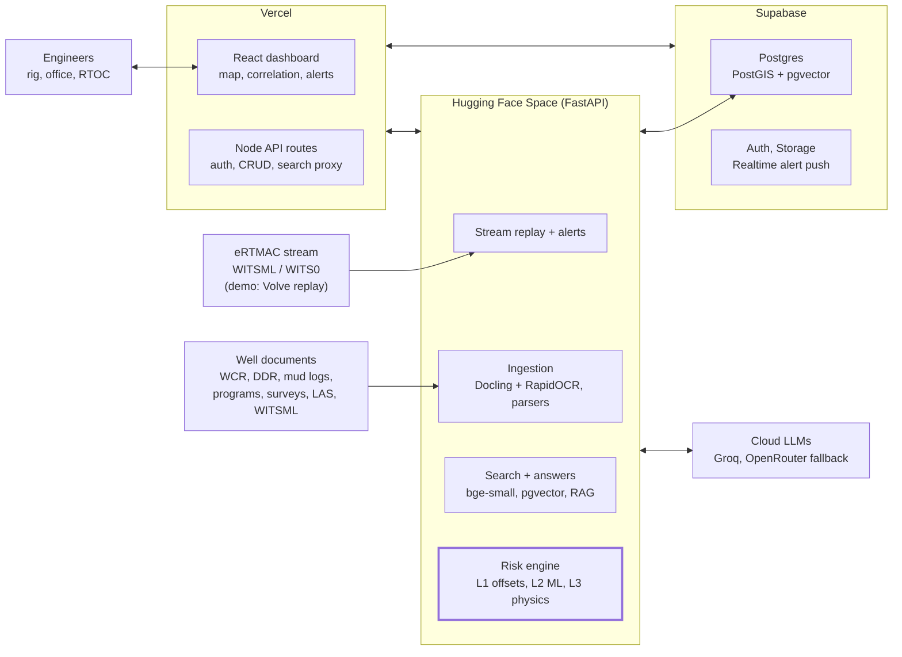
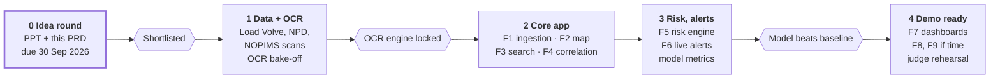
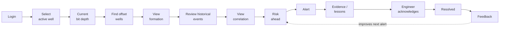
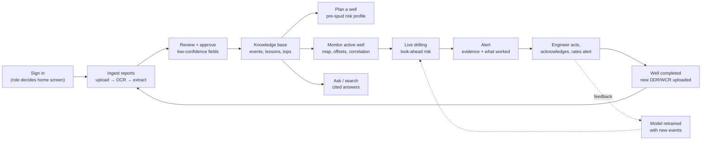
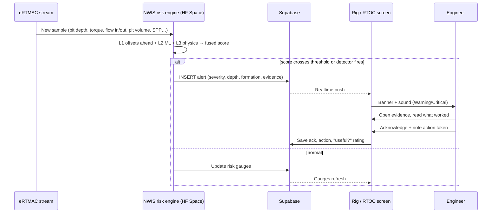
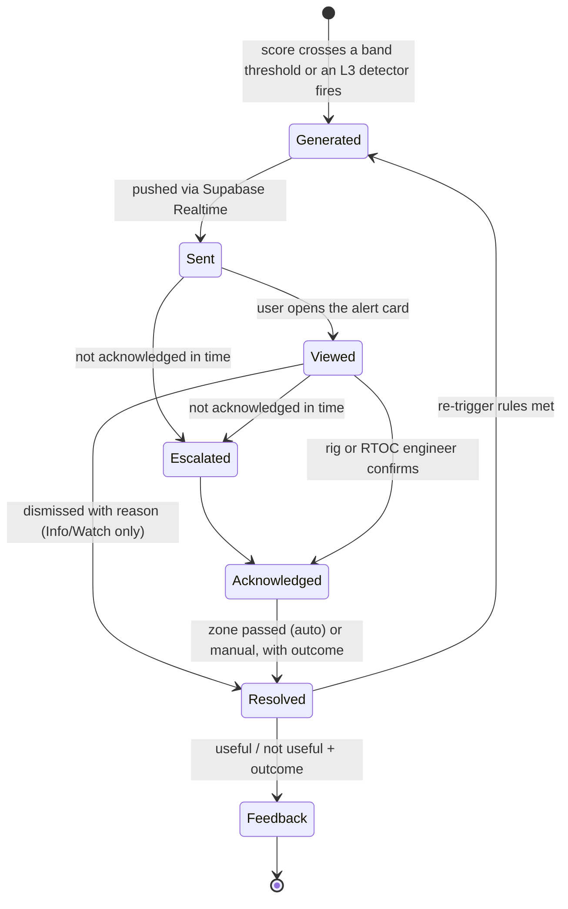

# eRTMAC-NWIS: Product Requirements Document

**SIH26121 · Oil India Limited** · 28 Sep 2026 · Author: Gaurav

Live, editable version: https://claude.ai/code/artifact/e6387f21-b014-4b97-be3f-15234946c32e

NWIS gives a drilling engineer, at the current bit depth, what happened in nearby wells at the same depth and formation, and what worked, before the bit gets there. It is our SIH26121 solution for Oil India Limited (OIL). The idea submission deadline is 30 Sep 2026.

## Contents
1. [Overview](#1-overview)
2. [PS coverage map](#2-ps-coverage-map)
3. [Source data: report structures and fields we extract](#3-source-data-report-structures-and-fields-we-extract)
4. [OCR engine decision](#4-ocr-engine-decision)
5. [Functional requirements](#5-functional-requirements)
6. [Architecture, tech stack and free deployment](#6-architecture-tech-stack-and-free-deployment)
7. [Data model and APIs](#7-data-model-and-apis)
8. [Differentiators and quality rules](#8-differentiators-and-quality-rules)
9. [Milestones, team split, risks, open questions](#9-milestones-team-split-risks-open-questions)
10. [End-to-end user workflows](#10-end-to-end-user-workflows)
11. [Sources](#sources)

---

## 1. Overview

**Problem.** OIL's eRTMAC (Enhanced Real Time Monitoring & Control Center) streams live data from the active well. It has no memory of offset wells. That knowledge lives in scanned WCRs, DDRs, PDFs and people's heads, so finding it is slow and depends on individuals.

**Product.** A standalone, read-only decision-support platform beside eRTMAC. It ingests historical reports, structures them, and warns engineers before the bit reaches a risky depth or formation.

**Goals**
- Turn scanned and digital well documents into structured, searchable events with source-page citations.
- Show offset wells within a user-defined radius on a map, measured at depth as well as at surface.
- Correlate wells by formation, not raw depth, and predict formation tops for the active well.
- Score risk (losses, stuck pipe, kick/overpressure, torque spikes, cementing) from offset history, ML and live telemetry together.
- Push proactive alerts 50–300 m ahead of the bit, each with a recommendation and its sources.

**Non-goals (for SIH)**
- No IoT or edge hardware. The rig sensor data already reaches eRTMAC, and we consume that stream.
- No writes back to eRTMAC, SAP or the OT Data Lake.
- No local or self-hosted LLMs. We use cloud LLM APIs (Groq, OpenRouter).
- No paid infrastructure. Everything runs on free tiers.
- No drilling-control automation. NWIS advises; engineers decide.

**Users**

| Persona | Where | Needs |
| --- | --- | --- |
| Rig/field drilling engineer | Rig site, tablet | Next risk ahead of the bit, what worked before, clear alerts |
| RTOC monitoring engineer | eRTMAC centre, FHQ Duliajan | All active wells, offset evidence, alert triage |
| Office drilling/planning engineer | Office | Search, cross-well correlation, pre-spud planning |
| Data reviewer | Office | Check and approve low-confidence extractions |
| Admin | Office | Users, roles, data sources |

**Success metrics (what we will measure and show judges)**

| Metric | Target |
| --- | --- |
| Event extraction precision / recall on a hand-labelled set of real DDR/WCR pages | ≥ 0.80 / ≥ 0.70 |
| Formation-top extraction accuracy (within ±5 m) | ≥ 85% |
| Risk model PR-AUC, leave-one-well-out | Reported honestly, beats the offset-frequency baseline |
| Alert lead distance before the hazard depth | 50–300 m |
| Offset-well query time for a 10 km radius | < 1 s |
| Question to cited answer | < 5 s |
| Works for any well and any depth (no scripted scenario) | Yes, demoed live |

These targets are our own goals for a first prototype, not published benchmarks.

## 2. PS coverage map

Every point in the problem statement maps to at least one feature (F-numbers, detailed in section 5) and a named technology. No point is left uncovered.

**Problem description: what drilling teams lack today**

| PS gap | NWIS feature | Technology |
| --- | --- | --- |
| (i) Nearby wells on a geospatial map relative to the active well | F2 Offset-well map: radius slider, surface and at-depth distance, 3D trajectories | PostGIS `ST_DWithin`, Minimum Curvature Method (numpy), Leaflet + OpenStreetMap, pyproj (Everest 1830 / UTM → WGS84) |
| (ii) Instant access to historical experiences and events from offset wells | F3 Knowledge search + cited Q&A; F1 event extraction feeds it | Postgres full-text + pgvector hybrid search, sentence-transformers (`bge-small-en-v1.5`), Groq LLM (OpenRouter fallback) |
| (iii) Correlate parameters, reservoir data, losses, kicks, stuck pipe, casing, cementing, formation risks across wells | F4 Formation-aligned multi-well correlation; casing/cement/mud comparison; predicted formation tops | Per-well formation tops in Postgres, relative-depth normalisation, IDW interpolation, Plotly multi-track logs |
| (iv) Proactive alerts as operations approach depths/formations where nearby wells had trouble | F5 Three-layer risk engine + F6 look-ahead alerts | XGBoost + SHAP, physics rules (flow Δ, pit gain, d-exponent, drag), Isolation Forest, Supabase Realtime |

**Expected outcomes: what the solution must do**

| PS outcome | NWIS feature | Technology |
| --- | --- | --- |
| (i) AI, NLP, OCR, analytics to extract and structure reports | F1 Document ingestion pipeline with human review | Docling (layout + TableFormer tables) with RapidOCR (PaddleOCR models) for scans, Tesseract fallback, PyMuPDF, Groq JSON-mode extraction, Pydantic validation (see section 4) |
| (ii) Interactive map of nearby wells within a user-defined radius | F2 Offset-well map | PostGIS, Leaflet, React |
| (iii) Searchable repository of events, lessons, challenges, mitigations | F3 Knowledge repository + lessons-learned cards | pgvector, Postgres FTS, sentence-transformers, Groq / OpenRouter |
| (iv) Correlate geological, drilling, reservoir data by depth and formation | F4 Correlation view | Postgres, numpy/pandas, Plotly |
| (v) Predictive models for losses, stuck pipe, overpressure, torque spikes, cementing | F5 Risk engine (L1 offset look-ahead, L2 ML, L3 physics detectors) | XGBoost/LightGBM, SHAP, scikit-learn, leave-one-well-out CV |
| (vi) Real-time alerts and recommendations | F6 Alerts + recommendations from lessons learned | FastAPI stream replay, Supabase Realtime, Groq for the recommendation wording (facts from the DB only) |
| (vii) User-friendly dashboard for field and office | F7 Rig view + office/RTOC view | React + Vite + Tailwind on Vercel, Supabase Auth (roles) |

The PS also lists IoT/Embedded as a technology. We cover it by consuming the rig sensor stream that already reaches eRTMAC (WITSML / WITS0), not by adding hardware.

## 3. Source data: report structures and fields we extract

All nine sources can be joined on three keys: **well, measured depth (MD) and formation**. Where a public standard exists (IADC DDR, WITSML, LAS), we parse it directly. Only scanned and free-form documents go through OCR. OIL's own templates are not public, so the WCR and program layouts below are the typical industry structure. Confirm them against a real OIL sample.

**How each source arrives**

| # | Source | Typical format | Ingestion path |
| --- | --- | --- | --- |
| i | Well Completion Report (WCR) | PDF, 50–300 pages; old wells are scans | OCR + layout + LLM extraction |
| ii | Daily Drilling Report (DDR) | IADC paper form (scanned), Excel/PDF export, or WITSML `drillReport` / `opsReport` XML | XML parser if digital; else OCR + LLM |
| iii | Drilling and mud-logging databases | LAS / ASCII / CSV, WITSML `mudLog`, final mud log as PDF/TIFF | Tabular parser; mud-log PDF via OCR |
| iv | Historical parameters and drilling records | LAS / CSV, WITSML `log` (time- or depth-indexed) | Tabular parser → depth series |
| v | Reservoir and geological data | Formation tops CSV, LAS/DLIS logs, pore/frac-pressure tables, reports | Parser + OCR for reports |
| vi | eRTMAC data streams | WITSML 1.4.1.1 / 2.0 (ETP) or WITS Level 0 ASCII | Read-only stream connector (demo: replayed Volve logs) |
| vii | Trajectory and survey data | Survey tables (Excel/CSV), WITSML `trajectory` | Parser → Minimum Curvature |
| viii | Casing, cementing, mud programs and records | Word/PDF/Excel programs, cement job reports, WITSML `tubular` / `wbGeometry` / `cementJob` / `fluidsReport` | OCR + LLM for documents; parser for XML |
| ix | Operational event records (losses, kicks, stuck pipe, fishing, NPT) | NPT spreadsheets, incident reports, DDR remarks | Parser for sheets; LLM for free text |

### 3.1 Well Completion Report (WCR)

A WCR is the end-of-well summary and the richest single source. Typical sections:

| WCR section | Fields we extract |
| --- | --- |
| Well data / header | Well name, field, block, operator, rig, surface coordinates + datum, KB/GL elevation, spud date, TD date, TD (MD/TVD), well type, status |
| Drilling summary | Per hole section: hole size, depth interval, days, main operations |
| Casing and cementing summary | Casing OD, weight, grade, shoe depth, TOC, cement volumes/density, returns, shoe/FIT/LOT result |
| Mud summary | Per section: mud type, MW range, key properties, losses |
| Bit and BHA record | Bit size/type, depth in/out, metres, hours, ROP, dull grade |
| Deviation survey | MD, inclination, azimuth (usually an appendix table) |
| **Drilling complications / problems** | Event type, MD, formation, description, time lost, remedial action, outcome |
| Time breakdown / NPT | Productive vs non-productive hours by category |
| Geology: formation tops | Formation, prognosed top vs actual top (MD, TVDSS), thickness |
| Lithology and shows | Interval descriptions, hydrocarbon shows, gas peaks |
| Formation evaluation | Logs run, cores, pressure tests (RFT/MDT), DST results, pore pressure |
| Completion / abandonment | Completion string, perforations, well schematic |
| Appendices | Composite log, mud log, survey listing, cement job reports |

### 3.2 Daily Drilling Report (DDR)

Two layouts matter: the **IADC DDR** (paper or scanned forms) and the **WITSML `drillReport`** (digital, as in the Volve dataset).

| DDR block | Fields we extract |
| --- | --- |
| Header | Well, rig, report date and number, depth at 24:00 / 06:00 (MD, TVD), footage, hole size, current operation, planned operation |
| **Time log** (one row per activity) | Start/end time, hours, MD, phase, IADC activity code, state, free-text comment |
| Mud properties | Mud type, MW, funnel viscosity, PV, YP, gels, filtrate, pH, solids, chlorides, ECD |
| Bit / BHA | Bit number, size, type, depth in/out, WOB, RPM, flow rate, SPP |
| Surveys | MD, inclination, azimuth |
| Mud losses | Depth, volume lost, loss rate, LCM used |
| Equipment failures | Equipment type, time, MD, repair time, description |
| Well control / kicks | Time, MD, influx type, pit gain, shut-in pressures, kill mud weight |
| Summary | 24 h summary, 24 h forecast, remarks |

**IADC activity codes** give each time-log line a category. The [IADC DDR Plus defines 34 main codes](https://iadc.org/wp-content/uploads/2019/04/DDR-Codes-2-13-2019.pdf); the ones that mark trouble are **3 Reaming**, **5 Circulate & condition mud**, **19 Fishing**, **24 Non-productive time** and **27 Well control**. [IADC's DDR update work](https://iadc.org/wp-content/uploads/2018/05/IADC-Daily-Drilling-Report_RevA.pdf) also lists trouble rig states: tight hole, stuck pipe/jarring, flow check, FIT/PIT, and shut-in well/well kill. We map every time-log line to a code, and a trouble state becomes an event candidate.

**Volve DDR XML (WITSML 1.4.1 `drillReport`).** The Volve set has about 1,759 daily reports ([Volve drilling repo](https://github.com/f0nzie/volve-drilling)). The elements we use: `statusInfo` (depth, 24 h summary), `fluid` (mud properties), `activity` (`dTimStart`, `dTimEnd`, `md`, `phase`, `proprietaryCode`, `state`, `stateDetailActivity`, `comments`), `equipFailureInfo`, `controlIncidentInfo` (kicks), `surveyStation`, `lithShowInfo`, `stratInfo` and the mud-loss block. The digital reports need no OCR. The free-text `comments` still go through the LLM.

### 3.3 Drilling and mud-logging data

| Record | Fields |
| --- | --- |
| Depth-based drilling record (per 0.5–1 m) | MD, ROP, WOB, RPM, torque, SPP, flow in/out, hookload, MW in/out, pit volume, d-exponent |
| Gas record | Total gas, C1–C5, background vs peak, trip/connection gas |
| Lithology record | Interval top/base, lithology type and %, description, show |
| WITSML `mudLog` | `geologyInterval` with depth range, lithology, show, gas readings and average drilling parameters |

### 3.4 Historical parameters and eRTMAC stream

| Item | Structure |
| --- | --- |
| LAS 2.0 file | `~V` version, `~W` well info (STRT, STOP, STEP, NULL, WELL, FLD, UWI), `~C` curve mnemonics + units, `~P` parameters, `~A` data rows |
| WITSML `log` | `logCurveInfo` (mnemonic, unit, index type time/depth) + `logData` rows |
| WITS Level 0 | ASCII records framed by `&&` … `!!`; each line = 4-digit item code (record + item) + value |
| Channels NWIS needs | Bit depth, hole depth, ROP, WOB, RPM, torque, SPP, flow in, flow out, pit volume, hookload, MW, ECD, total gas |

### 3.5 Reservoir and geological data

| Item | Fields |
| --- | --- |
| Formation tops | Well, formation name, top MD, top TVDSS, source (pick / prognosis) |
| Well logs (LAS/DLIS) | GR, resistivity, density, neutron, sonic, caliper, SP |
| Pressure profile | Depth, pore pressure, fracture gradient (ppg or SG), source |
| Reservoir summary | Zone, net pay, porosity, Sw, test results |

### 3.6 Trajectory and survey

| Item | Fields |
| --- | --- |
| Survey station | MD, inclination, azimuth; we compute TVD, northing, easting, dogleg severity (Minimum Curvature) |
| Survey header | Azimuth reference (true/grid/magnetic), magnetic declination, grid convergence, tool type |
| Surface location | Lat/long or UTM + **datum**; Indian wells may use Everest 1830, which we convert to WGS84 |

### 3.7 Casing, cementing and mud programs

| Item | Fields (planned and actual) |
| --- | --- |
| Casing | Hole size, casing OD, weight, grade, connection, setting depth (MD/TVD), TOC |
| Cement job | Job type (primary/squeeze/plug), slurry density, volume, yield, displacement, returns to surface, plug bumped, WOC hours, CBL result |
| Mud program | Interval, mud type, MW window, PV/YP/filtrate targets |

### 3.8 Operational event records

| Field | Notes |
| --- | --- |
| Well, date, start/end, duration (h) | Duration = NPT hours |
| MD (from/to), formation, hole section | Formation is filled from the well's tops if missing |
| Event type | Loss (partial/total), kick/influx, stuck pipe (differential/mechanical), tight hole, pack-off, fishing, torque spike, cement failure, equipment failure |
| Severity | From NPT hours, volume lost or pit gain |
| Cause, action taken, outcome | Becomes a lessons-learned card |
| Source | Document, page, extraction confidence, provenance (DIRECT / ANALOG / SYNTHETIC) |

## 4. OCR engine decision

**Decision: Docling with the RapidOCR engine as the primary pipeline, and Tesseract as the fallback.** Everything runs free on the Hugging Face Space CPU, with no API quota.

**Why Gemini was proposed first.** Gemini is a vision LLM. From one page image it can read the text, rebuild tables, handle skew, stamps and handwritten entries, and return structured JSON in the same call. That made OCR and extraction a single step with no GPU. The team dropped it because the free-tier rate limits are too low for bulk ingestion.

**Why plain Tesseract is not enough on its own.** Tesseract recognises words and lines only. It has no layout or table understanding, so a WCR casing table or a DDR time log comes out as loose text in the wrong order. Accuracy also drops on noisy, skewed or low-resolution scans unless the image is cleaned first ([comparison](https://modal.com/blog/8-top-open-source-ocr-models-compared)). Those are exactly the documents OIL has for older wells.

**What fits the PS better: Docling + RapidOCR.** [Docling](https://towardsdatascience.com/parse-pdfs-for-rag-locally-with-docling-rich-tables-no-cloud-upload/) is IBM's open-source document parser. It runs a layout model first (headings, tables, figures, reading order), then TableFormer on each table, and only then OCR on scanned regions. The OCR engine is pluggable: [RapidOCR, Tesseract, EasyOCR, Surya and others](https://deepwiki.com/docling-project/docling/4.1-ocr-models). RapidOCR runs PaddleOCR's recognition models through ONNX Runtime, which is light enough for CPU. PaddleOCR is generally more accurate than Tesseract on dense tables and noisy scans ([comparison](https://www.koncile.ai/en/ressources/paddleocr-analyse-avantages-alternatives-open-source)).

| Option | Layout + tables | Noisy scans | Runs free on CPU | Limits | Verdict |
| --- | --- | --- | --- | --- | --- |
| Gemini vision | Yes | Strong | API only | Free-tier rate limits too low | Dropped by team |
| Tesseract alone | No (needs img2table/Camelot) | Weak without preprocessing | Yes | None | Fallback only |
| PaddleOCR PP-Structure | Yes | Strong | Slow; GPU preferred | None | Heavier than we need |
| **Docling + RapidOCR** | **Yes (layout model + TableFormer)** | **Good** | **Yes** | **None** | **Primary** |
| Free vision LLM via OpenRouter/Groq | Yes | Strong | API only | Daily caps, availability varies | Optional escalation for the worst pages |

**Pipeline**
1. Digital PDF with a text layer → Docling reads it directly (no OCR).
2. Scanned page → OpenCV cleanup (deskew, denoise, 300 DPI) → Docling layout + TableFormer → RapidOCR on text regions.
3. Page confidence below threshold → re-run with Tesseract and keep the better result.
4. Still low → flag for human review. Optionally send the page image to a free vision model, if one is available at build time.
5. Docling outputs Markdown/JSON with tables kept as tables → Groq LLM extracts events into our schemas.

**Validation gate (week 1).** Run both engines on 20 scanned pages from public WCRs (NOPIMS). Measure character error rate and table-cell accuracy, and lock the engine on that result, not on assumption.

## 5. Functional requirements

Nine features. F1–F7 are **Must** for the finale demo; F8 and F9 are **Should**. Every output must work for any well and any depth, with no hardcoded scenario.

| ID | Feature | Priority | PS outcome |
| --- | --- | --- | --- |
| F1 | Document ingestion and extraction | Must | i |
| F2 | Offset-well map | Must | ii |
| F3 | Knowledge repository and cited Q&A | Must | iii |
| F4 | Cross-well correlation | Must | iv |
| F5 | Risk engine | Must | v |
| F6 | Real-time alerts and recommendations | Must | vi |
| F7 | Dashboards (rig and office) | Must | vii |
| F8 | Pre-spud planning mode | Should | ii, iv, v |
| F9 | Users, roles, audit, provenance | Should | vii |

### F1 Document ingestion and extraction
- Upload PDF, image, Excel/CSV, LAS or WITSML XML; store the original in Supabase Storage.
- Classify the document type (WCR, DDR, mud log, program, cement report, incident, other).
- Route: XML/LAS/CSV → parser; digital PDF → Docling text; scanned → Docling + RapidOCR (section 4).
- Extract into schemas: Well header, FormationTop, Casing, CementJob, MudProps, Survey, Event, TimeLogEntry.
- Normalise units (ft↔m, ppg↔SG, bbl↔m³), formation names (synonym list) and IADC codes.
- Validate: depth ≤ TD, formation order, dates in sequence; each field gets a confidence score.
- Review queue: fields below 0.7 confidence, or failing validation, wait for a reviewer to approve or edit.
- Every extracted record keeps its document id, page number and text snippet.

**Acceptance:** a judge uploads an unseen scanned DDR page and sees extracted events with page references in under 60 s. Precision/recall on the labelled test set meets section 1 targets.

### F2 Offset-well map
- Pick the active well; set a radius from 1 to 25 km with a slider.
- List and plot offset wells within the radius at the surface **and** at a chosen depth (trajectory position).
- Show trajectories as lines from Minimum Curvature surveys; colour markers by risk or event density.
- Filter by formation, event type, date range and data provenance.
- Well popup: header, TD, casing summary, event count by type, link to documents.

**Acceptance:** the offset list changes correctly when the radius or depth changes. The query returns in < 1 s for 10 km.

### F3 Knowledge repository and cited Q&A
- Hybrid search: keyword (Postgres full-text) + semantic (pgvector) + filters (field, formation, event type, depth range).
- Q&A: retrieve top chunks and events, then Groq writes the answer using only them, with citations (document, page). If evidence is weak, it answers "insufficient evidence".
- Lessons-learned cards: problem → cause → mitigation → outcome, grouped by formation and event type with counts.
- LLM failover: Groq → OpenRouter on rate-limit or timeout.

**Acceptance:** 10 test questions each return a cited answer in < 5 s. Every number in an answer traces to a cited record.

### F4 Cross-well correlation
- Multi-track view for the active well + up to 6 offsets: formation column, lithology, GR, ROP, MW/ECD, casing shoes, event markers.
- Align by formation: flatten on a chosen top, or show relative depth within each formation (0–1).
- Predict formation tops for the active well by inverse-distance weighting of offset tops, with an uncertainty band.
- Compare casing, cementing and mud programs side by side across the offsets.

**Acceptance:** predicted tops for a held-out well fall within the reported uncertainty for most formations.

### F5 Risk engine
- **L1 offset look-ahead:** for each depth interval ahead of the bit, a distance- and similarity-weighted event rate from offset wells in the same formation and relative depth, computed from the Events table.
- **L2 ML classifier:** XGBoost/LightGBM per risk type (losses, stuck pipe, kick/overpressure, torque spike, cementing issue), with SHAP explanations. Leave-one-well-out validation; metrics shown in the app.
- **L3 physics detectors on the live stream:** flow-out minus flow-in and pit gain/loss (losses, kicks); d-exponent trend + gas (overpressure); overpull and drag trend (stuck pipe); rolling z-score or Isolation Forest on torque (spikes).
- Fused score per risk type, 0–100, with the contribution of each layer shown.

**What the 0–100 score means.** The score is the calibrated chance that the risk occurs in the look-ahead window (the next 50–300 m), times 100. L1, L2 and L3 are each turned into a probability, combined with weights set during validation, then calibrated on held-out wells. A score of 70 therefore means that roughly 7 in 10 similar situations in the offset history led to the event. The bands below are our own proposal, to be tuned after validation.

| Score | Band | Alert raised | What the engineer should do |
| --- | --- | --- | --- |
| 0–20 | Low | None | Normal drilling |
| 21–40 | Moderate | Info (no sound) | Be aware; lessons shown on the rig view |
| 41–60 | Elevated | Watch (no sound) | Review offset evidence; prepare mitigation |
| 61–80 | High | Warning (sound, must acknowledge) | Apply the recommended mitigation; inform RTOC |
| 81–100 | Critical | Critical (sound, must acknowledge, escalates) | Act now; follow the well-control or trouble procedure |

- **Confidence is shown next to every score** (High / Medium / Low). It is based on how many offset wells support the score, how close they are, the extraction confidence of their events, and whether the layers agree. Low confidence caps the alert at Watch unless an L3 physics detector confirms the risk.
- Each score shows its top reasons (SHAP values and the offset events behind it), so a number never appears without a why.

**Acceptance:** changing telemetry in the replay changes the score. The model beats the L1-only baseline on PR-AUC.

### F6 Real-time alerts and recommendations
- Replay a real Volve log as the "eRTMAC" stream at 1×, 10× or 60× speed.
- Raise an alert when the fused score crosses a threshold within 50–300 m ahead, or when an L3 detector fires.
- Severity follows the score bands in F5: Info / Watch / Warning / Critical. Deduplicate; require acknowledgement for Warning and above.
- Every alert follows the lifecycle in section 10.3 (Generated → Sent → Viewed → Acknowledged → Resolved → Feedback), including the permission, dismissal, re-trigger, telemetry-loss and low-confidence rules defined there.
- Each alert shows: expected depth and formation, offset evidence (wells, distance, what happened), what worked, and sources.
- Push via Supabase Realtime; browser notification and alarm sound for Warning and Critical.
- "Was this useful?" feedback stored for retraining.

**Acceptance:** during replay, an alert appears before the bit reaches a known hazard depth, on any well chosen by the judge.

### F7 Dashboards
- **Rig view:** large text, high contrast; current depth, current and next formation, risk gauges, active alerts, top three lessons. Works on a tablet.
- **Office/RTOC view:** map, correlation, search, analytics (NPT by formation, event counts by field), review queue.
- Responsive layout from phone to desktop.

### F8 Pre-spud planning mode (Should)
- Click a location or enter coordinates → offset wells nearby, predicted formation tops, expected risk by depth, lessons per formation.

### F9 Users, roles, audit, provenance (Should)
- Supabase Auth with roles: rig engineer, RTOC engineer, office engineer, reviewer, admin.
- Audit log of uploads, approvals and alert acknowledgements.
- Provenance tag on every record: DIRECT (from a real document), ANALOG, SYNTHETIC. Synthetic wells use a `SYN-` prefix, never real OIL well names.

## 6. Architecture, tech stack and free deployment

NWIS runs on four free services: Vercel, a Hugging Face Space, Supabase and cloud LLM APIs. It reads the eRTMAC stream and never writes back.

Documents and the stream enter the Python service. Results live in Supabase. The browser gets data through Vercel and live alerts through Supabase Realtime, because Vercel serverless functions cannot hold WebSocket connections. The risk engine (highlighted) is where offset history, ML and live telemetry come together.

**Tech stack**

| Layer | Choice | Why |
| --- | --- | --- |
| Frontend | React + Vite + Tailwind, Leaflet (OpenStreetMap tiles), Plotly | Listed in PS; free GIS and charts |
| API gateway | Node.js serverless routes on Vercel | Listed in PS; deploys with the frontend |
| AI/ML service | Python FastAPI in a Docker Hugging Face Space | Free CPU tier with enough RAM for OCR and XGBoost |
| Document AI | Docling + RapidOCR, Tesseract fallback, PyMuPDF, OpenCV, lasio (LAS), lxml (WITSML) | Free, no quota (section 4) |
| LLM | Groq (e.g. Llama 3.3 70B) primary, OpenRouter free models fallback | Two free providers; both OpenAI-compatible, so one client covers both |
| Embeddings | sentence-transformers `bge-small-en-v1.5`, in the Space | Groq has no embeddings API; runs on CPU with no limits |
| Database | Supabase Postgres + PostGIS + pgvector | Spatial, vector and depth series in one free DB |
| Auth, files, live push | Supabase Auth, Storage, Realtime | Same free project |
| ML | XGBoost/LightGBM, SHAP, scikit-learn | Explainable; works with little data |
| Geo maths | numpy (Minimum Curvature), pyproj (datum conversion) | Standard, free |

**Free-tier plan** (limits change; confirm when creating the accounts)

| Service | Free-tier behaviour to plan around |
| --- | --- |
| Vercel Hobby | Non-commercial use; serverless functions have execution time limits, so long jobs go to the Space |
| Hugging Face Space (CPU basic) | Sleeps when idle; wake it before the demo |
| Supabase Free | About 500 MB database and 1 GB storage; pauses after about a week idle |
| Groq | Per-model limits on requests and tokens per minute and per day |
| OpenRouter free models | Daily request cap; some providers may log prompts, so only public or synthetic data is sent |

**Keeping the demo reliable**
- Process all seed documents once and store the results; only the judge's own upload runs live.
- Cache LLM answers by prompt hash.
- Fail over from Groq to OpenRouter on a rate-limit error or timeout.
- Run a warm-up script before presenting: wake the Space, check Supabase, send a test query.

## 7. Data model and APIs

The **events** table is the centre of the model. Alerts, search results and ML labels all come from it, and every event links back to a document page.

**Core tables (Supabase Postgres)**

| Table | Key fields | Notes |
| --- | --- | --- |
| `wells` | id, name, field, operator, surface_geom (PostGIS point, WGS84), datum_src, kb_elev_m, spud_date, td_md_m, td_tvd_m, provenance | One row per well |
| `wellbores` | id, well_id, name, type (vertical/deviated/horizontal) | Sidetracks are separate wellbores |
| `survey_stations` | wellbore_id, md_m, inc_deg, azi_deg, tvd_m, north_m, east_m, dls | TVD/N/E computed by Minimum Curvature |
| `trajectories` | wellbore_id, geom (PostGIS LineStringZ) | Used for at-depth distance |
| `formation_tops` | wellbore_id, formation, top_md_m, top_tvdss_m, source (actual/prognosis/predicted), uncertainty_m | Per well, never one global column |
| `hole_sections` | wellbore_id, hole_size_in, md_from, md_to, casing_od_in, weight, grade, shoe_md, toc_md | Planned and actual |
| `cement_jobs` | wellbore_id, job_type, casing_od_in, slurry_density_sg, volume_m3, returns, bumped, woc_h, cbl_result | |
| `mud_records` | wellbore_id, md_m or date, mud_type, mw_sg, pv, yp, gels, filtrate, ecd_sg | |
| `depth_series` | wellbore_id, md_m, rop, wob, rpm, torque, spp, flow_in, flow_out, pit_vol, hookload, mw, ecd, gas_total | Indexed on (wellbore_id, md_m) |
| **`events`** | id, wellbore_id, type, subtype, md_from, md_to, formation, severity, npt_h, volume, cause, action, outcome, doc_id, page, snippet, confidence, provenance, review_status | The central table |
| `documents` | id, well_id, type, file_path, pages, ocr_engine, status | Originals in Supabase Storage |
| `chunks` | id, doc_id, page, text, embedding (vector 384), well_id, formation, md_from, md_to | For hybrid search |
| `lessons` | id, formation, event_type, problem, cause, mitigation, outcome, event_ids[] | Built from events |
| `risk_scores` | wellbore_id, md_m, risk_type, l1, l2, l3, fused, model_version | Per depth interval |
| `alerts` | id, wellbore_id, created_at, severity, risk_type, expected_md, formation, message, evidence (json), ack_by, useful | Subscribed through Supabase Realtime |
| `users`, `audit_log` | role, actions | Supabase Auth + our audit table |

**Main APIs**

| Method + path | Served by | Purpose |
| --- | --- | --- |
| `POST /api/documents` | Vercel → Space | Upload a file; returns a job id |
| `GET /api/jobs/{id}` | Vercel → Space | Extraction progress and results |
| `GET/PATCH /api/review` | Vercel | Review queue: list, approve or edit extracted fields |
| `GET /api/wells/{id}/offsets?radius_km=&md=` | Vercel (PostGIS) | Offset wells at surface and at depth |
| `GET /api/wells/{id}/correlation?flatten=` | Vercel | Multi-well tracks aligned by formation |
| `GET /api/wells/{id}/tops/predicted` | Space | IDW-predicted tops with uncertainty |
| `GET /api/search?q=&formation=&type=` | Vercel → Space | Hybrid search results |
| `POST /api/ask` | Space | Cited answer (Groq → OpenRouter) |
| `GET /api/wells/{id}/risk?md_from=&md_to=` | Space | Fused risk per depth interval with SHAP |
| `POST /api/stream/start` | Space | Start Volve replay for a well at 1×/10×/60× |
| Realtime `alerts` channel | Supabase | Live alerts to the browser |
| `POST /api/alerts/{id}/ack` | Vercel | Acknowledge and rate an alert |

## 8. Differentiators and quality rules

NWIS is built so that every feature runs on real logic and works for any well, depth or document.

**Differentiators**
1. **Live extraction on any document.** Judges upload their own scan and watch events appear with page references.
2. **Real retrieval.** Real embeddings and hybrid search; the LLM writes only from retrieved evidence.
3. **A trained, honestly validated model.** Leave-one-well-out metrics, real SHAP.
4. **Telemetry changes the risk.** Physics detectors are fused with offset history and ML.
5. **Real subsurface geometry.** At-depth distance, per-well tops, predicted tops for the active well.
6. **Any well, any depth.** No scripted scenario.
7. **Real public data + a clearly labelled synthetic Assam layer**, with provenance on every record.
8. **Live and free to try** at a public URL.

**Pitch line:** "NWIS works on your data: upload any report, pick any well, drill to any depth."

**Quality rules:** no hardcoded scores or canned answers, no invented metrics, no real-looking OIL well names on synthetic data, no claims the code does not back, no tests that only check their own mocks.

## 9. Milestones, team split, risks, open questions

The only fixed date is the idea submission on 30 Sep 2026. Later phases follow the shortlist, and each moves on only after its gate passes.

Phase 0 is where we are now. The OCR gate is the week-1 test in section 4. The model gate means the ML layer must beat the offset-frequency baseline under leave-one-well-out validation.

**Suggested team split** (SIH teams are usually six people; adjust to ours)

| Workstream | Scope | Features |
| --- | --- | --- |
| Document AI | Docling/OCR pipeline, parsers (LAS, WITSML), LLM extraction, review queue | F1 |
| Geo + correlation | Minimum Curvature, PostGIS queries, formation alignment, predicted tops | F2, F4, F8 |
| ML + risk | L1/L2/L3 layers, training, SHAP, stream replay, alert logic | F5, F6 |
| Search + LLM | Embeddings, hybrid search, cited Q&A, Groq/OpenRouter failover, lessons cards | F3 |
| Frontend | React dashboards, map, correlation tracks, alert UI | F7 + UI for F2–F6 |
| Platform + data | Supabase schema, auth/roles, deployment, synthetic Assam data generator, public data loading | F9 |

**Risks**

| Risk | Mitigation |
| --- | --- |
| No OIL data | Real public data (Volve, NPD FactPages, NOPIMS) + labelled synthetic Assam layer; source-agnostic pipeline |
| Poor OCR on old scans | Docling + RapidOCR, OpenCV cleanup, Tesseract retry, confidence flags, human review |
| Few labelled events for ML | Labels from extracted events; L1 works without ML; class weighting; honest metrics |
| Free-tier limits (LLM rate limits, sleeping Space, paused DB) | Pre-processed seed data, answer cache, Groq → OpenRouter failover, warm-up script |
| Cloud LLM and PSU data privacy | Demo uses only public or synthetic data; for production, a provider switch to an enterprise cloud with Indian data residency and no training on inputs |
| Judges ask about the IoT/Embedded tag | We use the rig sensor stream eRTMAC already receives; no duplicate hardware |
| Alert fatigue | Severity levels, dedup, acknowledgement, citations, feedback loop |
| Unit and datum mix-ups | Validation rules (ft↔m, ppg↔SG); Everest 1830 → WGS84 conversion |

**Open questions**
- [ ] Can OIL share a redacted WCR, a DDR and an eRTMAC output sample? Ask through the SIH portal.
- [ ] Team roles: who owns each workstream?
- [ ] Has the college given an official SIH PPT template?
- [ ] Which Groq model for extraction, and which OpenRouter free model as fallback? Decide after the bake-off.
- [ ] Keep F8 pre-spud planning in scope, or leave it as a stretch goal?
- [ ] Grand finale dates, once announced.

## 10. End-to-end user workflows

This section follows each user through NWIS from sign-in to outcome. Every step names the screen, what the user does and what the system does behind it. Section 5 has the feature details (F-numbers).

### 10.0 Main journey: drilling engineer on an active well

This is the core path, and the one we demo. The other workflows (W1–W7 below) feed it with data or learn from it.

| # | Step | What the engineer sees | What NWIS does |
| --- | --- | --- | --- |
| 1 | Login | Home screen for their role | Supabase Auth checks the role (rig / RTOC / office) |
| 2 | Select active well | List of wells being drilled | Loads the well, its trajectory and its eRTMAC stream |
| 3 | Current bit depth | Live depth, ROP, torque, flow, pit volume | Reads the stream (demo: Volve replay) |
| 4 | Find offset wells | Map with offsets inside the radius, at surface and at bit depth | PostGIS radius query on trajectories |
| 5 | View formation | Current formation and distance to the next top | Predicted tops from offset tops (IDW) |
| 6 | Review historical events | Events the offsets had in this and the next formation | Events table filtered by formation and relative depth |
| 7 | View correlation | Active well beside offsets, aligned by formation | Multi-track logs flattened on a formation top |
| 8 | Risk ahead | Score per risk type for the next 50–300 m, with band and confidence (F5) | L1 + L2 + L3 fused and calibrated |
| 9 | Alert | Banner, with sound for Warning and Critical | Alert generated when a band threshold is crossed (10.3) |
| 10 | Evidence / lessons | Offset events, source pages, SHAP reasons, what worked | Evidence stored with the alert |
| 11 | Engineer acknowledgement | Acknowledge button and action note | Records who, when and what action |
| 12 | Resolved | Alert closes with an outcome | Automatic when the zone is passed, or manual |
| 13 | Feedback | "Useful / not useful" and outcome | Stored as a training label for the next retrain |

### 10.1 The whole journey at a glance

NWIS is a loop, not a one-way pipeline. Every finished well feeds its reports back in, so the next well gets better warnings.

### 10.2 Who does what

| Workflow | Main user | Screen(s) | Features |
| --- | --- | --- | --- |
| W1 Sign in and set up | Admin, all users | Login, Admin | F9 |
| W2 Ingest historical reports | Data reviewer, office engineer | Documents, Review queue | F1 |
| W3 Plan a new well (pre-spud) | Office/planning engineer | Planning | F8, F2, F4, F5 |
| W4 Prepare to monitor an active well | RTOC engineer | Well workspace: Map, Correlation, Risk | F2, F4, F5 |
| W5 Drill with live look-ahead alerts | Rig engineer + RTOC engineer | Rig view, Alerts | F5, F6, F7 |
| W6 Search and ask | Anyone | Search / Ask | F3 |
| W7 Close out a well (learning loop) | Data reviewer, admin | Documents, Model page | F1, F5 |

---

### W1 Sign in and set up

**Trigger:** first use, or a new team member joins.

1. **Admin** opens NWIS and signs in (Supabase Auth, email + password).
2. Admin opens **Admin → Users**, invites engineers and assigns a role: rig engineer, RTOC engineer, office engineer, reviewer or admin.
3. Admin opens **Admin → Data sources** and registers the eRTMAC stream (WITSML/WITS0 endpoint; in the demo, the Volve replay).
4. Each user signs in and lands on the home screen for their role:
   - Rig engineer → **Rig view** of their assigned well.
   - RTOC engineer → **Active wells** list.
   - Office engineer → **Map + Search**.
   - Reviewer → **Review queue**.

**Outcome:** everyone sees only what their role allows; every login and change is written to the audit log.

---

### W2 Ingest historical reports

**Trigger:** a batch of old WCRs/DDRs is found, or a new report arrives.

1. Reviewer opens **Documents → Upload** and drops files (PDF, scans, Excel, LAS, WITSML XML). They pick or confirm the well; NWIS suggests it from the file name and header.
2. System stores the originals in Supabase Storage and creates one job per file. The screen shows a progress bar per file.
3. Behind the scenes (Hugging Face Space):
   1. Classify: WCR, DDR, mud log, program, cement report, incident.
   2. Route: XML/LAS/CSV → parser; digital PDF → Docling; scan → cleanup → Docling + RapidOCR (Tesseract retry if confidence is low).
   3. Groq extracts events, formation tops, casing, cement, mud and surveys into the schemas; units and formation names are normalised.
   4. Validation rules run (depth ≤ TD, formation order, dates); each field gets a confidence score.
   5. Text chunks are embedded and indexed for search.
4. Reviewer gets a notification: "WCR SYN-07: 42 fields extracted, 6 need review".
5. Reviewer opens the **Review queue**. The page image sits on the left with the extracted field highlighted; the value, confidence and reason sit on the right.
6. For each flagged field: **Approve**, **Edit** or **Reject**. Edits are logged with the reviewer's name.
7. Approved records go live. Events appear on the map, in search and in the risk engine immediately.

**Outcome:** a scanned report becomes structured, searchable events that cite their source page.

**If things go wrong**
- Unreadable scan → the page is marked "manual entry needed" with a form to type the key values.
- Wrong well picked → reviewer reassigns the document; all its records move with it.
- Duplicate upload → detected by file hash; the user is asked whether to replace or skip.

---

### W3 Plan a new well (pre-spud)

**Trigger:** a planning engineer is designing a new well.

1. Office engineer opens **Planning** and clicks a location on the map, or types coordinates and the planned TD.
2. System finds offset wells within the chosen radius (default 5 km) and shows them with trajectories.
3. System predicts formation tops at the new location by distance-weighted interpolation of offset tops, each with an uncertainty band.
4. System builds a **risk-by-depth profile**: for each formation and depth interval, the expected losses, stuck pipe, kick/overpressure, torque and cementing risk, with the offset events behind each number.
5. Engineer opens a risky interval (e.g. "Barail, 2,800–2,950 m: HIGH stuck-pipe risk") and sees the lessons cards: what happened, what worked, which casing, mud and cement programs the offsets used.
6. Engineer exports the **Offset Risk Brief** (PDF) to attach to the well plan.

**Outcome:** the drilling program is written with offset lessons in hand, before the rig moves in.

---

### W4 Prepare to monitor an active well

**Trigger:** a well is spudded, or an RTOC engineer takes over a shift.

1. RTOC engineer opens **Active wells** and picks a well.
2. **Map tab:** offset wells within the radius, coloured by risk. The engineer moves the radius slider (1–25 km) and the depth slider; the list switches between surface and at-depth distance.
3. **Correlation tab:** the active well beside up to 6 offsets, aligned on a formation top. Tracks show formation, lithology, GR, ROP, MW/ECD, casing shoes and event markers. The predicted tops for the active well appear as dashed lines with their uncertainty.
4. **Risk tab:** the look-ahead profile from current depth to TD, per risk type, with the L1/L2/L3 contribution and SHAP reasons.
5. Engineer pins the 2–3 zones to watch and adds a shift note ("Watch Tipam losses from 2,300 m").

**Outcome:** the engineer knows which depths and formations need attention before they are reached.

---

### W5 Drill with live look-ahead alerts

**Trigger:** the bit is drilling and the eRTMAC stream is live (demo: Volve replay at 1×/10×/60×).

1. **Rig view** shows current depth, current formation, the next formation with predicted distance to its top, risk gauges and the top three lessons for the current zone.
2. Each new sample updates the scores. Gauges move when telemetry changes (e.g. torque trending up raises stuck-pipe risk).
3. **Look-ahead alert** fires when the fused score crosses the threshold within 50–300 m ahead. Example:
   > **WARNING · Stuck pipe · ~120 m ahead (Barail, ~2,850 m)**
   > 4 of 6 offset wells within 3 km had tight hole or stuck pipe here (avg NPT 18 h).
   > What worked: MW 1.28 SG, wiper trip every stand, ECD below 1.35 SG.
   > Sources: DDR SYN-03 p.4, WCR SYN-05 p.37
4. **Live detector alert** fires straight away when a physics rule trips (e.g. flow-out minus flow-in above the limit → possible losses; pit gain → possible kick).
5. Engineer taps the alert → **Evidence panel**: offset wells on a mini-map, the matching events, the source page images, the SHAP reasons and the telemetry trend that triggered it.
6. Engineer acts on the rig (the decision stays with them), then taps **Acknowledge** and records the action taken. Warning and Critical alerts keep sounding until acknowledged.
7. RTOC sees the same alert and the acknowledgement on the **Alerts** screen for every active well.
8. Engineer rates the alert **Useful / Not useful**; the rating is stored for retraining.
9. After the zone is passed, the alert closes automatically and moves to the well's alert history.

**Outcome:** the crew is warned before the hazard, sees why, and knows what worked in nearby wells.

**If things go wrong**
- Stream drops → banner "Live data lost at 14:32"; look-ahead from offsets (L1) keeps working, live detectors pause.
- Too many alerts → duplicates are merged; Info-level alerts never make a sound.
- LLM unavailable → alerts still fire (they come from the database and rules); only the wording of the recommendation falls back to a template.

### 10.3 Alert lifecycle

Every alert moves through six states. Warning and Critical alerts cannot skip acknowledgement.

| State | Meaning | Recorded |
| --- | --- | --- |
| **Generated** | The risk engine creates the alert | Well, risk type, depth zone, formation, score, band, confidence, evidence, model version |
| **Sent** | Pushed to every screen subscribed to that well | Delivery time per client |
| **Viewed** | A user opens the alert card | First-view time per user |
| **Acknowledged** | An authorised user confirms awareness | Who, when, action-taken note |
| **Resolved** | The risk is over | How: automatic (zone passed, score back below the band) or manual. Outcome: *event occurred / avoided / false alarm* |
| **Feedback** | The engineer rates the alert | Useful / not useful; becomes a training label |

**Rules** (the timings are our proposals; tune them with users)

| Question | Rule |
| --- | --- |
| Who can acknowledge? | The rig engineer assigned to that well, or any RTOC engineer. Office engineers and reviewers can only view. |
| Who can resolve? | RTOC engineers, for all severities; rig engineers, for Info and Watch. The system auto-resolves when the bit is past the zone and the score has dropped below the band. |
| Can an alert be dismissed? | Info and Watch: yes, with a mandatory reason; this counts as Resolved (false alarm). Warning and Critical: no; they must be acknowledged, then resolved with an outcome. |
| What if nobody acknowledges? | The sound repeats. Critical escalates to the RTOC lead after 5 min, Warning after 15 min. The escalation is logged. |
| Can the same alert reappear? | Dedup key = well + risk type + depth zone, so there is no duplicate while one is open. It re-triggers only if the severity band rises, an L3 detector fires, or, after resolution, the score climbs at least 15 points above the band threshold (hysteresis stops flicker). |
| What if telemetry disappears? | After 30 s with no data, a "Stream lost" alert goes to RTOC and the rig view shows the time of the last data. L3 detectors pause. L1 look-ahead continues from the last known depth, marked stale. Open alerts stay open and are never auto-resolved while data is missing. On reconnect, the gap is backfilled and all scores are re-evaluated. |
| What if confidence is low? | The alert shows "Low confidence" with the reason (few or distant offsets, unreviewed events, layers disagree). It is capped at Watch and makes no sound, unless an L3 physics detector confirms the risk. Unreviewed low-confidence events count at reduced weight. |
| What if the LLM is down? | Alerts still fire; the recommendation text falls back to a template filled from the lessons table. |

---

### W6 Search and ask

**Trigger:** anyone needs past experience fast ("What happened last time in Tipam near Moran?").

1. User opens **Search / Ask** and types a question or keywords. Optional filters: field, formation, event type, depth range, date.
2. System runs hybrid search (keywords + semantic) and returns matching events, lessons cards and document pages.
3. For a question, Groq writes a short answer **only from the retrieved records**, with a citation after each claim. If the evidence is weak, it says "insufficient evidence" and shows the closest records.
4. User clicks a citation → the source page opens with the passage highlighted.
5. User can pin an answer to a well's shift notes or export it.

**Outcome:** an answer in seconds that the engineer can verify against the original report.

---

### W7 Close out a well (learning loop)

**Trigger:** a well reaches TD and its final DDRs and WCR are written.

1. Reviewer uploads the final reports (W2). Their events are tagged to the well and approved.
2. The system compares **predicted vs actual**: formation tops, risk zones, alerts raised vs events that really happened.
3. Admin opens **Model** and sees the new data, alert feedback and current metrics (precision, recall, PR-AUC under leave-one-well-out).
4. Admin clicks **Retrain**. The new model is validated; it replaces the old one only if it scores better. Every alert keeps the model version that raised it.
5. The completed well now appears as an offset for the next well.

**Outcome:** every well drilled makes the next warning more accurate. This is the "institutional memory" the problem statement asks for.

---

### 10.4 Demo script for the judges (about 7 minutes)

| # | What we show | Workflow | What the judges see |
| --- | --- | --- | --- |
| 1 | Upload a scanned report the judges pick | W2 | Events extracted live with page references; approve one in the review queue |
| 2 | Pick any active well | W4 | Offsets on the map; change radius and depth; at-depth distance updates |
| 3 | Open correlation | W4 | Wells aligned by formation; predicted tops with uncertainty |
| 4 | Start the live replay at 60× | W5 | Gauges move with telemetry; a look-ahead alert appears before the hazard depth |
| 5 | Open the alert | W5 | Evidence, what worked, source pages; acknowledge and rate it |
| 6 | Ask "What worked for losses in Tipam?" | W6 | Cited answer; click a citation to open the page |
| 7 | Show the model page | W7 | Honest metrics under leave-one-well-out; the retrain loop |
| 8 | Hand over the URL | All | Judges try their own well, depth or document |

## Sources

- [IADC DDR Plus: 34 main codes](https://iadc.org/wp-content/uploads/2019/04/DDR-Codes-2-13-2019.pdf)
- [IADC Daily Drilling Report update (rig states)](https://iadc.org/wp-content/uploads/2018/05/IADC-Daily-Drilling-Report_RevA.pdf)
- [Energistics WITSML Ops Report object](https://docs.energistics.org/WITSML/WITSML_TOPICS/WITSML-000-149-0-C-sv2000.html)
- [Volve drilling data (WITSML)](https://github.com/f0nzie/volve-drilling)
- [Docling OCR engines](https://deepwiki.com/docling-project/docling/4.1-ocr-models)
- [Docling for PDF tables](https://towardsdatascience.com/parse-pdfs-for-rag-locally-with-docling-rich-tables-no-cloud-upload/)
- [Open-source OCR comparison](https://modal.com/blog/8-top-open-source-ocr-models-compared)
- [PaddleOCR vs Tesseract](https://www.koncile.ai/en/ressources/paddleocr-analyse-avantages-alternatives-open-source)
- [OIL Digitalization (eRTMAC)](https://www.oil-india.com/index.php/digitalfootprint)
- [SIH26121 listing](https://zaidsayyed.in/tools/sih-problem-statements/sih26121)
