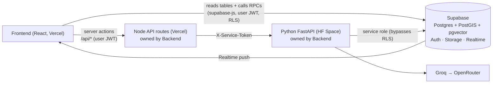
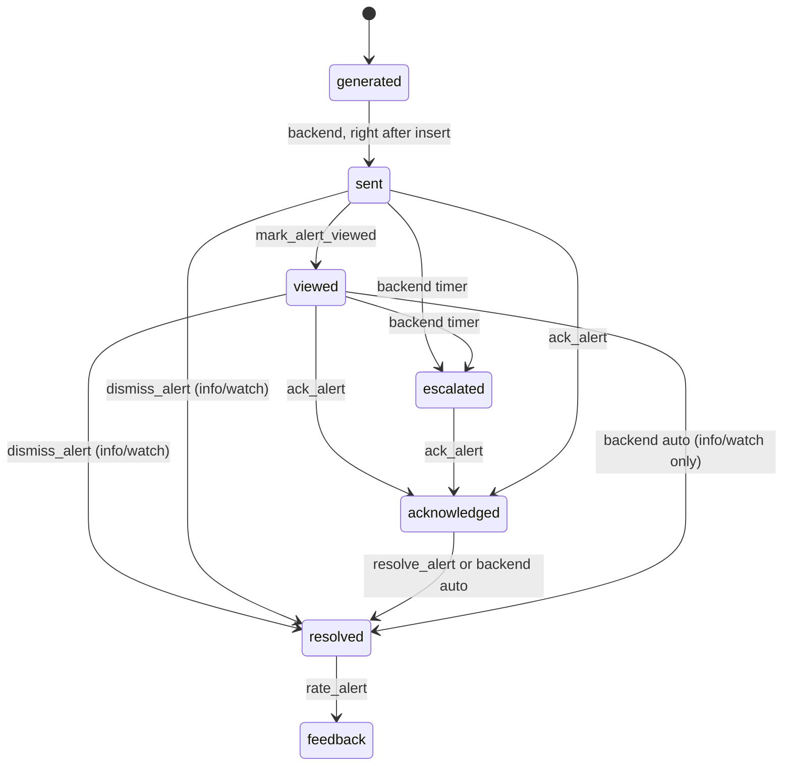
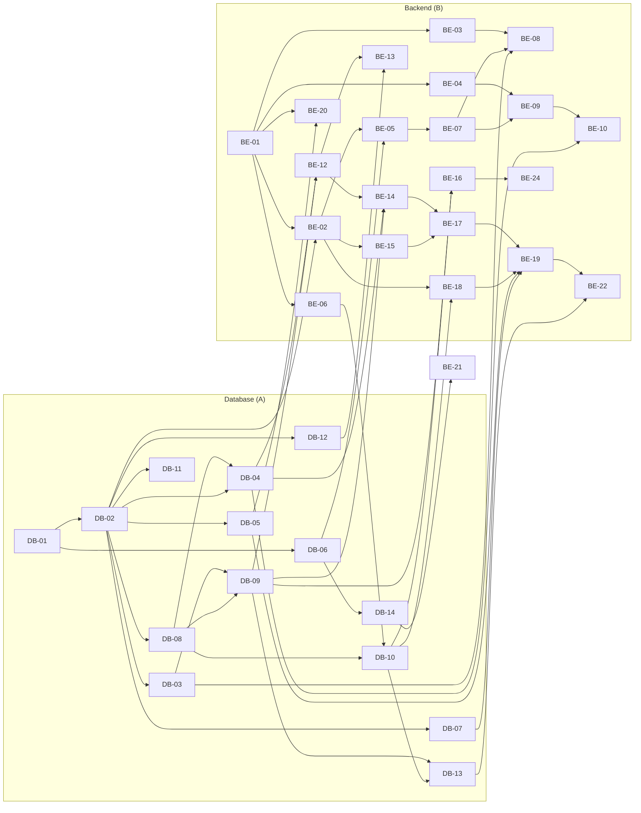

# NWIS: Shared Contracts (read this first)

**Project:** eRTMAC-NWIS, SIH26121 (Oil India Limited)
**Applies to:** all three workstreams: Database (DB), Backend (BE), Frontend (FE)
**Parent document:** `NWIS_PRD.md` (the product PRD). This file turns it into exact names, shapes and rules.
**Status:** v1.0, 28 Sep 2026. Changes follow the process in §2.

> **For AI coding assistants (Gemini, Sonnet, etc.):** this file is the single source of truth. Never invent a table, column, enum value, endpoint, field name or environment variable that is not written here. If a task needs something missing, stop and output `CONTRACT QUESTION: <what is missing and why>` instead of guessing.

---

## Contents
1. [Team and ownership](#1-team-and-ownership)
2. [Rules for changing this contract](#2-rules-for-changing-this-contract)
3. [Repository layout](#3-repository-layout)
4. [Conventions](#4-conventions)
5. [Enums](#5-enums)
6. [Database schema (exact SQL)](#6-database-schema-exact-sql)
7. [Database functions (RPC)](#7-database-functions-rpc)
8. [Realtime, storage, security](#8-realtime-storage-security)
9. [HTTP API](#9-http-api)
10. [Extraction schemas](#10-extraction-schemas)
11. [Risk and alert constants](#11-risk-and-alert-constants)
12. [Alert lifecycle and permissions](#12-alert-lifecycle-and-permissions)
13. [Environment variables](#13-environment-variables)
14. [Master task list: blocked by / blocks](#14-master-task-list-blocked-by--blocks)
15. [Definition of done](#15-definition-of-done)
16. [How to prompt a smaller AI model](#16-how-to-prompt-a-smaller-ai-model)

---

## 1. Team and ownership

| Person | Workstream | Owns | PRD |
| --- | --- | --- | --- |
| Person A | **Database + data** | Supabase project, schema, SQL functions, security (RLS), storage, realtime, seed data (synthetic Assam, Volve, NPD), evaluation set | `01_PRD_DATABASE.md` |
| Person B | **Backend** | Python FastAPI service (Hugging Face Space), document AI (OCR + LLM extraction), search/RAG, risk engine, stream replay, alert engine, Node API routes on Vercel | `02_PRD_BACKEND.md` |
| Person C | **Frontend** | React app on Vercel, all screens, mocks, realtime UI, alert UX, demo mode | `03_PRD_FRONTEND.md` |

**Who calls what**



- The **frontend reads data directly from Supabase** (tables, views, RPCs) using the logged-in user's token. Row Level Security decides what they see.
- The **frontend calls `/api/*` only for server actions**: upload, search, ask, predict tops, correlation, risk recompute, stream control, planning, admin.
- **Human alert actions** (view, acknowledge, resolve, dismiss, rate) are **database RPCs** owned by DB, so permission rules live in one place.
- **System alert actions** (generate, send, escalate, auto-resolve) are done by the **backend alert engine** with the service role.

---

## 2. Rules for changing this contract

1. Any change to §5–§13 needs a pull request that edits this file **first**, then the code.
2. The PR title starts with `contract:` and tags the other two people. It merges only when both approve.
3. Additive changes (new nullable column, new optional field, new endpoint) can merge the same day. Breaking changes (rename, remove, type change) need a version bump of this file and a note in §14 of tasks affected.
4. The Database owner applies schema changes as a **new migration file**; never edit an applied migration. Create files with `supabase migration new <name>` (timestamp prefix, so they always apply in creation order). The `000x_` numbers in the PRDs only show the logical grouping.
5. Deployment is **manual** (no auto-deploy): Vercel via `vercel --prod`, the Space via `git push space main`, database via `supabase db push`. Whoever deploys posts in the team chat.

---

## 3. Repository layout

One GitHub repository (monorepo), named `nwis`.

```
nwis/
├── apps/
│   └── web/                      # FRONTEND + Node API routes (one Vercel project)
│       ├── api/                  # Vercel serverless functions (Node, JavaScript ES modules) — owned by BACKEND
│       │   ├── _lib/             # auth.js, forward.js, errors.js
│       │   ├── documents/upload-url.js  documents.js
│       │   ├── search.js
│       │   ├── ask.js
│       │   ├── wells/[wellboreId]/predict-tops.js
│       │   ├── wells/[wellboreId]/correlation.js
│       │   ├── wells/[wellboreId]/risk.js
│       │   ├── stream/start.js  stream/stop.js  stream/speed.js  stream/drop.js
│       │   ├── planning/brief.js
│       │   ├── admin/users/invite.js  admin/users/[id].js  admin/retrain.js
│       │   └── health.js
│       ├── src/                  # React app — owned by FRONTEND
│       │   ├── app/              # routes, layout
│       │   ├── features/         # map, correlation, risk, alerts, documents, review, search, planning, admin, rig
│       │   ├── components/       # shared UI
│       │   ├── lib/              # supabase.js, api.js, constants.js (copied from §5–§10), units.js
│       │   └── mocks/            # MSW handlers + fixtures
│       ├── index.html  vite.config.js  tailwind.config.js  package.json  vercel.json
├── services/
│   └── ai/                       # BACKEND Python FastAPI (Hugging Face Docker Space)
│       ├── app/
│       │   ├── main.py  config.py  deps.py  db.py
│       │   ├── routers/          # documents.py search.py ask.py wells.py stream.py planning.py admin.py health.py
│       │   ├── ingest/           # classify.py ocr.py parsers/ (witsml.py las.py tabular.py) extract.py validate.py normalize.py
│       │   ├── search/           # embed.py index.py rag.py
│       │   ├── geo/              # mcm.py position.py tops.py correlation.py
│       │   ├── risk/             # l1.py l2.py l3.py fuse.py config.py
│       │   ├── stream/           # replay.py
│       │   ├── alerts/           # engine.py recommend.py
│       │   ├── llm/              # client.py prompts/ cache.py
│       │   └── models/           # pydantic schemas mirroring §10
│       ├── training/             # train_l2.py evaluate.py ocr_bakeoff.py
│       ├── tests/
│       ├── Dockerfile  requirements.txt  README.md (HF Space card)
├── db/                           # DATABASE
│   ├── supabase/
│   │   ├── migrations/           # 0001_extensions.sql 0002_enums.sql 0003_tables.sql ...
│   │   └── seed.sql              # reference data only
│   ├── loaders/                  # python: synth_assam.py volve.py npd.py trajectories.py common.py
│   ├── eval/                     # labelled evaluation set (json) + page images
│   ├── data/                     # downloaded raw data (git-ignored) + small samples (committed)
│   └── README.md                 # data dictionary
├── docs/
│   ├── NWIS_PRD.md
│   └── team/  00_SHARED_CONTRACTS.md  01_PRD_DATABASE.md  02_PRD_BACKEND.md  03_PRD_FRONTEND.md
├── .env.example
└── README.md
```

**Shared Python package:** the WITSML/LAS/tabular parsers live in `services/ai/app/ingest/parsers/` (Backend, task BE-06). The Database loaders import them (`sys.path` add `services/ai`), so there is one parser, not two.

---

## 4. Conventions

**Units (internal storage is always these; convert at ingestion)**

| Quantity | Unit | Column suffix | Notes |
| --- | --- | --- | --- |
| Depth, length | metre | `_m` | MD and TVD positive downward; TVDSS = TVD − KB elevation |
| Mud weight, ECD, slurry density | specific gravity | `_sg` | ppg ÷ 8.345 = SG |
| Volume | cubic metre | `_m3` | bbl × 0.158987 = m³ |
| Flow rate | litre/minute | `_lpm` | gpm × 3.78541 = L/min |
| Pressure | bar | `_bar` | psi × 0.0689476 = bar |
| Weight on bit, hookload | kilonewton | `_kn` | klbf × 4.44822 = kN |
| Torque | kilonewton·metre | `_knm` | kft·lbf × 1.35582 = kN·m |
| ROP | metre/hour | `_m_h` | ft/h × 0.3048 = m/h |
| Angles | degrees | `_deg` | Azimuth 0–360 from true north |
| Dogleg severity | degrees per 30 m | `dls_deg_per_30m` | |
| Hole/casing size | inch | `_in` | industry convention, kept |
| PV | centipoise | `pv_cp` | |
| YP, gels | lbf/100 ft² | `_lbf100ft2` | industry convention, kept |
| Time | UTC, ISO 8601 | `_at`, `t_` | `2026-09-28T10:15:00Z` |
| Duration | hours | `_h` | |
| Coordinates | WGS84 lon/lat | PostGIS `geography(Point,4326)` | Convert Everest 1830 / UTM with pyproj at ingestion |

**Naming:** tables and columns `snake_case`; React components `PascalCase`, JS functions/variables `camelCase`; JSON fields over HTTP are `snake_case` (same as columns, no camelCase conversion anywhere).
**IDs:** `uuid` (`gen_random_uuid()`), except composite keys stated in §6.
**Formation names:** always the canonical `formations.name` (e.g. `Tipam`, `Barail`). Aliases are resolved through `formation_synonyms` at ingestion.
**Well names:** synthetic wells start with `SYN-` (e.g. `SYN-DLJ-03`). Never use real OIL well names on synthetic data.
**Errors over HTTP:** status code + body `{"error": {"code": "NWIS_<UPPER_SNAKE>", "message": "human text", "details": {}}}`. Codes: `NWIS_UNAUTHORIZED` 401, `NWIS_FORBIDDEN` 403, `NWIS_NOT_FOUND` 404, `NWIS_BAD_REQUEST` 400, `NWIS_BAD_STATE` 409, `NWIS_RATE_LIMITED` 429, `NWIS_UPSTREAM` 502, `NWIS_INTERNAL` 500.
**Errors from SQL functions:** `raise exception using errcode = 'P0001', message = 'NWIS_FORBIDDEN: ...'` (message starts with the code).
**Logging:** JSON lines with `ts`, `level`, `service`, `msg`, `request_id`, `user_id`.

---

## 5. Enums

Defined once in SQL (§6) and mirrored in JavaScript constants (`apps/web/src/lib/constants.js`) and Pydantic (`services/ai/app/models/enums.py`).

| Enum | Values |
| --- | --- |
| `user_role` | `rig_engineer`, `rtoc_engineer`, `office_engineer`, `reviewer`, `admin` |
| `provenance` | `direct`, `analog`, `synthetic` |
| `well_status` | `planned`, `drilling`, `completed` |
| `doc_type` | `wcr`, `ddr`, `mud_log`, `program`, `cement_report`, `incident`, `survey`, `las`, `witsml`, `other` |
| `job_status` | `queued`, `running`, `needs_review`, `done`, `failed` |
| `review_status` | `pending`, `approved`, `edited`, `rejected`, `auto_approved` |
| `event_type` | `loss_partial`, `loss_total`, `kick`, `stuck_pipe_diff`, `stuck_pipe_mech`, `tight_hole`, `pack_off`, `hole_instability`, `fishing`, `torque_spike`, `cement_failure`, `equipment_failure`, `other` |
| `risk_type` | `losses`, `stuck_pipe`, `kick`, `torque`, `cementing` |
| `risk_band` | `low`, `moderate`, `elevated`, `high`, `critical` |
| `alert_severity` | `info`, `watch`, `warning`, `critical` |
| `alert_kind` | `lookahead`, `detector`, `system` |
| `alert_state` | `generated`, `sent`, `viewed`, `escalated`, `acknowledged`, `resolved`, `feedback` |
| `resolve_how` | `auto`, `manual`, `dismissed` |
| `alert_outcome` | `event_occurred`, `avoided`, `false_alarm`, `unknown` |
| `confidence_level` | `high`, `medium`, `low` |
| `stream_status` | `stopped`, `live`, `stale`, `lost` |
| `top_source` | `actual`, `prognosis`, `predicted` |

**event_type → risk_type mapping** (used by the backend when writing `events.risk_type`)

| event_type | risk_type |
| --- | --- |
| `loss_partial`, `loss_total` | `losses` |
| `kick` | `kick` |
| `stuck_pipe_diff`, `stuck_pipe_mech`, `tight_hole`, `pack_off`, `hole_instability` | `stuck_pipe` |
| `torque_spike` | `torque` |
| `cement_failure` | `cementing` |
| `fishing`, `equipment_failure`, `other` | `null` (stored, not scored) |

UI labels: `losses` → "Mud losses", `stuck_pipe` → "Stuck pipe", `kick` → "Kick / overpressure", `torque` → "Torque spike", `cementing` → "Cementing issue".

---

## 6. Database schema (exact SQL)

Implemented by DB-02 as migrations. Column names here are final.

```sql
-- 0001_extensions.sql
create extension if not exists postgis;
create extension if not exists vector;
create extension if not exists pg_trgm;

-- 0002_enums.sql
create type user_role as enum ('rig_engineer','rtoc_engineer','office_engineer','reviewer','admin');
create type provenance as enum ('direct','analog','synthetic');
create type well_status as enum ('planned','drilling','completed');
create type doc_type as enum ('wcr','ddr','mud_log','program','cement_report','incident','survey','las','witsml','other');
create type job_status as enum ('queued','running','needs_review','done','failed');
create type review_status as enum ('pending','approved','edited','rejected','auto_approved');
create type event_type as enum ('loss_partial','loss_total','kick','stuck_pipe_diff','stuck_pipe_mech','tight_hole','pack_off','hole_instability','fishing','torque_spike','cement_failure','equipment_failure','other');
create type risk_type as enum ('losses','stuck_pipe','kick','torque','cementing');
create type risk_band as enum ('low','moderate','elevated','high','critical');
create type alert_severity as enum ('info','watch','warning','critical');
create type alert_kind as enum ('lookahead','detector','system');
create type alert_state as enum ('generated','sent','viewed','escalated','acknowledged','resolved','feedback');
create type resolve_how as enum ('auto','manual','dismissed');
create type alert_outcome as enum ('event_occurred','avoided','false_alarm','unknown');
create type confidence_level as enum ('high','medium','low');
create type stream_status as enum ('stopped','live','stale','lost');
create type top_source as enum ('actual','prognosis','predicted');

-- 0003_tables.sql
create table profiles (
  id uuid primary key references auth.users(id) on delete cascade,
  email text,                                 -- copied from auth.users at sign-up (admin screen)
  full_name text,
  role user_role not null default 'office_engineer',
  assigned_wellbore_ids uuid[] not null default '{}',
  created_at timestamptz not null default now()
);

create table wells (
  id uuid primary key default gen_random_uuid(),
  name text not null unique,
  field text,
  basin text,
  operator text,
  surface geography(Point,4326) not null,
  datum_src text not null default 'WGS84',
  kb_elev_m real,
  spud_date date,
  td_md_m real,
  td_tvd_m real,
  status well_status not null default 'completed',
  provenance provenance not null,
  created_at timestamptz not null default now()
);

create table wellbores (
  id uuid primary key default gen_random_uuid(),
  well_id uuid not null references wells(id) on delete cascade,
  name text not null unique,
  kind text not null default 'deviated' check (kind in ('vertical','deviated','horizontal')),
  is_primary boolean not null default true
);

create table survey_stations (
  wellbore_id uuid not null references wellbores(id) on delete cascade,
  md_m real not null,
  inc_deg real not null,
  azi_deg real not null,
  tvd_m real not null,
  north_m real not null,
  east_m real not null,
  dls_deg_per_30m real,
  primary key (wellbore_id, md_m)
);

create table trajectories (
  wellbore_id uuid primary key references wellbores(id) on delete cascade,
  geom geometry(LineStringZ,4326) not null   -- x=lon, y=lat, z=tvd_m (positive down)
);

create table formations (
  name text primary key,
  basin text not null,
  strat_order int not null,                  -- 1 = shallowest
  lithology text,
  typical_risks risk_type[] not null default '{}'
);

create table formation_synonyms (
  alias text primary key,                    -- lowercase, trimmed
  formation text not null references formations(name)
);

create table documents (
  id uuid primary key default gen_random_uuid(),
  well_id uuid references wells(id) on delete set null,
  wellbore_id uuid references wellbores(id) on delete set null,
  doc_type doc_type not null default 'other',
  title text not null,
  file_path text not null,                   -- storage path in bucket 'documents'
  sha256 text not null unique,
  pages int,
  has_text_layer boolean,
  ocr_engine text,
  provenance provenance not null default 'direct',
  uploaded_by uuid references auth.users(id),
  created_at timestamptz not null default now()
);

create table document_pages (
  doc_id uuid not null references documents(id) on delete cascade,
  page_no int not null,                      -- 1-based
  image_path text,                           -- storage path in bucket 'page-images'
  text text,
  ocr_confidence real,                       -- 0..1, null if text layer
  engine text,                               -- 'text_layer' | 'rapidocr' | 'tesseract'
  primary key (doc_id, page_no)
);

create table formation_tops (
  id uuid primary key default gen_random_uuid(),
  wellbore_id uuid not null references wellbores(id) on delete cascade,
  formation text not null references formations(name),
  top_md_m real not null,
  top_tvdss_m real,
  source top_source not null default 'actual',
  uncertainty_m real,
  n_offsets int,                             -- predicted only
  provenance provenance not null,
  doc_id uuid references documents(id) on delete set null,
  page int,
  unique (wellbore_id, formation, source)
);

create table hole_sections (
  id uuid primary key default gen_random_uuid(),
  wellbore_id uuid not null references wellbores(id) on delete cascade,
  hole_size_in real,
  md_from_m real,
  md_to_m real,
  casing_od_in real,
  casing_weight_ppf real,
  casing_grade text,
  shoe_md_m real,
  toc_md_m real,
  planned boolean not null default false,
  provenance provenance not null,
  doc_id uuid references documents(id) on delete set null,
  page int
);

create table cement_jobs (
  id uuid primary key default gen_random_uuid(),
  wellbore_id uuid not null references wellbores(id) on delete cascade,
  job_type text not null check (job_type in ('primary','squeeze','plug')),
  casing_od_in real,
  slurry_density_sg real,
  volume_m3 real,
  returns_to_surface boolean,
  plug_bumped boolean,
  woc_h real,
  cbl_result text,
  issue text,
  provenance provenance not null,
  doc_id uuid references documents(id) on delete set null,
  page int
);

create table mud_records (
  id uuid primary key default gen_random_uuid(),
  wellbore_id uuid not null references wellbores(id) on delete cascade,
  report_date date,
  md_m real,
  mud_type text,
  mw_sg real,
  pv_cp real,
  yp_lbf100ft2 real,
  gel10s_lbf100ft2 real,
  gel10m_lbf100ft2 real,
  filtrate_ml real,
  ecd_sg real,
  chlorides_mgl real,
  provenance provenance not null,
  doc_id uuid references documents(id) on delete set null,
  page int
);

create table iadc_codes (
  code int primary key,
  name text not null,
  is_trouble boolean not null default false
);

create table time_log (
  id uuid primary key default gen_random_uuid(),
  wellbore_id uuid not null references wellbores(id) on delete cascade,
  report_date date,
  t_start timestamptz,
  t_end timestamptz,
  hours real,
  md_m real,
  phase text,
  iadc_code int references iadc_codes(code),
  state text,
  comment text,
  doc_id uuid references documents(id) on delete set null,
  page int
);

create table depth_series (
  wellbore_id uuid not null references wellbores(id) on delete cascade,
  md_m real not null,
  t timestamptz,
  rop_m_h real, wob_kn real, rpm real, torque_knm real, spp_bar real,
  flow_in_lpm real, flow_out_lpm real, pit_vol_m3 real, hookload_kn real,
  mw_sg real, ecd_sg real, gas_total_pct real, dxc real,
  gr_api real,                                -- gamma ray (API units), for correlation tracks
  primary key (wellbore_id, md_m)
);
-- NOTE: for wells being drilled (live or replayed), rows with md_m > stream_state.bit_md_m are
-- "future" data. RLS hides them from users (§8) and the backend must never return them.

create table events (
  id uuid primary key default gen_random_uuid(),
  wellbore_id uuid not null references wellbores(id) on delete cascade,
  event_type event_type not null,
  risk_type risk_type,                        -- from mapping in §5
  md_from_m real not null,
  md_to_m real,
  formation text references formations(name),
  relative_depth real,                        -- 0..1 inside formation
  severity smallint check (severity between 1 and 5),
  npt_h real,
  volume_m3 real,
  description text not null,
  cause text,
  action text,
  outcome text,
  event_date date,
  doc_id uuid references documents(id) on delete set null,
  page int,
  snippet text,
  confidence real,                            -- 0..1
  provenance provenance not null,
  review_status review_status not null default 'pending',
  created_at timestamptz not null default now()
);

create table jobs (
  id uuid primary key default gen_random_uuid(),
  doc_id uuid not null references documents(id) on delete cascade,
  status job_status not null default 'queued',
  stage text,                                 -- 'classify'|'ocr'|'extract'|'validate'|'index'|'done'
  progress int not null default 0 check (progress between 0 and 100),
  error text,
  created_by uuid references auth.users(id),
  created_at timestamptz not null default now(),
  updated_at timestamptz not null default now()
);

create table extracted_fields (
  id uuid primary key default gen_random_uuid(),
  job_id uuid references jobs(id) on delete cascade,
  doc_id uuid not null references documents(id) on delete cascade,
  page int,
  entity text not null check (entity in ('event','formation_top','hole_section','cement_job','mud_record','survey_station','well_header','time_log')),
  entity_id uuid,                             -- row created in the target table (null for well_header)
  field text not null,
  value jsonb,
  confidence real not null,
  reason text,                                -- why flagged, e.g. 'low_ocr_confidence', 'failed_rule:depth_gt_td'
  bbox jsonb,                                 -- {"x":0.12,"y":0.40,"w":0.30,"h":0.03} fractions of page
  review_status review_status not null default 'pending',
  reviewed_by uuid references auth.users(id),
  reviewed_at timestamptz
);

create table chunks (
  id uuid primary key default gen_random_uuid(),
  doc_id uuid not null references documents(id) on delete cascade,
  page int,
  text text not null,
  tsv tsvector generated always as (to_tsvector('english', text)) stored,
  embedding vector(384),
  well_id uuid references wells(id) on delete set null,
  formation text references formations(name),
  md_from_m real,
  md_to_m real
);

create table lessons (
  id uuid primary key default gen_random_uuid(),
  formation text references formations(name),
  event_type event_type not null,
  title text not null,
  problem text not null,
  cause text,
  mitigation text,
  outcome text,
  event_ids uuid[] not null default '{}',
  well_count int not null default 0,
  success_rate real,                          -- share of events where mitigation worked, 0..1
  updated_at timestamptz not null default now()
);

create table risk_scores (
  wellbore_id uuid not null references wellbores(id) on delete cascade,
  md_from_m real not null,
  md_to_m real not null,
  risk_type risk_type not null,
  l1 real, l2 real, l3 real,                  -- probabilities 0..1, null if layer unavailable
  fused real not null,                        -- 0..100
  band risk_band not null,
  confidence confidence_level not null,
  confidence_reason text,
  reasons jsonb not null default '[]',        -- [{"kind":"offset_event","event_id":"..."},{"kind":"shap","feature":"torque_trend","value":0.12}]
  formation text,
  model_version text,
  computed_at timestamptz not null default now(),
  primary key (wellbore_id, md_from_m, risk_type)
);

create table stream_state (
  wellbore_id uuid primary key references wellbores(id) on delete cascade,
  status stream_status not null default 'stopped',
  source text,                                -- 'volve' | 'synthetic' | 'witsml'
  speed int not null default 1,
  bit_md_m real,
  hole_md_m real,
  last_sample_at timestamptz,
  latest jsonb,                               -- latest channel values, keys = depth_series column names
  updated_at timestamptz not null default now()
);

create table alerts (
  id uuid primary key default gen_random_uuid(),
  wellbore_id uuid not null references wellbores(id) on delete cascade,
  kind alert_kind not null,
  risk_type risk_type,                        -- null for system alerts
  severity alert_severity not null,
  state alert_state not null default 'generated',
  dedup_key text not null,
  zone_md_from_m real,
  zone_md_to_m real,
  expected_md_m real,
  formation text,
  score real,
  confidence confidence_level,
  title text not null,
  message text not null,
  recommendation text,
  evidence jsonb not null default '{}',       -- see §11.6
  model_version text,
  created_at timestamptz not null default now(),
  sent_at timestamptz,
  escalated_at timestamptz,
  acknowledged_by uuid references auth.users(id),
  acknowledged_at timestamptz,
  action_note text,
  resolved_by uuid references auth.users(id),
  resolved_at timestamptz,
  resolved_how resolve_how,
  outcome alert_outcome,
  dismiss_reason text,
  useful boolean,
  feedback_by uuid references auth.users(id),
  feedback_at timestamptz
);
create unique index alerts_one_open_per_key on alerts(dedup_key)
  where state not in ('resolved','feedback');

create table alert_views (
  alert_id uuid not null references alerts(id) on delete cascade,
  user_id uuid not null references auth.users(id) on delete cascade,
  viewed_at timestamptz not null default now(),
  primary key (alert_id, user_id)
);

create table model_runs (
  id uuid primary key default gen_random_uuid(),
  risk_type risk_type not null,
  version text not null unique,               -- e.g. 'l2-stuck_pipe-2026-10-04-01'
  metrics jsonb not null,                     -- {"pr_auc":0.41,"baseline_pr_auc":0.28,"precision":..,"recall":..,"n_wells":..}
  params jsonb,
  artifact_path text,                         -- storage path in bucket 'models'
  is_active boolean not null default false,
  created_at timestamptz not null default now()
);

create table llm_cache (
  prompt_hash text primary key,               -- sha256 of provider-independent prompt
  provider text not null,
  model text not null,
  response jsonb not null,
  created_at timestamptz not null default now()
);

create table shift_notes (
  id uuid primary key default gen_random_uuid(),
  wellbore_id uuid not null references wellbores(id) on delete cascade,
  user_id uuid not null references auth.users(id),
  text text not null,
  created_at timestamptz not null default now()
);

create table audit_log (
  id bigint generated always as identity primary key,
  user_id uuid,
  action text not null,                       -- 'alert.ack', 'field.approve', 'doc.upload', 'user.invite', ...
  entity text not null,
  entity_id uuid,
  details jsonb not null default '{}',
  at timestamptz not null default now()
);

-- 0004_indexes.sql
create index on wells using gist (surface);
create index on trajectories using gist (geom);
create index on events (wellbore_id, md_from_m);
create index on events (formation, risk_type);
create index on chunks using gin (tsv);
create index on chunks using hnsw (embedding vector_cosine_ops);
create index on extracted_fields (review_status) where review_status = 'pending';
create index on alerts (wellbore_id, state);
create index on formation_tops (wellbore_id, top_md_m);
create index on time_log (wellbore_id, md_m);
```

**Views (DB-12)**

| View | Columns | Used by |
| --- | --- | --- |
| `v_well_summary` | wellbore_id, well_id, well_name, field, basin, status, provenance, lon, lat, td_md_m, event_count, npt_h_total, top_risk_type | FE well list, map popups |
| `v_npt_by_formation` | formation, risk_type, event_count, npt_h_total, well_count | FE analytics |
| `v_open_alerts` | all `alerts` columns + well_name, where state not in ('resolved','feedback') | FE RTOC alerts screen |
| `v_review_queue` | extracted_fields + doc title + doc_type + page image_path, where review_status='pending' | FE review queue |
| `v_trajectory_geojson` | wellbore_id, well_name, geojson (`ST_AsGeoJSON(ST_Force2D(geom))::json`) | FE map trajectories |

---

## 7. Database functions (RPC)

All in schema `public`, callable from supabase-js as `supabase.rpc('<name>', {...})`. Owned by the Database workstream. Parameter names start with `p_`.

| Function | Returns | Security | Behaviour |
| --- | --- | --- | --- |
| `current_user_role()` | `user_role` | definer, stable | Role from `profiles` for `auth.uid()`; null if none |
| `well_position_at_md(p_wellbore uuid, p_md real)` | table(`lon float8`, `lat float8`, `tvd_m real`) | invoker | Linear interpolation of `survey_stations` (north, east, tvd) at `p_md`; clamp to last station; offset from `wells.surface` using `ST_Project` (north then east) |
| `formation_at_md(p_wellbore uuid, p_md real)` | table(`formation text`, `top_md_m real`, `next_formation text`, `next_top_md_m real`, `relative_depth real`, `source top_source`) | invoker | Uses tops with priority actual > predicted > prognosis; relative_depth = (md − top) / (next_top − top), clamped 0..1 |
| `offsets_within(p_wellbore uuid, p_radius_m real, p_md real default null, p_mode text default 'surface')` | table(`wellbore_id uuid`, `well_id uuid`, `well_name text`, `field text`, `provenance provenance`, `lon float8`, `lat float8`, `surface_distance_m real`, `depth_distance_m real`, `event_count int`) | invoker | Excludes the input wellbore. `surface_distance_m` = geography distance between well surfaces. If `p_md` given: `depth_distance_m` = 3D distance between the active well at `p_md` and the offset at the MD whose TVD is closest to the active TVD. `p_mode='depth'` filters on depth distance, else surface. Ordered by the distance used |
| `events_for_offsets(p_wellbore uuid, p_radius_m real, p_formations text[] default null, p_limit int default 200)` | table(events.*, `well_name text`, `surface_distance_m real`) | invoker | Events of offsets from `offsets_within`, optional formation filter, excludes `review_status='rejected'` |
| `hybrid_search(p_query text, p_embedding vector(384), p_formation text default null, p_event_type text default null, p_field text default null, p_md_from real default null, p_md_to real default null, p_limit int default 20)` | table(`chunk_id uuid`, `doc_id uuid`, `doc_title text`, `page int`, `text text`, `well_name text`, `formation text`, `score real`) | invoker | Reciprocal Rank Fusion (k = 60) of full-text rank (`websearch_to_tsquery`) and cosine similarity (top 50 each), then filters. `p_embedding` may be null → keyword only |
| `mark_alert_viewed(p_alert uuid)` | void | definer | Insert into `alert_views` (ignore duplicate); if state = 'sent' → 'viewed' |
| `ack_alert(p_alert uuid, p_note text default null)` | `alerts` | definer | Permission + state rules §12; sets acknowledged_*; state → 'acknowledged'; audit |
| `resolve_alert(p_alert uuid, p_outcome alert_outcome, p_note text default null)` | `alerts` | definer | §12; sets resolved_* with `resolved_how='manual'`; state → 'resolved'; audit |
| `dismiss_alert(p_alert uuid, p_reason text)` | `alerts` | definer | Info/Watch only; reason required (≥ 5 chars); `resolved_how='dismissed'`, `outcome='false_alarm'`; state → 'resolved'; audit |
| `rate_alert(p_alert uuid, p_useful boolean)` | `alerts` | definer | Only when state = 'resolved'; sets useful + feedback_*; state → 'feedback' |
| `review_field(p_field uuid, p_action text, p_value jsonb default null)` | `extracted_fields` | definer | Role reviewer/admin; `p_action` in ('approve','edit','reject'). approve/edit copy value into the target row column (whitelisted entity→table/column map); reject marks the target row rejected (events) or deletes it (other entities). Special case: `entity='well_header'`, `field='well_id'` (raised by the backend when a document's well cannot be matched, reason `unmatched_well`): approve/edit set `documents.well_id` for the field's `doc_id` from the value (a `wells.id` uuid that must exist, else `NWIS_BAD_REQUEST`) and set `documents.wellbore_id` to that well's `is_primary` wellbore (null if none); `value` is `{"raw": "<name as read>", "value": null or "<uuid>", "unit": null}`, so an unedited approve with a null value raises `NWIS_BAD_REQUEST`. Reject leaves `documents.well_id` null. When every field of an event is reviewed, set `events.review_status`. If all pending fields of a job are done, set job status 'done'. Audit |
| `add_shift_note(p_wellbore uuid, p_text text)` | `shift_notes` | definer | Roles rig/rtoc/office/admin |

---

## 8. Realtime, storage, security

**Realtime (DB-07):** tables in publication `supabase_realtime`: `alerts`, `stream_state`, `risk_scores`, `jobs`. Frontend subscribes with `postgres_changes`, filtered by `wellbore_id=eq.<id>` (alerts, stream_state, risk_scores) or `id=eq.<job_id>` (jobs).

**Storage buckets (DB-06)**

| Bucket | Public | Path pattern | Written by | Read by |
| --- | --- | --- | --- | --- |
| `documents` | no | `incoming/{upload_id}/{filename}` (browser upload via signed upload URL), then moved by backend to `{doc_id}/{filename}` | browser via signed upload URL only; backend (service role) | authenticated (signed URL) |
| `page-images` | no | `{doc_id}/{page_no}.png` | backend | authenticated (signed URL) |
| `models` | no | `{version}.joblib` | backend | backend |

**Row Level Security (DB-05)** — RLS on for every table. Backend uses the service role (bypasses RLS).

| Table(s) | Select | Insert/Update/Delete by users |
| --- | --- | --- |
| Reference: `formations`, `formation_synonyms`, `iadc_codes` | any authenticated | admin only |
| Well data: `wells`, `wellbores`, `survey_stations`, `trajectories`, `formation_tops`, `hole_sections`, `cement_jobs`, `mud_records`, `time_log`, `events`, `lessons`, `risk_scores`, `stream_state`, `documents`, `document_pages`, `chunks`, `model_runs` | any authenticated | none (backend only) |
| `depth_series` | any authenticated, **except rows below the current bit**: `not exists (select 1 from stream_state s where s.wellbore_id = depth_series.wellbore_id and s.bit_md_m is not null and depth_series.md_m > s.bit_md_m)` | none (backend only) |
| `jobs` | creator, reviewer, admin | none |
| `extracted_fields` | reviewer, admin, office_engineer | none (use `review_field`) |
| `alerts` | rig_engineer: only `wellbore_id = any(assigned_wellbore_ids)`; others: all | none (use RPCs) |
| `alert_views` | own rows | via `mark_alert_viewed` |
| `profiles` | own row; admin all | admin only (via Node admin route) |
| `shift_notes` | any authenticated | via `add_shift_note` |
| `audit_log` | admin | none |
| `llm_cache` | none | none |

---

## 9. HTTP API

### 9.1 Rules
- Base path from the browser: `/api` (same Vercel domain). Node routes live in `apps/web/api/`.
- Every request (except `/api/health`) sends `Authorization: Bearer <supabase access_token>`.
- The Node route: (1) verifies the token with `supabase.auth.getUser(token)`, (2) loads `profiles.role`, (3) checks the role list below → 403 if not allowed, (4) forwards to the Space `${AI_SERVICE_URL}/v1/<same path>` with headers `X-Service-Token: ${SERVICE_TOKEN}`, `X-User-Id`, `X-User-Role`, `X-Request-Id`, (5) returns the Space response unchanged. Admin user routes are handled in Node only.
- The Space rejects any request without the correct `X-Service-Token` (401).
- Timeouts: set `maxDuration` for each function in `vercel.json` to what the Vercel Hobby plan allows (check the current limit). Any Space endpoint that can take longer than 8 s must return **202 immediately** and continue in the background (progress through `jobs` / Realtime).
- **File uploads never pass through a Vercel function** (serverless request bodies are limited to about 4.5 MB). The browser gets a signed upload URL from `/api/documents/upload-url`, uploads straight to Supabase Storage, then calls `/api/documents` with the storage path.
- All request/response bodies are JSON with snake_case fields unless stated.

### 9.2 Endpoint list

| Method | Path | Roles | Handled by | Request | Response |
| --- | --- | --- | --- | --- | --- |
| GET | `/api/health` | public | Node → Space | – | `{"ok":true,"space":{"ok":true,"version":"0.1.0","models":{"l2":["stuck_pipe"]}}}` |
| POST | `/api/documents/upload-url` | reviewer, office_engineer, admin | Node only | `{"filename":"DDR_12.pdf","size_bytes":1830211,"mime_type":"application/pdf"}` (≤ 25 MB) | `{"upload_id":"uuid","storage_path":"incoming/<upload_id>/DDR_12.pdf","signed_url":"https://…","token":"…"}` (use with `supabase.storage.from('documents').uploadToSignedUrl(storage_path, token, file)`) |
| POST | `/api/documents` | reviewer, office_engineer, admin | Space | `{"storage_path":"incoming/<upload_id>/DDR_12.pdf","filename":"DDR_12.pdf","well_id":null,"wellbore_id":null,"doc_type":null,"provenance":"direct"}` | 202 `{"document_id":"uuid","job_id":"uuid","duplicate":false}`; if same sha256 exists: 200 `{"document_id":"<existing>","job_id":null,"duplicate":true}` |
| POST | `/api/search` | all | Space | `{"q":"losses in tipam","filters":{"formation":"Tipam","event_type":null,"field":null,"md_from":null,"md_to":null},"limit":20}` | `{"results":[{"chunk_id":"uuid","doc_id":"uuid","doc_title":"WCR SYN-DLJ-03","page":37,"snippet":"…partial losses 15 m3/h…","well_name":"SYN-DLJ-03","formation":"Tipam","score":0.031}]}` |
| POST | `/api/ask` | all | Space | `{"question":"What worked for losses in Tipam?","filters":{},"wellbore_id":null}` | `{"answer_md":"LCM pills … [1] … [2]","evidence":"sufficient","citations":[{"n":1,"chunk_id":"uuid","doc_id":"uuid","doc_title":"…","page":4,"snippet":"…"}],"provider":"groq","model":"llama-3.3-70b-versatile","cached":false}` |
| POST | `/api/wells/{wellbore_id}/predict-tops` | rtoc_engineer, office_engineer, admin | Space | `{"radius_m":10000}` | `{"tops":[{"formation":"Tipam","top_md_m":2310.5,"top_tvdss_m":2261.0,"uncertainty_m":28.4,"n_offsets":5}]}` (also written to `formation_tops` with source 'predicted') |
| GET | `/api/wells/{wellbore_id}/correlation?offsets=uuid,uuid&flatten=Barail&channels=gr_api,rop_m_h,mw_sg,ecd_sg` | all | Space | query (`channels` = `depth_series` column names) | see §9.3 |
| POST | `/api/wells/{wellbore_id}/risk` | all | Space | `{"md_from_m":2400,"md_to_m":2700}` (optional; default bit depth → +300 m) | `{"scores":[<risk_scores rows>]}` (also upserted) |
| POST | `/api/stream/start` | rtoc_engineer, admin | Space | `{"wellbore_id":"uuid","source":"volve","speed":10,"start_md_m":null}` | `{"status":"live"}` |
| POST | `/api/stream/stop` | rtoc_engineer, admin | Space | `{"wellbore_id":"uuid"}` | `{"status":"stopped"}` |
| POST | `/api/stream/speed` | rtoc_engineer, admin | Space | `{"wellbore_id":"uuid","speed":60}` | `{"speed":60}` |
| POST | `/api/stream/drop` | rtoc_engineer, admin | Space | `{"wellbore_id":"uuid","seconds":45}` (demo: stop sending samples for N seconds to show the "stream lost" rules) | `{"dropping_until":"2026-10-04T10:15:45Z"}` |
| POST | `/api/planning/brief` | office_engineer, admin | Space | `{"lat":27.35,"lon":95.30,"planned_td_m":3600,"radius_m":10000}` | see §9.4 |
| POST | `/api/admin/users/invite` | admin | Node only | `{"email":"a@b.in","role":"rig_engineer","full_name":"…","assigned_wellbore_ids":[]}` | `{"user_id":"uuid"}` |
| PATCH | `/api/admin/users/{user_id}` | admin | Node only | `{"role":"rtoc_engineer","assigned_wellbore_ids":["uuid"]}` | `{"ok":true}` |
| POST | `/api/admin/retrain` | admin | Space | `{"risk_types":["stuck_pipe"]}` | 202 `{"model_run_ids":["uuid"]}` |

### 9.3 Correlation response

```json
{
  "flatten_formation": "Barail",
  "wells": [
    {
      "wellbore_id": "uuid",
      "name": "SYN-DLJ-03",
      "is_active": true,
      "shift_m": -42.0,
      "tops": [{"formation": "Tipam", "top_md_m": 2310.5, "source": "predicted", "uncertainty_m": 28.4}],
      "casing": [{"casing_od_in": 9.625, "shoe_md_m": 2280.0}],
      "events": [{"id": "uuid", "event_type": "loss_partial", "md_from_m": 2395.0, "severity": 3, "description": "…"}],
      "tracks": {"md_m": [2300.0, 2300.5], "gr_api": [65.2, 70.1], "rop_m_h": [12.1, 11.8], "mw_sg": [1.18, 1.18], "ecd_sg": [1.25, 1.25]}
    }
  ]
}
```
`shift_m` = amount added to every MD of that well so the flatten formation tops line up with the active well's top. Tracks are down-sampled to at most 2,000 points per well.

### 9.4 Planning brief response

```json
{
  "location": {"lat": 27.35, "lon": 95.30},
  "offsets": [{"wellbore_id": "uuid", "well_name": "SYN-DLJ-03", "surface_distance_m": 2140.0}],
  "predicted_tops": [{"formation": "Tipam", "top_md_m": 2300.0, "uncertainty_m": 35.0, "n_offsets": 4}],
  "risk_profile": [{"md_from_m": 2300, "md_to_m": 2325, "risk_type": "losses", "fused": 58.2, "band": "elevated", "confidence": "medium"}],
  "lessons": [{"id": "uuid", "formation": "Tipam", "event_type": "loss_partial", "title": "…", "mitigation": "…", "well_count": 4}]
}
```

---

## 10. Extraction schemas

The LLM returns JSON matching these shapes (Pydantic in `services/ai/app/models/extraction.py`). Every item carries `page`, `snippet` (≤ 300 chars, verbatim from the page) and `confidence` (0..1, the model's own estimate; the backend combines it with OCR confidence).

```json
{
  "doc_type": "ddr",
  "well_name": "SYN-DLJ-03",
  "report_date": "2019-03-12",
  "well_header": {"field": "Duliajan", "surface_lat": 27.36, "surface_lon": 95.31, "datum": "Everest 1830", "kb_elev_m": 105.2, "spud_date": "2019-02-01", "td_md_m": 3620.0, "td_tvd_m": 3540.0},
  "events": [
    {"event_type": "loss_partial", "md_from_m": 2395.0, "md_to_m": 2410.0, "formation": "Tipam",
     "description": "Partial losses 15 m3/h while drilling", "cause": "Permeable sand", "action": "Pumped 30 m3 LCM pill",
     "outcome": "Losses cured after 2 h", "npt_h": 3.5, "volume_m3": 42.0, "event_date": "2019-03-12",
     "page": 4, "snippet": "Obs. partial losses @ 2395 m 15 m3/hr, pumped LCM pill…", "confidence": 0.86}
  ],
  "formation_tops": [{"formation": "Tipam", "top_md_m": 2310.5, "top_tvdss_m": 2261.0, "source": "actual", "page": 12, "snippet": "…", "confidence": 0.9}],
  "hole_sections": [{"hole_size_in": 12.25, "md_from_m": 900, "md_to_m": 2290, "casing_od_in": 9.625, "casing_weight_ppf": 47, "casing_grade": "N80", "shoe_md_m": 2285, "toc_md_m": 1500, "page": 8, "snippet": "…", "confidence": 0.8}],
  "cement_jobs": [{"job_type": "primary", "casing_od_in": 9.625, "slurry_density_sg": 1.90, "volume_m3": 45.0, "returns_to_surface": false, "plug_bumped": true, "woc_h": 12, "cbl_result": "poor bond 1500–1650 m", "issue": "losses during displacement", "page": 9, "snippet": "…", "confidence": 0.75}],
  "mud_records": [{"report_date": "2019-03-12", "md_m": 2400, "mud_type": "WBM", "mw_sg": 1.18, "pv_cp": 18, "yp_lbf100ft2": 22, "ecd_sg": 1.25, "page": 4, "snippet": "…", "confidence": 0.9}],
  "time_log": [{"t_start": "2019-03-12T06:00:00Z", "t_end": "2019-03-12T09:30:00Z", "hours": 3.5, "md_m": 2395, "phase": "12-1/4in", "iadc_code": 24, "state": "problem", "comment": "…", "page": 4, "confidence": 0.8}],
  "survey_stations": [{"md_m": 2400, "inc_deg": 18.5, "azi_deg": 112.0, "page": 5, "confidence": 0.95}]
}
```

**Rules the backend applies after the LLM (BE-08)**
- Units converted to §4; the raw text value is kept in `extracted_fields.value` as `{"raw":"15 bbl/hr","value":2.38,"unit":"m3/h"}`.
- `formation` resolved through `formation_synonyms` (case-insensitive); unknown → null + reason `unknown_formation`.
- Validation rules (each failure lowers confidence to ≤ 0.5 and sets `reason`): `depth_gt_td` (md > td + 50), `depth_negative`, `formation_order` (tops out of `strat_order`), `date_out_of_range` (before 1950 or in future), `mw_out_of_range` (mw_sg outside 0.8–2.4), `snippet_not_found` (snippet not in page text, fuzzy ratio < 0.8).
- Final confidence = min(llm_confidence, ocr_confidence_of_page or 1.0) after rule penalties.
- Confidence ≥ 0.85 → `auto_approved`; else `pending` (goes to review queue).

---

## 11. Risk and alert constants

Stored in `services/ai/app/risk/config.py` as named constants. These are **initial proposals**; tune after validation and record changes here.

### 11.1 Score bands (0–100)

| Score | `risk_band` | Alert `severity` | Sound | Must acknowledge |
| --- | --- | --- | --- | --- |
| 0–20 | `low` | none | – | – |
| 21–40 | `moderate` | `info` | no | no |
| 41–60 | `elevated` | `watch` | no | no |
| 61–80 | `high` | `warning` | yes | yes |
| 81–100 | `critical` | `critical` | yes, repeating | yes, escalates |

Boundaries: score ≤ 20 → low; 20 < score ≤ 40 → moderate; and so on (use `>`/`<=` exactly like this).

### 11.2 Look-ahead grid
- `LOOKAHEAD_MIN_M = 50`, `LOOKAHEAD_MAX_M = 300`, `INTERVAL_M = 25` → risk is computed for intervals [bit+0, bit+25), … up to bit+300.
- Alerts are raised only for intervals starting between bit+50 and bit+300 (look-ahead), or at the bit (detectors).

### 11.3 L1 offset look-ahead (per interval, per risk type)
- Offsets = `offsets_within(p_wellbore, RADIUS_M=10000, p_md=interval_mid, 'depth')`.
- Weight per offset: `w = exp(-depth_distance_m / 3000)`.
- Hit = the offset has an event of that risk type in the same formation with |relative_depth − interval_relative_depth| ≤ 0.10 (or within ±25 m MD-equivalent if relative depth unknown).
- `l1 = (Σ w·hit + 0.5) / (Σ w + 1.0)` (smoothed rate; 0.5/1.0 is the prior).
- Only offsets that actually drilled that formation count in Σ w.
- If no offset drilled that formation (Σ w = 0), `l1 = null` (unknown), not 0.5.

### 11.4 L3 detectors (live stream)

| Detector | Rule (initial) | Risk type | Floor score |
| --- | --- | --- | --- |
| Losses | flow_out < flow_in × 0.90 for ≥ 120 s, or pit volume falls ≥ 1.0 m³ in 10 min while circulating | losses | 65 |
| Total losses | flow_out < flow_in × 0.50 for ≥ 30 s | losses | 85 |
| Kick | pit gain ≥ 1.6 m³ (≈10 bbl) in 10 min, or flow_out > flow_in × 1.10 for ≥ 60 s | kick | 85 |
| Overpressure trend | dxc falls ≥ 15% over 50 m below its 200 m trend, with gas_total_pct rising | kick | 65 |
| Stuck pipe | hookload overpull > 20% above 30 m moving average on 3 consecutive connections, or torque z-score > 3 with ROP drop > 50% | stuck_pipe | 65 |
| Torque spike | torque rolling z-score > 3.5 (window 60 samples) | torque | 65 |

`l3` = 1.0 when a detector fires, else the detector's normalised signal (0..1) or null when no stream. A firing detector sets `fused = max(fused, floor)`.

### 11.5 Fusion, confidence, capping
- Weights (renormalised over the layers that are not null): `W_L1 = 0.5`, `W_L2 = 0.3`, `W_L3 = 0.2`.
- `fused = 100 × calibrate(W_L1·l1 + W_L2·l2 + W_L3·l3)`; `calibrate` is isotonic regression fitted in BE-16 (identity until fitted).
- Confidence: `high` if ≥ 3 contributing offsets and mean event confidence ≥ 0.8; `medium` if ≥ 2 offsets or mean ≥ 0.6; else `low`. Reason text lists what was missing (e.g. `"1 offset within 10 km; 2 unreviewed events"`).
- **Low confidence caps the alert severity at `watch`** (score is still shown) unless an L3 detector fired.
- Unreviewed events (`review_status='pending'`) count with weight × 0.5; rejected events never count.

### 11.6 Alert `evidence` JSON

```json
{
  "offsets": [{"wellbore_id": "uuid", "well_name": "SYN-DLJ-05", "depth_distance_m": 1850.0,
               "events": [{"id": "uuid", "event_type": "stuck_pipe_diff", "md_from_m": 2860, "npt_h": 18.0, "doc_id": "uuid", "page": 37}]}],
  "lessons": [{"id": "uuid", "title": "…", "mitigation": "…", "success_rate": 0.8}],
  "shap": [{"feature": "torque_trend_30m", "value": 0.12}],
  "detector": {"name": "stuck_pipe", "signal": {"overpull_pct": 24.0}},
  "layers": {"l1": 0.62, "l2": 0.55, "l3": null},
  "sources": [{"doc_id": "uuid", "doc_title": "DDR SYN-DLJ-05 2018-11-02", "page": 4}]
}
```

### 11.7 Timings and keys
- `STREAM_STALE_S = 10`, `STREAM_LOST_S = 30`.
- `ESCALATE_CRITICAL_S = 300`, `ESCALATE_WARNING_S = 900`.
- `RETRIGGER_HYSTERESIS = 15` score points above the band threshold.
- `dedup_key` = `"{wellbore_id}:{risk_type}:{zone_start}"` where `zone_start = floor(zone_md_from_m / 50) * 50`; system alerts use `"{wellbore_id}:system:{name}"`.
- `ENGINE_TICK_S = 5` (alert engine loop).

---

## 12. Alert lifecycle and permissions



| Action | Who | Allowed from state | Severity limit |
| --- | --- | --- | --- |
| generate, send | backend | – / generated | any |
| escalate | backend | sent, viewed (warning ≥ 900 s, critical ≥ 300 s unacknowledged) | warning, critical |
| view | any user who can see the alert | sent (others: just record the view) | any |
| acknowledge | rig_engineer assigned to the wellbore; rtoc_engineer; admin | sent, viewed, escalated | any |
| resolve (manual) | rtoc_engineer, admin: any severity; rig_engineer (assigned): info, watch | acknowledged (warning/critical); sent/viewed/acknowledged (info/watch) | see who |
| dismiss | rig_engineer (assigned), rtoc_engineer, admin | sent, viewed | info, watch only |
| auto-resolve | backend | acknowledged (any); sent/viewed (info/watch) — when bit_md > zone_md_to + 25 **and** fused score < band threshold; never while stream status is `lost` | any |
| rate (feedback) | the resolver, or any rig/rtoc engineer on that well | resolved | any |
| re-trigger | backend | a new row (the old one is resolved) | when band rises, a detector fires, or score ≥ threshold + 15 |

System alerts: `Stream lost` (kind `system`, severity `warning`) is generated when `stream_state.status` becomes `lost`, and auto-resolved when it returns to `live`.

---

## 13. Environment variables

`.env.example` at repo root lists all of these with empty values. Never commit real values.

| Variable | Used by | Example / note |
| --- | --- | --- |
| `VITE_SUPABASE_URL` | FE | `https://xxxx.supabase.co` |
| `VITE_SUPABASE_ANON_KEY` | FE | anon public key |
| `VITE_API_BASE` | FE | `/api` |
| `VITE_USE_MOCKS` | FE | `true` to use MSW mocks |
| `SUPABASE_URL` | Node, Space, loaders | same as above |
| `SUPABASE_SERVICE_ROLE_KEY` | Node, Space, loaders | **secret** |
| `SUPABASE_DB_URL` | Space, loaders | Postgres connection string (pooler) — **secret** |
| `AI_SERVICE_URL` | Node | `https://<user>-nwis-ai.hf.space` |
| `SERVICE_TOKEN` | Node, Space | long random string — **secret** |
| `GROQ_API_KEY` | Space | **secret** |
| `GROQ_MODEL` | Space | `openai/gpt-oss-20b` (verified with `--ping`; `llama-3.3-70b-versatile` is retired on Groq) |
| `OPENROUTER_API_KEY` | Space | **secret** |
| `OPENROUTER_MODEL` | Space | a `:free` model chosen after bake-off |
| `EMBED_MODEL` | Space, loaders | `BAAI/bge-small-en-v1.5` (384 dims) |
| `OCR_ENGINE` | Space | `rapidocr` (fallback `tesseract`) |
| `LOG_LEVEL` | Space | `INFO` |

---

## 14. Master task list: blocked by / blocks

"Blocked by (start)" = cannot begin until done. "Blocked by (integrate)" = can be built against mocks/fixtures, but needs these to finish and test against real data. Sprints are order, not dates (the finale dates are not announced).

### 14.1 Database (Person A)

| ID | Task | Sprint | Blocked by (start) | Blocks |
| --- | --- | --- | --- | --- |
| DB-01 | Supabase project + extensions + CLI | S1 | – | DB-02, DB-06 |
| DB-02 | Enums + tables + indexes (§6) | S1 | DB-01 | DB-03, DB-04, DB-05, DB-07, DB-08, DB-10, DB-11, DB-12, BE-02 |
| DB-03 | Reference data: formations, synonyms, IADC codes | S1 | DB-02 | DB-09, BE-08 |
| DB-04 | Spatial + search SQL functions (§7 geo + hybrid_search) | S2 | DB-02, DB-08 | BE-10, BE-12, BE-14, FE-05 (integrate) |
| DB-05 | Roles, RLS, lifecycle + review RPCs | S1 | DB-02 | BE-19, BE-20, FE-03/FE-09/FE-11 (integrate) |
| DB-06 | Storage buckets + policies | S1 | DB-01 | DB-14, BE-05, FE-10 (integrate) |
| DB-07 | Realtime publication | S1 | DB-02 | BE-19, FE-09/FE-10 (integrate) |
| DB-08 | Trajectory builder (Minimum Curvature) | S1 | DB-02 | DB-04, DB-09, DB-10, DB-11 |
| DB-09 | Synthetic Assam dataset generator | S2 | DB-03, DB-08 | DB-13, BE-11, BE-12, BE-14, BE-16, FE-05 (integrate) |
| DB-10 | Volve loader | S2 | DB-02, DB-08, BE-06 | DB-13, BE-16, BE-18 |
| DB-11 | NPD FactPages loader (Should) | S3 | DB-02, DB-08 | – |
| DB-12 | Views | S2 | DB-02 | BE-13, FE-15 (integrate) |
| DB-13 | Seed/reset scripts + data dictionary | S3 | DB-09, DB-10 | BE-22 |
| DB-14 | Labelled evaluation set | S2 | DB-06 | BE-21 |

### 14.2 Backend (Person B)

| ID | Task | Sprint | Blocked by (start) | Blocks |
| --- | --- | --- | --- | --- |
| BE-01 | FastAPI skeleton, Dockerfile, Space deploy, service-token auth | S1 | – | BE-02, BE-03, BE-04, BE-06, BE-20 |
| BE-02 | DB access layer + Pydantic models | S1 | BE-01, DB-02 | BE-05, BE-15, BE-18 |
| BE-03 | LLM client (Groq → OpenRouter, cache) | S1 | BE-01 | BE-08, BE-10, BE-11 |
| BE-04 | Embedding service | S1 | BE-01 | BE-09 |
| BE-05 | Upload, jobs, document classifier | S2 | BE-02, DB-06 | BE-07, FE-10 (integrate) |
| BE-06 | Structured parsers (WITSML, LAS, CSV/Excel) | **S1 (early!)** | BE-01 | DB-10 |
| BE-07 | OCR pipeline (Docling + RapidOCR, Tesseract fallback) | S2 | BE-05 | BE-08, BE-09, BE-21 |
| BE-08 | LLM extraction + normalisation + validation + review rows | S2 | BE-03, BE-07, DB-03 | BE-21, FE-11 (integrate) |
| BE-09 | Chunking + indexing | S2 | BE-04, BE-07 | BE-10 |
| BE-10 | Search + Ask (RAG with citations) | S3 | BE-03, BE-09, DB-04 | FE-12 (integrate) |
| BE-11 | Lessons builder | S3 | BE-03, DB-09 | BE-19 (optional) |
| BE-12 | Predicted tops (IDW) + position helpers | S3 | DB-04, DB-09 | BE-13, BE-14, BE-23 |
| BE-13 | Correlation endpoint | S3 | BE-12, DB-12 | FE-06 (integrate) |
| BE-14 | Risk L1 | S3 | BE-12, DB-04, DB-09 | BE-17, BE-23 |
| BE-15 | Risk L3 detectors | S3 | BE-02 | BE-17 |
| BE-16 | Risk L2 training + calibration + SHAP | S3 | DB-09, DB-10 | BE-24 (and improves BE-17) |
| BE-17 | Fusion, bands, confidence, risk endpoint | S3 | BE-14, BE-15 | BE-19, FE-07 (integrate) |
| BE-18 | Stream replay | S3 | BE-02, DB-10 | BE-19, FE-08/FE-16 (integrate) |
| BE-19 | Alert engine (lifecycle, dedup, escalation, stream-lost) | S4 | BE-17, BE-18, DB-05, DB-07 | BE-22, FE-09 (integrate) |
| BE-20 | Node API routes on Vercel | S2 | BE-01, DB-05 | BE-22, BE-24, FE-10/FE-12/FE-16 (integrate) |
| BE-21 | Evaluation: OCR bake-off + extraction P/R | S2–S3 | BE-07, BE-08, DB-14 | OCR gate |
| BE-22 | Warm-up script + demo readiness | S4 | DB-13, BE-19, BE-20 | – |
| BE-23 | Planning brief (Should) | S4 | BE-12, BE-14 | FE-13 (integrate) |
| BE-24 | Admin: retrain endpoint | S4 | BE-16, BE-20 | FE-14 (integrate) |

### 14.3 Frontend (Person C)

| ID | Task | Sprint | Blocked by (start) | Blocked by (integrate) | Blocks |
| --- | --- | --- | --- | --- | --- |
| FE-01 | Scaffold, design system, Vercel deploy | S1 | – | – | FE-02, FE-03 |
| FE-02 | Mock layer (MSW + fixtures) | S1 | FE-01 | – | (enables all FE work before BE) |
| FE-03 | Auth + role routing | S1 | FE-01 | DB-05 | FE-04, FE-10, FE-12, FE-14, FE-15 |
| FE-04 | Active wells list + well workspace shell | S1 | FE-03 | DB-12 | FE-05…FE-09, FE-13, FE-16 |
| FE-05 | Map tab | S2 | FE-04 | DB-04, DB-09 | FE-17 |
| FE-06 | Correlation tab | S3 | FE-04 | BE-13 | FE-17 |
| FE-07 | Risk tab | S3 | FE-04 | BE-17 | FE-17 |
| FE-08 | Rig view | S3 | FE-04, FE-09 (banner component) | BE-18 | FE-17 |
| FE-09 | Alerts: realtime, banner, sound, card, evidence, actions | S3 | FE-04 | DB-05, DB-07, BE-19 | FE-08, FE-17 |
| FE-10 | Documents upload + job progress | S2 | FE-03 | BE-05, BE-20, DB-06, DB-07 | FE-11 |
| FE-11 | Review queue | S2 | FE-10 | BE-08, DB-05 | FE-17 |
| FE-12 | Search / Ask + source viewer | S2 | FE-03 | BE-10, BE-20 | FE-17 |
| FE-13 | Planning page (Should) | S4 | FE-04 | BE-23 | FE-17 |
| FE-14 | Admin: users + model page | S4 | FE-03 | BE-24, BE-20 | FE-17 |
| FE-15 | Analytics | S4 | FE-03 | DB-12 | FE-17 |
| FE-16 | Replay control panel (demo) | S3 | FE-04 | BE-18, BE-20 | FE-17 |
| FE-17 | Polish, states, accessibility, demo mode | S4 | FE-05…FE-16 | – | – |

### 14.4 Dependency graph (start-blocking edges only)



**Critical path:** DB-01 → DB-02 → DB-08 → DB-09 → BE-12 → BE-14 → BE-17 → BE-19 → FE-09 (integrate) → BE-22.
**Cross-team hand-off to watch:** BE-06 (parsers) is needed by DB-10 (Volve loader) — Backend must finish BE-06 in sprint 1.

---

## 15. Definition of done

A task is done when **all** of these hold:
1. Code merged to `main` through a pull request reviewed by one teammate.
2. Names match this contract exactly (tables, columns, enums, endpoints, fields).
3. Tests listed in the task pass locally (`pytest`, `vitest`, or the SQL test script).
4. No secrets in code; new env vars added to `.env.example` and §13.
5. The task's acceptance checks in its PRD are demonstrated (screenshot or command output in the PR).
6. Works for **any** well and depth — no hardcoded well names, depths or scores outside test fixtures.
7. The task's "Blocks" owners are told in chat that it is done.

---

## 16. How to prompt a smaller AI model

Smaller models do well with one small, fully specified task at a time. Use this routine for every task in the three PRDs.

1. **New chat per task.** Do not continue a long chat across tasks.
2. **Paste context in this order:** (a) the "Global context" block below, (b) the sections of this file the task lists under "Read first", (c) the task's prompt block from your PRD, (d) any existing files the task says to modify (paste their current content).
3. **Ask for a plan first**, then the code. Reply "go" only when the plan matches the task.
4. **Ask for tests with the code**, run them yourself, and paste failures back verbatim.
5. **Never accept invented names.** If the model uses a name not in this contract, point to the section and ask it to fix it.
6. **Keep diffs small.** If the model rewrites unrelated files, reject and ask for only the listed files.

**Global context block (paste at the top of every task chat):**

```text
You are a senior engineer on "NWIS" (Nearby Wells Intelligence System), a hackathon
project for Oil India Limited (SIH26121). It warns drilling engineers about risks
(mud losses, stuck pipe, kicks/overpressure, torque spikes, cementing issues) ahead of
the drill bit, using events extracted from historical reports of nearby (offset) wells.

Stack (fixed, do not change):
- Database: Supabase (Postgres 15+, PostGIS, pgvector, Auth, Storage, Realtime).
- Backend: Python 3.11 FastAPI in a Docker Hugging Face Space; Node 20 JavaScript (ES modules)
  serverless functions in apps/web/api on Vercel; LLMs via OpenAI-compatible APIs
  (Groq primary, OpenRouter fallback); embeddings BAAI/bge-small-en-v1.5 (384 dims);
  OCR Docling + RapidOCR with Tesseract fallback.
- Frontend: React 18 + JavaScript (JSX, no TypeScript) + Vite + Tailwind + React Router + TanStack Query +
  supabase-js v2 + react-leaflet + Plotly, hosted on Vercel.

Hard rules:
1. The shared contract (00_SHARED_CONTRACTS.md) is the source of truth. Use its table,
   column, enum, endpoint and field names exactly. Never invent new ones. If something
   is missing, output "CONTRACT QUESTION: ..." and stop.
2. Internal units are SI as listed in the contract (metres, SG, m3, L/min, bar, kN, kN.m).
3. No hardcoded well names, depths or scores in application code.
4. Only create or modify the files listed in the task.
5. Write tests together with the code. Show how to run them.
6. Output: first a short plan, then each file in full inside a fenced block with its path.
```
