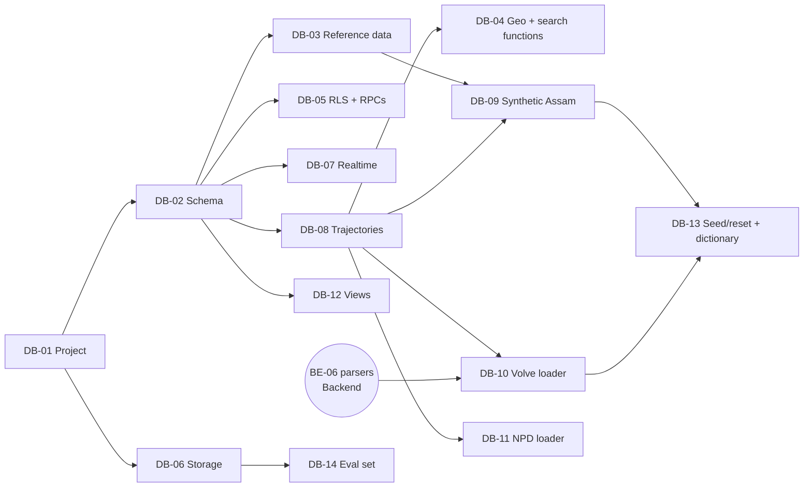

# NWIS PRD: Database + Data (Person A)

**Workstream:** Database. **Owner:** Person A.
**Read first:** `00_SHARED_CONTRACTS.md` (all of it, especially §4–§8, §11, §12, §14).
**You deliver:** the Supabase project, every table/function/policy in the contract, and all the data the demo runs on (synthetic Assam wells, real Volve data, optional NPD wells, and a labelled evaluation set).

---

## 1. Your goal in one paragraph

Build the single database that the backend and frontend both depend on. Your first two tasks (DB-01, DB-02) unblock almost everyone, so do them first and announce them. After that, your most valuable work is **data**: without realistic wells, trajectories, formation tops and events, the map, correlation, risk engine and alerts have nothing to show. Your data must work for any well and any depth: no special-case wells.

## 2. What you own and what you do not

| You own | You do not own (but must support) |
| --- | --- |
| `db/supabase/migrations/*.sql`, `db/supabase/seed.sql` | Python FastAPI code (Backend) |
| All SQL functions in contract §7 | Node API routes (Backend) |
| RLS policies, storage buckets, realtime publication | React screens (Frontend) |
| `db/loaders/*.py` (synthetic, Volve, NPD, trajectories) | The WITSML/LAS parsers themselves (Backend BE-06; you import them) |
| `db/eval/` labelled evaluation set | Extraction quality evaluation code (Backend BE-21) |
| `db/README.md` data dictionary | |

## 3. Tools and setup

- Supabase account (free tier) + **Supabase CLI** (`supabase login`, `supabase link`, `supabase db push`).
- Python 3.11 for loaders: `psycopg[binary]`, `numpy`, `pandas`, `pyproj`, `shapely`, `reportlab` (synthetic PDFs), `faker`, `pytest`.
- A SQL client (Supabase SQL editor is enough).
- Put secrets in `.env` (never commit): `SUPABASE_URL`, `SUPABASE_SERVICE_ROLE_KEY`, `SUPABASE_DB_URL`.

## 4. Task order at a glance



| Sprint | Tasks | Unblocks |
| --- | --- | --- |
| S1 | DB-01, DB-02, DB-03, DB-05, DB-06, DB-07, DB-08 | All backend DB work; frontend real auth |
| S2 | DB-04, DB-09, DB-10, DB-12, DB-14 | Map, risk engine, search, stream replay, evaluation |
| S3 | DB-11, DB-13 | Richer map; one-command demo reset |

---

## 5. Tasks

Each task lists: goal, blocked by, blocks, files, detailed spec, acceptance checks, and a **prompt** to paste into your AI model (after the Global context block from contract §16).

---

### DB-01 Supabase project, extensions and CLI

- **Goal:** a working Supabase project linked to the repo, with PostGIS, pgvector and pg_trgm enabled.
- **Blocked by:** nothing.
- **Blocks:** DB-02, DB-06.
- **Files:** `db/supabase/config.toml` (from `supabase init`), `db/supabase/migrations/0001_extensions.sql`, `.env.example` (add the three DB variables), `db/README.md` (setup section).

**Steps**
1. Create a free Supabase project named `nwis` (region closest to India, e.g. Mumbai `ap-south-1` if offered).
2. In the repo: `cd db && supabase init && supabase link --project-ref <ref>`.
3. Write `0001_extensions.sql` exactly as contract §6.
4. `supabase db push`, then check in the SQL editor: `select extname from pg_extension;` shows `postgis`, `vector`, `pg_trgm`.
5. Share the project URL and anon key with the team (chat, not git). Share the service role key and DB URL only with Backend.
6. Invite the other two teammates to the Supabase project (Organisation → Members).

**Acceptance**
- [ ] `supabase db push` runs clean on an empty project.
- [ ] Extensions query returns all three.
- [ ] Teammates can open the dashboard.

**Prompt**
```text
Task DB-01. Read contract §3 (repo layout), §6 (0001_extensions.sql), §13 (env vars).
Create:
1. db/supabase/migrations/0001_extensions.sql — exactly the three "create extension if not exists" lines from §6.
2. db/README.md — a "Setup" section: install Supabase CLI, supabase login, supabase init (inside db/),
   supabase link --project-ref <ref>, supabase db push, and how to verify extensions with
   "select extname from pg_extension;". Also a "Secrets" section saying which env vars exist and
   that .env is never committed.
3. Add SUPABASE_URL, SUPABASE_SERVICE_ROLE_KEY, SUPABASE_DB_URL (empty values) to .env.example.
Do not create any tables yet.
```

---

### DB-02 Enums, tables and indexes

- **Goal:** the complete schema from contract §6, as migrations.
- **Blocked by:** DB-01.
- **Blocks:** DB-03, DB-04, DB-05, DB-07, DB-08, DB-10, DB-11, DB-12, BE-02.
- **Files:** `db/supabase/migrations/0002_enums.sql`, `0003_tables.sql`, `0004_indexes.sql`, `db/tests/test_schema.sql`.

**Spec**
- Copy §6 **exactly**. Same order: enums → tables → indexes. Tables must be created in dependency order (e.g. `formations` before `formation_tops`, `documents` before `document_pages`).
- Add `updated_at` trigger for `jobs` and `stream_state`: a function `set_updated_at()` that sets `new.updated_at = now()` before update.
- Enable RLS on every table in this migration (`alter table <t> enable row level security;`) — policies come in DB-05. Until DB-05 lands, only the service role can read, which is fine for Backend.
- `db/tests/test_schema.sql`: a script that inserts one well → wellbore → survey stations → formation top → event → alert, selects them back, then rolls back (`begin; … rollback;`).

**Acceptance**
- [ ] `supabase db push` succeeds.
- [ ] `test_schema.sql` runs without errors in the SQL editor.
- [ ] Inserting a second open alert with the same `dedup_key` fails (unique partial index).
- [ ] Announce in chat: "DB-02 done — schema live" (unblocks Backend BE-02).

**Prompt**
```text
Task DB-02. Read contract §5 (enums) and §6 (exact SQL) fully.
Create these migration files with the SQL from §6, split exactly as the "-- 000x" comments show:
- db/supabase/migrations/0002_enums.sql
- db/supabase/migrations/0003_tables.sql  (tables in dependency order; add at the end:
  a plpgsql function set_updated_at() returning trigger that sets new.updated_at = now(),
  and BEFORE UPDATE triggers on jobs and stream_state; then "alter table ... enable row level
  security;" for every table created in this file)
- db/supabase/migrations/0004_indexes.sql
Also create db/tests/test_schema.sql: inside begin; ... rollback; insert one row into wells
(surface = ST_GeogFromText('POINT(95.31 27.36)'), provenance 'synthetic', name 'SYN-TEST-01'),
one wellbores row, three survey_stations rows, one formations row ('Tipam','Upper Assam',5),
one formation_tops row, one events row, one alerts row (kind 'lookahead', severity 'watch',
dedup_key 'x:losses:2400', title 't', message 'm'); then try a second open alert with the same
dedup_key inside a savepoint and show it fails; select counts.
Do not change any column name or type from §6.
```

---

### DB-03 Reference data: formations, synonyms, IADC codes

- **Goal:** the lookup tables that make extraction and correlation consistent.
- **Blocked by:** DB-02.
- **Blocks:** DB-09, BE-08.
- **Files:** `db/supabase/seed.sql` (reference data only), `db/data/reference/formations.csv`, `formation_synonyms.csv`, `iadc_codes.csv`.

**Spec**

`formations` — two basins so the app works with both synthetic Assam wells and real Volve wells:

| name | basin | strat_order | lithology | typical_risks |
| --- | --- | --- | --- | --- |
| Alluvium | Upper Assam | 1 | Unconsolidated sand, clay | {losses} |
| Dhekiajuli | Upper Assam | 2 | Sand, clay | {losses} |
| Namsang | Upper Assam | 3 | Sandstone, conglomerate | {losses} |
| Girujan | Upper Assam | 4 | Mottled clay | {stuck_pipe} |
| Tipam | Upper Assam | 5 | Sandstone, minor shale | {losses,cementing} |
| Barail | Upper Assam | 6 | Shale, sandstone, coal | {stuck_pipe,torque} |
| Kopili | Upper Assam | 7 | Shale | {kick,stuck_pipe} |
| Sylhet | Upper Assam | 8 | Limestone, shale | {losses,kick} |
| Langpar | Upper Assam | 9 | Sandstone, shale | {kick} |
| Basement | Upper Assam | 10 | Granite, gneiss | {} |
| Nordland Gp | Volve | 1 | Clay, sand | {} |
| Hordaland Gp | Volve | 2 | Claystone | {stuck_pipe} |
| Rogaland Gp | Volve | 3 | Claystone, tuff | {} |
| Shetland Gp | Volve | 4 | Chalk, limestone | {losses} |
| Cromer Knoll Gp | Volve | 5 | Marl | {} |
| Viking Gp | Volve | 6 | Shale (Draupne, Heather) | {stuck_pipe,kick} |
| Hugin Fm | Volve | 7 | Sandstone (reservoir) | {losses} |
| Skagerrak Fm | Volve | 8 | Sandstone, conglomerate | {losses} |
| Smith Bank Fm | Volve | 9 | Claystone | {} |

> The Assam rows are a simplified stratigraphic column for the synthetic data. The typical risks follow widely reported drilling behaviour (Tipam losses, Barail coal/shale instability, deeper overpressure) and are **plausible, not OIL data**. Refine them if OIL shares real information.

`formation_synonyms` — lowercase aliases, at least: `tipam sandstone`, `tipam ss`, `tipam fm` → Tipam; `barail group`, `barail coal shale`, `barail fm` → Barail; `girujan clay`, `girujan clays` → Girujan; `kopili shale` → Kopili; `sylhet limestone`, `sylhet lst` → Sylhet; `hugin`, `hugin formation` → Hugin Fm; `draupne`, `heather`, `viking` → Viking Gp; `skagerrak` → Skagerrak Fm; plus each canonical name in lowercase → itself.

`iadc_codes` — the 34 IADC DDR Plus main codes (1 Rig up/tear down/rig move … 34 Subsea installations) with `is_trouble = true` for 3 Reaming, 5 Circulate & condition mud, 19 Fishing, 24 Non-productive time, 27 Well control. Source: IADC "Definitions of the 34 Main Codes of the IADC DDR Plus" (link in `NWIS_PRD.md` Sources).

**Acceptance**
- [ ] `select count(*) from formations` = 19; `iadc_codes` = 34; synonyms ≥ 30.
- [ ] `select formation from formation_synonyms where alias = 'tipam ss'` → `Tipam`.

**Prompt**
```text
Task DB-03. Read contract §5, §6 (formations, formation_synonyms, iadc_codes).
Create CSV files in db/data/reference/:
- formations.csv with columns name,basin,strat_order,lithology,typical_risks (typical_risks as a
  Postgres array literal like {losses,cementing}) containing exactly the 19 rows in the task table
  (I will paste it below).
- formation_synonyms.csv with columns alias,formation: every canonical name lowercased mapped to
  itself, plus these aliases: [paste list].
- iadc_codes.csv with columns code,name,is_trouble for the 34 IADC DDR Plus codes:
  1 Rig up / tear down / rig move; 2 Drilling; 3 Reaming; 4 Coring; 5 Circulate & condition mud;
  6 Trips; 7 Service / maintain rig; 8 Repair rig; 9 Replacing drill line; 10 Deviation survey;
  11 Wireline logs; 12 Run casing & cement; 13 Wait on cement; 14 Rig up/down BOP; 15 Test BOP;
  16 Drill stem test; 17 Plug back; 18 Squeeze cement; 19 Fishing; 20 Specialized directional work;
  21 Run/retrieve riser equipment; 22 Surface testing; 23 Other; 24 Non-productive time;
  25 Operating status; 26 Safety; 27 Well control; 28 Coiled tubing; 29 Perforating;
  30 Tubing trips; 31 Treating & well completion; 32 Swabbing; 33 Testing; 34 Subsea installations.
  is_trouble = true only for 3, 5, 19, 24, 27.
Then create db/supabase/seed.sql that inserts all three with INSERT ... ON CONFLICT DO NOTHING
(write the rows as SQL VALUES, generated from the CSVs, not \copy, so it runs in the SQL editor).
Add a short db/tests/test_reference.sql with the count checks from the acceptance list.
[paste the formations table and synonyms list from the PRD here]
```

---

### DB-04 Spatial and search SQL functions

- **Goal:** the geo and search functions in contract §7 (`well_position_at_md`, `formation_at_md`, `offsets_within`, `events_for_offsets`, `hybrid_search`).
- **Blocked by:** DB-02, DB-08 (you need real survey data to test).
- **Blocks:** BE-10, BE-12, BE-14; FE-05 (integrate).
- **Files:** `db/supabase/migrations/0006_geo_functions.sql`, `0007_search_function.sql`, `db/tests/test_geo.sql`, `db/tests/test_search.sql`.

**Spec (exact behaviour)**
1. `well_position_at_md(p_wellbore, p_md)`
   - Find stations s1 (largest md ≤ p_md) and s2 (smallest md ≥ p_md). If p_md is beyond the last station, use the last station. If there are no stations, return the surface point with `tvd_m = p_md` (vertical assumption).
   - Linear interpolation factor `f = (p_md − s1.md) / (s2.md − s1.md)` (f = 0 if equal).
   - `north = s1.north + f·(s2.north − s1.north)`; same for east and tvd.
   - Position = `ST_Project(ST_Project(surface, north, 0), east, pi()/2)` for positive values (use `abs()` and azimuth pi for negative north, 3·pi/2 for negative east). Return `ST_X`, `ST_Y` of the resulting geography cast to geometry, and tvd.
2. `formation_at_md(p_wellbore, p_md)` — pick tops for the wellbore with source priority actual (1) > predicted (2) > prognosis (3) per formation (`distinct on (formation)` ordered by priority), then the formation with the largest `top_md_m ≤ p_md`; next = smallest top > p_md. `relative_depth = (p_md − top)/(next_top − top)` clamped 0..1, or null if no next top.
3. `offsets_within(p_wellbore, p_radius_m, p_md, p_mode)` — see contract §7. For depth distance: get active position P at p_md (lon, lat, tvd). For each candidate offset, find the survey station (or interpolated MD) whose `tvd_m` is closest to P.tvd; get that position Q. `depth_distance_m = sqrt(ST_Distance(P2d, Q2d)^2 + (P.tvd − Q.tvd)^2)`. Candidate pre-filter: `ST_DWithin(surface, active_surface, p_radius_m + 5000)`. `event_count` = count of events of the offset with `review_status <> 'rejected'`.
4. `events_for_offsets(...)` — join events with the offsets from `offsets_within(p_wellbore, p_radius_m, null, 'surface')`; filter formations if `p_formations` not null; order by surface distance, md.
5. `hybrid_search(...)` — two CTEs: `kw` = top 50 by `ts_rank_cd(tsv, websearch_to_tsquery('english', p_query))` where tsv matches; `vec` = top 50 by `embedding <=> p_embedding` (skip if p_embedding is null). Score = Σ 1/(60 + rank) across both lists. Join documents (title), wells (name). Apply optional filters (formation equality, field via wells.field, md overlap with chunk md range, event_type via `exists` on events with same doc_id and page). Return top `p_limit`.
- All functions `language sql` or `plpgsql`, `stable`, `security invoker`, and granted `execute` to `authenticated` and `service_role`.

**Acceptance**
- [ ] On synthetic data (after DB-09): for a vertical well, `well_position_at_md` at 1000 m returns the surface lon/lat and tvd 1000.
- [ ] For a deviated well with 500 m east displacement at TD, the returned point is ~500 m east of surface (check with `ST_Distance`).
- [ ] `offsets_within(x, 5000)` returns only wells ≤ 5 km, excludes x, ordered by distance.
- [ ] `offsets_within(x, 5000, 2500, 'depth')` differs from surface mode for deviated wells.
- [ ] `hybrid_search('tipam losses', null)` returns keyword matches only; with an embedding returns fused results.
- [ ] Each function runs in < 200 ms for 50 wells (check `explain analyze`).

**Prompt**
```text
Task DB-04. Read contract §6 (tables wells, wellbores, survey_stations, formation_tops, events,
chunks, documents) and §7 (function signatures and behaviour). I paste the exact behaviour spec
from my PRD below — implement it precisely.
Create:
- db/supabase/migrations/0006_geo_functions.sql with well_position_at_md, formation_at_md,
  offsets_within, events_for_offsets.
- db/supabase/migrations/0007_search_function.sql with hybrid_search.
- db/tests/test_geo.sql and db/tests/test_search.sql: inside begin; ... rollback; build a tiny
  fixture (3 wells: one vertical at POINT(95.30 27.35), one deviated 2 km east with stations
  reaching 500 m east displacement, one 20 km away), then assert with DO blocks that raise
  exceptions on failure for each acceptance check.
Use PostGIS geography for distances (metres). Grant execute on each function to authenticated
and service_role. Functions are STABLE and SECURITY INVOKER. Keep parameter names p_*.
[paste the DB-04 spec section here]
```

---

### DB-05 Roles, RLS policies, lifecycle and review RPCs

- **Goal:** security and all human-action RPCs (contract §7 lifecycle + `review_field` + `add_shift_note`, §8 RLS table, §12 permissions).
- **Blocked by:** DB-02.
- **Blocks:** BE-19, BE-20; FE-03, FE-09, FE-11 (integrate).
- **Files:** `db/supabase/migrations/0005_auth_rls.sql`, `0008_alert_rpcs.sql`, `0009_review_rpcs.sql`, `db/tests/test_rls.sql`, `db/tests/test_alert_rpcs.sql`.

**Spec**
1. **Profiles on sign-up:** trigger on `auth.users` insert → insert `profiles(id, email, full_name)` with default role `office_engineer` (`email` from `new.email`, `full_name` from `raw_user_meta_data->>'full_name'`).
2. `current_user_role()` as contract §7 (`security definer`, `set search_path = public`).
3. **Policies** exactly per contract §8. Helper for rig engineers: `wellbore_id = any((select assigned_wellbore_ids from profiles where id = auth.uid()))`.
4. **Alert RPCs** (`security definer`, `set search_path = public`), each:
   - Loads the alert `for update`; raises `NWIS_NOT_FOUND` if missing.
   - Checks role and assignment per contract §12 table; raises `NWIS_FORBIDDEN`.
   - Checks allowed "from" states and severity limits per §12; raises `NWIS_BAD_STATE`.
   - Updates the row and inserts `audit_log(user_id, action, entity='alert', entity_id, details)` with actions `alert.view`, `alert.ack`, `alert.resolve`, `alert.dismiss`, `alert.rate`.
   - Returns the updated alert row.
   - `dismiss_alert` requires `length(trim(p_reason)) >= 5`.
   - `resolve_alert` by a rig engineer is allowed only for `info`/`watch`.
   - `rate_alert` allowed only from `resolved`; sets `state='feedback'`.
5. **`review_field(p_field, p_action, p_value)`**:
   - Role must be `reviewer` or `admin`.
   - Whitelist map entity → table: `event→events`, `formation_top→formation_tops`, `hole_section→hole_sections`, `cement_job→cement_jobs`, `mud_record→mud_records`, `survey_station→survey_stations` (identify by wellbore_id + md_m from value), `time_log→time_log`, `well_header→wells` (columns field, kb_elev_m, spud_date, td_md_m, td_tvd_m only).
   - The column must exist in that table (check `information_schema.columns`), else `NWIS_BAD_REQUEST`.
   - approve: copy `extracted_fields.value->'value'` (or `value` if scalar) into the column via `format('update %I set %I = $1 where id = $2', …)` with the correct cast (`::real`, `::text`, `::date`, enum types as text cast).
   - edit: same, using `p_value`, and store `p_value` into `extracted_fields.value`; status `edited`.
   - reject: status `rejected`; for `event` set `events.review_status='rejected'`; for other entities delete the target row if every field of that row is rejected.
   - After any action: if the event has no pending fields left → `events.review_status` = `approved` (or `edited` if any edited). If the job has no pending fields → `jobs.status='done'`, `stage='done'`, `progress=100`.
   - Audit `field.approve|field.edit|field.reject`.
6. `add_shift_note(p_wellbore, p_text)` — roles rig (assigned)/rtoc/office/admin.
7. **Seed test users** (for the team): a SQL snippet in `db/README.md` that sets roles for 5 test accounts after they sign up (`update profiles set role = ... where id = (select id from auth.users where email = ...)`).

**Acceptance**
- [ ] As a rig engineer not assigned to well X: `select * from alerts where wellbore_id = X` returns 0 rows.
- [ ] Rig engineer acknowledging a `critical` alert on an assigned well works; dismissing it raises `NWIS_BAD_STATE`.
- [ ] Office engineer calling `ack_alert` raises `NWIS_FORBIDDEN`.
- [ ] `rate_alert` on an unresolved alert raises `NWIS_BAD_STATE`.
- [ ] `review_field` approve writes the value into the target row and flips job to `done` when it is the last pending field.
- [ ] Every RPC call writes one `audit_log` row.
- [ ] Test script uses `set local role authenticated; set local request.jwt.claims = '{"sub":"<uuid>"}';` to simulate users.

**Prompt (split into two chats)**
```text
Task DB-05 part 1 (RLS). Read contract §6 (profiles and all tables), §7 (current_user_role),
§8 (RLS table), §12 (permissions).
Create db/supabase/migrations/0005_auth_rls.sql:
1. Trigger function handle_new_user() on auth.users AFTER INSERT → insert into profiles(id, email,
   full_name) values (new.id, new.email, new.raw_user_meta_data->>'full_name'). SECURITY DEFINER, search_path public.
2. current_user_role() returns user_role, SQL, STABLE, SECURITY DEFINER, search_path public.
3. RLS policies for every table exactly as the §8 table says. Name policies "<table>_<action>_<who>".
   For alerts: rig_engineer sees only rows where wellbore_id = any(assigned_wellbore_ids of their
   profile); all other roles see all rows. No insert/update/delete policies for users except where
   §8 says so (profiles select own row; admin select all).
Create db/tests/test_rls.sql that simulates users with
  set local role authenticated; set local request.jwt.claims = '{"sub":"<uuid>"}';
and asserts the acceptance checks with DO blocks.
```
```text
Task DB-05 part 2 (RPCs). Read contract §7 (lifecycle RPCs, review_field, add_shift_note) and
§12 (lifecycle diagram + permission table). Implement exactly those rules.
Create db/supabase/migrations/0008_alert_rpcs.sql with mark_alert_viewed, ack_alert,
resolve_alert, dismiss_alert, rate_alert; and 0009_review_rpcs.sql with review_field and
add_shift_note. All SECURITY DEFINER, set search_path = public, plpgsql.
Errors: raise exception using errcode='P0001', message='NWIS_FORBIDDEN: <text>' (or
NWIS_BAD_STATE / NWIS_NOT_FOUND / NWIS_BAD_REQUEST).
Each RPC writes one audit_log row (actions: alert.view, alert.ack, alert.resolve, alert.dismiss,
alert.rate, field.approve, field.edit, field.reject, note.add).
review_field: use the entity→table whitelist below; verify the column exists in
information_schema.columns; build the UPDATE with format() and %I; never concatenate raw input.
[paste the DB-05 spec items 4–6 here]
Create db/tests/test_alert_rpcs.sql covering every row of the §12 permission table (allowed and
forbidden cases) and the review_field acceptance checks.
```

---

### DB-06 Storage buckets and policies

- **Goal:** the three private buckets in contract §8.
- **Blocked by:** DB-01.
- **Blocks:** DB-14, BE-05; FE-10 (integrate).
- **Files:** `db/supabase/migrations/0010_storage.sql`.

**Spec**
- Insert buckets `documents`, `page-images`, `models` into `storage.buckets` with `public = false`; `documents` file size limit 25 MB; allowed MIME types for `documents`: `application/pdf`, `image/png`, `image/jpeg`, `image/tiff`, `text/csv`, `application/vnd.openxmlformats-officedocument.spreadsheetml.sheet`, `application/xml`, `text/xml`, `text/plain`, `application/octet-stream` (LAS).
- Policies on `storage.objects`: `select` for `authenticated` on `documents` and `page-images`; no user insert/update/delete (backend uses service role). `models`: no user access.
- **Browser uploads** use a signed upload URL created by the Node route `/api/documents/upload-url` with the service role (`createSignedUploadUrl` on path `incoming/{upload_id}/{filename}`). This works without a user insert policy. The backend later moves the file to `{doc_id}/{filename}`.
- Frontend reads files through **signed URLs** (`createSignedUrl`, 1 hour).

**Acceptance**
- [ ] Service role can upload to all three; an authenticated user can create a signed URL for `documents/x.pdf` but cannot upload.

**Prompt**
```text
Task DB-06. Read contract §8 (storage buckets table). Create
db/supabase/migrations/0010_storage.sql that inserts the three buckets into storage.buckets
(id, name, public=false, file_size_limit, allowed_mime_types) with ON CONFLICT DO NOTHING, and
creates storage.objects policies: SELECT for role authenticated where bucket_id in
('documents','page-images'); nothing else for users. Add a comment block explaining that the
backend uploads with the service role and the frontend uses createSignedUrl. MIME list: [paste].
```

---

### DB-07 Realtime publication

- **Goal:** live updates for `alerts`, `stream_state`, `risk_scores`, `jobs`.
- **Blocked by:** DB-02.
- **Blocks:** BE-19; FE-09, FE-10 (integrate).
- **Files:** `db/supabase/migrations/0011_realtime.sql`.

**Spec**
- `alter publication supabase_realtime add table alerts, stream_state, risk_scores, jobs;`
- `alter table alerts replica identity full;` (so updates carry the full row) — same for `stream_state`, `jobs`.
- Realtime respects RLS: a rig engineer receives only alerts for assigned wells (verify).

**Acceptance**
- [ ] A small Node or browser test subscribed to `alerts` receives an insert made with the service role within 2 s.
- [ ] A rig engineer not assigned to the well receives nothing.

**Prompt**
```text
Task DB-07. Read contract §8 (Realtime). Create db/supabase/migrations/0011_realtime.sql adding
alerts, stream_state, risk_scores, jobs to publication supabase_realtime and setting replica
identity full on alerts, stream_state, jobs. Also create db/tests/realtime_check.mjs: a Node 20
script using @supabase/supabase-js v2 that signs in with TEST_EMAIL/TEST_PASSWORD from env,
subscribes to postgres_changes on public.alerts, and prints events for 60 s; with instructions
in comments to insert a test alert from the SQL editor and see it arrive.
```

---

### DB-08 Trajectory builder (Minimum Curvature)

- **Goal:** turn MD/inclination/azimuth surveys into TVD/north/east/DLS and a PostGIS line, for every wellbore.
- **Blocked by:** DB-02.
- **Blocks:** DB-04, DB-09, DB-10, DB-11.
- **Files:** `db/loaders/trajectories.py`, `db/loaders/common.py` (DB connection, bulk insert helpers), `db/tests/test_trajectories.py`.

**Spec**
- Function `mcm(md, inc_deg, azi_deg) -> (tvd, north, east, dls_deg_per_30m)` (numpy arrays). Minimum Curvature Method:
  - For each pair of stations: β = arccos(cos(I2−I1) − sin I1 · sin I2 · (1 − cos(A2−A1))). Clamp the arccos input to [−1, 1].
  - Ratio factor RF = (2/β)·tan(β/2); RF = 1 when β < 1e−6.
  - ΔN = ΔMD/2 · (sin I1 cos A1 + sin I2 cos A2) · RF; ΔE = ΔMD/2 · (sin I1 sin A1 + sin I2 sin A2) · RF; ΔTVD = ΔMD/2 · (cos I1 + cos I2) · RF.
  - DLS = β (degrees) · 30 / ΔMD.
  - First station: if md > 0 and not at surface, prepend a tie-in (0, 0, 0).
- Function `build_trajectory(conn, wellbore_id)`: read stations (md, inc, azi), compute, update `tvd_m`, `north_m`, `east_m`, `dls_deg_per_30m`, and upsert `trajectories.geom` as `LINESTRING Z` of (lon, lat, tvd) points using the same `ST_Project` logic as `well_position_at_md` (compute in SQL via one `insert … select` or in Python with pyproj Geod `fwd`).
- CLI: `python -m db.loaders.trajectories --all` rebuilds every wellbore.
- `common.py`: `get_conn()` from `SUPABASE_DB_URL`; `copy_rows(conn, table, columns, rows)` using `COPY FROM STDIN`; `to_si(value, unit)` conversions from contract §4.

**Acceptance**
- [ ] Unit test: vertical well (inc 0) → tvd = md, north = east = 0.
- [ ] Unit test: constant inclination 90°, azimuth 90° from md 1000 to 2000 → east increases by 1000, tvd constant.
- [ ] Unit test against a hand-checked textbook example (build section): values within 0.1 m.
- [ ] Every wellbore in the DB has a `trajectories` row after `--all`.

**Prompt**
```text
Task DB-08. Read contract §4 (units), §6 (survey_stations, trajectories, wells, wellbores).
Create:
1. db/loaders/common.py: get_conn() using psycopg 3 and env SUPABASE_DB_URL; copy_rows(conn,
   table, columns, rows) using cursor.copy("COPY ... FROM STDIN"); to_si(value, unit) supporting
   ft→m, ppg→sg, bbl→m3, gpm→lpm, psi→bar, klbf→kn, kft.lbf→knm, ft/h→m/h (factors in §4).
2. db/loaders/trajectories.py with:
   - mcm(md, inc_deg, azi_deg) -> tvd, north, east, dls (numpy), Minimum Curvature Method as
     specified below (clamp arccos input; RF=1 for tiny beta; tie-in at 0 if first md > 0).
   - build_trajectory(conn, wellbore_id): read stations ordered by md, compute, UPDATE the four
     columns, and upsert trajectories.geom as a LineStringZ(lon, lat, tvd) in EPSG:4326 using
     pyproj.Geod(ellps='WGS84').fwd from the well surface point (north then east offsets).
   - CLI: --wellbore <uuid> or --all.
3. db/tests/test_trajectories.py (pytest): vertical case, horizontal east case, and one build
   section example; tolerance 0.1 m.
[paste the MCM formulas from the PRD]
```

---

### DB-09 Synthetic Assam dataset generator

- **Goal:** a realistic, clearly labelled synthetic field that makes every NWIS feature demonstrable in Assam terms.
- **Blocked by:** DB-03, DB-08.
- **Blocks:** DB-13, BE-11, BE-12, BE-14, BE-16; FE-05 (integrate).
- **Files:** `db/loaders/synth_assam.py`, `db/loaders/synth_docs.py` (fake DDR/WCR PDFs), `db/data/synth_config.yaml`, `db/tests/test_synth.py`.

**Spec**
- **Deterministic:** `--seed 42` gives the same data every run.
- **Area:** 30 wells in three clusters inside lat 26.9–27.6 N, lon 94.8–95.6 E, cluster names used as `field`: `SYN-Duliajan`, `SYN-Naharkatiya`, `SYN-Moran`. Well names `SYN-DLJ-01…`, `SYN-NHK-01…`, `SYN-MRN-01…`. `basin = 'Upper Assam'`, `provenance = 'synthetic'`, `operator = 'SYNTHETIC'`, `datum_src = 'WGS84'`.
- **Status:** 26 `completed`, 3 `drilling` (the demo active wells, one per cluster), 1 `planned`.
- **Trajectories:** 40% vertical, 50% deviated (kick-off 800–1500 m, build 2–3°/30 m to 20–45°, hold), 10% horizontal-ish (up to 80°). TD 3,200–4,200 m MD. Survey every 30 m → run DB-08 builder.
- **Formation tops:** per well, from a regional surface: base depths (TVD) Alluvium 0, Dhekiajuli 250, Namsang 900, Girujan 1300, Tipam 2200, Barail 2850, Kopili 3500, Sylhet 3700, Langpar 3900; add a regional dip (depth increases ~40 m/km toward the south-east) and per-well noise σ = 15 m. Convert TVD → MD via the trajectory. Source `actual` for completed wells; for drilling wells only tops above the current bit depth are `actual`, the rest are withheld (NWIS predicts them).
- **Hole sections/casing:** 17½" to ~350 m (13⅜"), 12¼" to top Tipam −30 m (9⅝"), 8½" to TD (7" liner or 5½"). Cement jobs per casing; 15% of 9⅝" jobs have `issue` (losses during displacement / poor CBL) when the well had Tipam losses.
- **Mud records:** every 100 m; MW rises with depth (1.05 → 1.60 SG), +0.05–0.10 in Kopili/Sylhet.
- **Events** (probabilities per well per formation, spatially correlated — wells near each other share hazards; use a smooth random field per cluster):
  - Tipam: losses 55% (partial 45%, total 10%), mostly in the lower third.
  - Girujan: tight hole 30%.
  - Barail: stuck pipe (diff or mech) 35%, pack-off 15%, torque spike 25%, hole instability 20%.
  - Kopili/Sylhet: kick 15% (higher in `SYN-Moran`), losses in Sylhet 20%.
  - Cementing failures linked to Tipam losses (as above).
  - Each event: md range, severity 1–5, npt_h (lognormal, median 6 h), volume_m3 for losses, description/cause/action/outcome text from templates with variety (≥ 5 templates per event type), `review_status='approved'`, `confidence` 0.9–1.0, `provenance='synthetic'`.
- **Depth series:** for every well, 0.5 m sampling from surface to TD: ROP, WOB, RPM, torque, SPP, flow in/out, pit volume, hookload, MW, ECD, gas, dxc and **gr_api** (shale/clay 90–130 API, sandstone 35–65, coal 20–45, limestone 15–35, with noise), generated from formation-dependent baselines plus noise.
- **Drilling (active) wells get the full series to TD too.** The part below the current bit is "future" data: RLS hides it (contract §8) and the stream replay reveals it sample by sample. Their **future events are NOT inserted into `events`** (that would leak the answer). Write them instead to `db/data/synth_truth/<well_name>.json` (`[{event_type, md_from_m, md_to_m, formation}]`) so the team can show "the alert came before a hazard that really happens". The pre-event signatures are still injected into the hidden series. **Inject signatures before/at events** so detectors and ML can learn: torque rising + ROP falling 10–30 m before stuck pipe; flow_out/flow_in < 0.9 and pit volume falling at losses; pit gain + flow_out > flow_in at kicks; dxc decrease + gas rise approaching overpressure.
- **Documents:** `synth_docs.py` writes for 10 wells a 6–10 page WCR PDF and 5 DDR PDFs using reportlab, containing the same facts as the DB rows (header, tops table, casing table, complications section, time log). Save to `db/data/synth_docs/`. Render 3 of them as **scanned-looking images** (rasterise, rotate 0.5–1.5°, add noise) to test OCR. These are uploaded through the app by Backend/Frontend tests — do not insert them into `documents` directly.
- **Lessons:** none (Backend BE-11 builds them).
- Everything inserted with `COPY` for speed; the whole run < 3 minutes.

**Acceptance**
- [ ] 30 wells, each with trajectory, ≥ 8 tops, ≥ 3 hole sections, depth series, and a plausible event mix (print a summary table by formation × risk type).
- [ ] Running twice with the same seed produces identical row counts and the same first event.
- [ ] `offsets_within` from each drilling well finds ≥ 5 offsets within 10 km.
- [ ] Every event depth lies inside its formation's interval for that well.
- [ ] 10 WCR + 50 DDR PDFs created; 3 scanned-style.
- [ ] Each drilling well has a truth file with at least one future event within 300 m below its start depth, and no rows in `events` below its start depth.
- [ ] As an authenticated user, `select max(md_m) from depth_series where wellbore_id = <drilling well>` returns the bit depth, not TD.

**Prompt (split into three chats)**
```text
Task DB-09 part 1 (wells, trajectories, tops, casing, mud). Read contract §4, §5, §6.
Create db/data/synth_config.yaml (all numbers from the spec below) and db/loaders/synth_assam.py
with functions generate_wells(cfg, rng), generate_surveys(well, rng), generate_tops(well, cfg,
rng), generate_casing_and_cement(well, rng), generate_mud(well, tops, rng), and a main() with
--seed and --reset (delete rows where provenance='synthetic' first). Use db/loaders/common.py
(copy_rows, get_conn) and call trajectories.build_trajectory for each wellbore after inserting
stations. Use numpy.random.default_rng(seed). Well names and fields exactly as the spec.
[paste DB-09 spec: area, status, trajectories, tops, hole sections, mud]
```
```text
Task DB-09 part 2 (events + depth series). Continue db/loaders/synth_assam.py. Add
generate_events(well, tops, cluster_field, rng) using the per-formation probabilities and a
smooth spatial random field per cluster (e.g. sum of 5 Gaussian bumps with random centres), and
generate_depth_series(well, tops, events, rng) at 0.5 m to TD with formation baselines (including
gr_api by lithology), noise, and the injected pre-event signatures listed below. For wells with
status 'drilling': generate events for the whole well, insert only those above the start depth
into events, and write the rest to db/data/synth_truth/<well_name>.json. Event text from >=5 templates per event_type in
db/loaders/templates/event_text.yaml. Map event_type→risk_type using contract §5. Print a summary
table (formation x risk_type counts) at the end.
[paste DB-09 spec: events, depth series]
```
```text
Task DB-09 part 3 (synthetic documents). Create db/loaders/synth_docs.py that reads the synthetic
wells from the DB and writes, for 10 wells, a WCR PDF (header, formation tops table, casing and
cement table, drilling complications section listing that well's events with depth and formation,
bit record) and 5 DDR PDFs (IADC-style header block, time log table with IADC codes, mud
properties, remarks mentioning that day's events) using reportlab. Then rasterise 3 PDFs to
page images with slight rotation (0.5–1.5°), Gaussian noise and JPEG artefacts, and save them
as image-only PDFs (these simulate scans). Output folder db/data/synth_docs/. Add a pytest that
checks file counts and that each WCR mentions its well name.
```

---

### DB-10 Volve loader (real public data)

- **Goal:** load real Volve drilling data so NWIS is proven on real reports and real telemetry.
- **Blocked by:** DB-02, DB-08, **BE-06** (Backend parsers).
- **Blocks:** DB-13, BE-16, BE-18.
- **Files:** `db/loaders/volve.py`, `db/data/volve/README.md` (download instructions + licence), `db/tests/test_volve.py`.

**Spec**
- **Download:** the Equinor Volve dataset (free registration on Equinor's data portal). Read and follow its licence; record the licence name and link in `db/data/volve/README.md`. Raw files go in `db/data/volve/raw/` (git-ignored). Commit only a 2-report sample for tests.
- **Wells:** create one `wells` row per Volve well (field `Volve`, basin `Volve`, provenance `direct`, status `completed`). Surface location from the dataset's well header (convert UTM zone 31N (EPSG:23031 or 25831, as stated in the data) to WGS84 with pyproj). The Volve wells are drilled from one platform, so surface locations are almost identical — **this is the showcase for at-depth distance**.
- **Surveys:** from WITSML `trajectory` objects → `survey_stations` → run DB-08 builder.
- **Formation tops:** from the well's `formation marker`/strat data if present in the dataset; otherwise from the well picks file in the dataset. Map names through `formation_synonyms` (add Volve synonyms if missing — additive change to DB-03 seed).
- **DDRs:** parse every WITSML `drillReport` with `services/ai/app/ingest/parsers/witsml.py` (BE-06). For each report:
  - create a `documents` row (`doc_type='witsml'`, `file_path` = storage path after uploading the XML to bucket `documents`, `provenance='direct'`, `has_text_layer=true`),
  - insert `time_log` rows (one per `activity`: dTimStart, dTimEnd, md, phase, proprietaryCode→`state`, comments),
  - insert `mud_records` from `fluid`,
  - do **not** create events here — events from free-text comments are extracted by the Backend LLM pipeline (BE-08) when it processes these documents (run it in batch in S3). This keeps one extraction path.
- **Logs:** depth-indexed drilling logs (ROP, WOB, RPM, torque, SPP, flow, hookload, MW) → `depth_series` (SI units; map mnemonics in `db/loaders/volve_mnemonics.yaml`). Down-sample to 0.5 m.
- Idempotent: rerun skips documents whose `sha256` exists.

**Acceptance**
- [ ] All Volve wells present with trajectories; at-depth distances between two wells differ from surface distance by > 500 m at reservoir depth.
- [ ] ≥ 1,000 `time_log` rows and ≥ 100 `documents` rows (WITSML DDRs).
- [ ] `depth_series` exists for ≥ 3 wells (needed for the stream replay).
- [ ] A test on the committed 2-report sample passes without the full dataset.

**Prompt**
```text
Task DB-10. Read contract §3 (shared parsers note), §4 (units), §6 (wells, wellbores,
survey_stations, formation_tops, documents, time_log, mud_records, depth_series).
The Backend has written services/ai/app/ingest/parsers/witsml.py with functions
parse_drill_report(xml_bytes) -> DrillReport and parse_trajectory(xml_bytes) -> list[Station]
(I paste their signatures and dataclasses below). Import them (add services/ai to sys.path).
Create db/loaders/volve.py with:
- load_wells(conn, raw_dir): create wells/wellbores (field 'Volve', basin 'Volve',
  provenance 'direct'), converting UTM coordinates to WGS84 with pyproj (source CRS from the file).
- load_trajectories(conn, raw_dir): parse trajectory XML → survey_stations → build_trajectory.
- load_ddrs(conn, supabase_client, raw_dir): for each drillReport XML: sha256; skip if exists;
  upload to bucket 'documents' at '{doc_id}/{filename}' with the service role; insert documents
  (doc_type 'witsml'), time_log and mud_records rows. Do NOT create events.
- load_logs(conn, raw_dir): depth logs → depth_series at 0.5 m, units via common.to_si, mnemonic
  map in db/loaders/volve_mnemonics.yaml.
- main() with --raw-dir and --only {wells,trajectories,ddrs,logs}.
Create db/tests/test_volve.py using the 2 sample reports in db/data/volve/sample/.
[paste BE-06 parser signatures here]
```

---

### DB-11 NPD FactPages loader (Should)

- **Goal:** add many real Norwegian wellbores (location, formation tops, wellbore history text) to show scale and real text.
- **Blocked by:** DB-02, DB-08.
- **Blocks:** nothing (enrichment).
- **Files:** `db/loaders/npd.py`, `db/data/npd/README.md`.

**Spec**
- Download CSV exports from the Norwegian Offshore Directorate FactPages (wellbore list with coordinates, lithostratigraphy tops, and wellbore history if available). Record source and date in the README.
- Load only wellbores within ~50 km of Volve (keeps it small and relevant): `wells` (provenance `direct`, field from the CSV), vertical-assumption trajectories if no surveys, `formation_tops` (map group/formation names through synonyms; add synonyms as needed).
- Wellbore history text → save as `.txt` files in `db/data/npd/history/` for Backend to ingest through the normal document pipeline (so events are extracted the same way).

**Acceptance**
- [ ] ≥ 50 NPD wellbores near Volve on the map with tops.
- [ ] History text files ready for ingestion.

**Prompt**
```text
Task DB-11. Read contract §6 (wells, wellbores, formation_tops, formation_synonyms). Create
db/loaders/npd.py that reads the NPD FactPages CSV exports I place in db/data/npd/raw/ (I will
paste the header row of each CSV), filters wellbores within 50 km of a given point (Volve,
lat 58.44, lon 1.89), inserts wells/wellbores (provenance 'direct', basin 'Volve' region label
'North Sea'), creates vertical trajectories (stations at 0 and TD, inc 0) when no survey data,
inserts formation tops mapped through formation_synonyms (log unknown names to a CSV for me to
review), and writes each wellbore's history text to db/data/npd/history/<wellbore>.txt.
[paste CSV headers]
```

---

### DB-12 Views

- **Goal:** the five views in contract §6.
- **Blocked by:** DB-02.
- **Blocks:** BE-13; FE-15 (integrate); also used by FE-04, FE-09, FE-11.
- **Files:** `db/supabase/migrations/0012_views.sql`.

**Spec**
- `v_well_summary`: one row per wellbore; `lon`/`lat` from `ST_X/ST_Y(surface::geometry)`; `event_count` and `npt_h_total` exclude rejected events; `top_risk_type` = the risk type with most events (null if none).
- `v_npt_by_formation`: group events (not rejected, risk_type not null) by formation, risk_type.
- `v_open_alerts`: alerts not in ('resolved','feedback') joined with wells.name via wellbores.
- `v_review_queue`: pending extracted_fields joined with documents (title, doc_type) and document_pages (image_path) on (doc_id, page).
- `v_trajectory_geojson`: wellbore_id, well_name, `ST_AsGeoJSON(ST_Force2D(geom))::json as geojson` (the map draws these as polylines).
- Views use `security_invoker = true` so RLS of base tables applies.

**Acceptance**
- [ ] Each view returns rows on synthetic data; a rig engineer sees only assigned wells' alerts in `v_open_alerts`.

**Prompt**
```text
Task DB-12. Read contract §6 (Views table and base tables) and §8 (RLS). Create
db/supabase/migrations/0012_views.sql with the five views exactly as described below, each
created WITH (security_invoker = true). Add db/tests/test_views.sql with simple row-count checks.
[paste DB-12 spec]
```

---

### DB-13 Seed/reset scripts and data dictionary

- **Goal:** one command to rebuild the demo database; documentation of every table.
- **Blocked by:** DB-09, DB-10.
- **Blocks:** BE-22.
- **Files:** `db/scripts/reset_demo.sh` (and `.ps1` for Windows), `db/README.md` (data dictionary), `db/scripts/snapshot.sql`.

**Spec**
- `reset_demo`: (1) delete runtime rows (`alerts`, `alert_views`, `risk_scores`, `stream_state`, `shift_notes`, `jobs` for demo uploads, `audit_log`), (2) reset the 3 drilling wells' `stream_state` to `stopped` at their start depth, (3) re-run synthetic generator only if `--full`, (4) print a readiness summary (well counts per provenance, events per risk type, documents, chunks with embeddings, active models).
- Data dictionary: for each table — purpose, key columns, who writes it, who reads it, example row.

**Acceptance**
- [ ] `reset_demo` takes < 30 s (without `--full`) and leaves the app demo-ready.
- [ ] Dictionary covers every table and view in §6.

**Prompt**
```text
Task DB-13. Read contract §6 fully. Create db/scripts/reset_demo.sh and reset_demo.ps1 that run
db/scripts/reset_demo.sql via psql with SUPABASE_DB_URL, supporting --full (also runs
python -m db.loaders.synth_assam --seed 42 --reset). reset_demo.sql deletes runtime rows from
alerts, alert_views, risk_scores, stream_state, shift_notes, audit_log, and jobs/documents whose
title starts with 'DEMO-UPLOAD'; re-creates stream_state rows (status 'stopped') for wells with
status 'drilling' at bit_md_m = their deepest actual formation top + 20 m; then prints the
readiness summary queries. Also write the data dictionary section of db/README.md: one
subsection per table/view with purpose, writer, readers, key columns, example row.
```

---

### DB-14 Labelled evaluation set

- **Goal:** ground truth to measure OCR and extraction quality honestly (success metrics in `NWIS_PRD.md` §1).
- **Blocked by:** DB-06.
- **Blocks:** BE-21.
- **Files:** `db/eval/pages/` (page images/PDF pages), `db/eval/ground_truth.jsonl`, `db/eval/README.md`.

**Spec**
- 30 pages total: 10 real scanned WCR pages from public repositories (e.g. Australian NOPIMS/WAPIMS well completion reports — record source and licence per page), 10 Volve DDR pages (rendered text), 10 synthetic scanned pages from DB-09.
- Include pages with: a formation tops table, a casing table, a drilling complications paragraph, a DDR time log.
- `ground_truth.jsonl`: one line per page: `{"page_id":"nopims_x_p12","source":"…","licence":"…","doc_type":"wcr","text":"<exact transcription>","entities":{…same shape as contract §10…}}`.
- Two people label independently for 5 pages and compare, to check consistency.

**Acceptance**
- [ ] 30 pages with transcription and entities; each has source + licence.
- [ ] README explains labelling rules (what counts as an event, how to write depths and units).

**Prompt**
```text
Task DB-14. Read contract §10 (extraction JSON shape). Create db/eval/README.md with labelling
rules: one JSON line per page; "text" is the exact transcription; "entities" follows the §10
shape; depths in metres as written converted to SI with the original in a "raw" field; an event
is any abnormal drilling occurrence (loss, kick, stuck pipe, tight hole, pack-off, instability,
fishing, torque spike, cement failure, equipment failure) with a depth. Also create
db/eval/validate_ground_truth.py that checks every line parses, required keys exist, enums match
contract §5, and depths are numbers; print a summary per doc_type.
```

---

## 6. Hand-off checklist (announce each in team chat)

| When done | Tell | Message |
| --- | --- | --- |
| DB-01 | Backend, Frontend | "Supabase is live. URL + anon key in chat; service key sent to Backend privately." |
| DB-02 | Backend | "Schema live — BE-02 unblocked." |
| DB-05 | Backend, Frontend | "RLS + alert/review RPCs live — FE auth and alert actions can go real." |
| DB-06, DB-07 | Backend, Frontend | "Buckets + realtime live — uploads and live alerts can go real." |
| DB-04 + DB-09 | Backend, Frontend | "Synthetic field + geo functions live — map, L1 risk and predicted tops unblocked." |
| DB-10 | Backend | "Volve loaded — stream replay and L2 training unblocked." |
| DB-13 | Everyone | "reset_demo ready." |

## 7. Risks in your workstream

| Risk | Mitigation |
| --- | --- |
| Supabase free tier pauses after about a week idle | Log in / run a query every few days; unpause before demos |
| Free DB size (~500 MB) exceeded by depth series | 0.5 m sampling; store only channels in §6; drop NPD depth data; check `pg_total_relation_size` weekly |
| Volve download or format surprises | Start DB-10 early with the 2-report sample; keep synthetic data as the fallback for every feature |
| Synthetic data looks fake | Spatially correlated hazards, varied text templates, realistic MW trends; label everything SYNTHETIC |
| RLS mistakes leak or hide data | `test_rls.sql` in every PR that touches policies |
