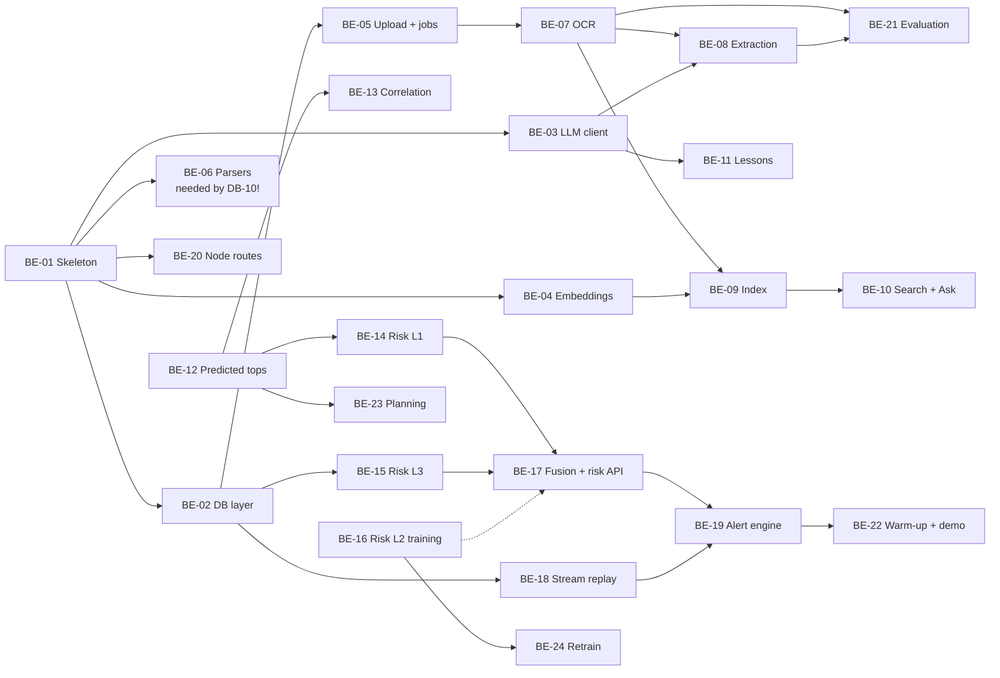

# NWIS PRD: Backend (Person B)

**Workstream:** Backend. **Owner:** Person B.
**Read first:** `00_SHARED_CONTRACTS.md` (all of it; you implement §9–§12).
**You deliver:** the Python FastAPI service on a Hugging Face Docker Space (document AI, search/RAG, geo, risk engine, stream replay, alert engine) and the thin Node API routes on Vercel.

---

## 1. Your goal in one paragraph

Turn documents into structured events, turn events and telemetry into risk scores, and turn risk scores into alerts that follow the lifecycle rules. Everything must work for **any** well and depth — no scripted demo scenario, no hardcoded scores, no canned answers. Every AI feature must be real and measurable.

## 2. What you own and what you do not

| You own | You do not own (but must use exactly) |
| --- | --- |
| `services/ai/**` (FastAPI, ingest, search, geo, risk, stream, alerts, llm, training) | Tables, views, SQL functions, RLS, buckets (Database) |
| `apps/web/api/**` (Node serverless routes) | React screens (Frontend) |
| Parsers used by Database loaders (`ingest/parsers/`) | Seed data and evaluation labels (Database) |
| Model training and evaluation scripts | |

You write to the database with the **service role** (bypasses RLS), so you must enforce the contract rules yourself (e.g. never expose depth rows below the bit; system alert transitions per §12).

## 3. Tech and setup

- **Python 3.11**, FastAPI, uvicorn, pydantic v2 + pydantic-settings, psycopg 3 + psycopg_pool, supabase (python client, for Storage), httpx, tenacity, orjson.
- Document AI: PyMuPDF, docling, RapidOCR (onnxruntime), pytesseract (+ `tesseract-ocr` apt package), opencv-python-headless, rapidfuzz, lasio, lxml, pandas, openpyxl.
- Search: sentence-transformers (`BAAI/bge-small-en-v1.5`), numpy.
- ML: scikit-learn, lightgbm (or xgboost), shap, joblib.
- Geo: numpy, pyproj.
- LLM: `openai` Python SDK pointed at Groq (`https://api.groq.com/openai/v1`) and OpenRouter (`https://openrouter.ai/api/v1`).
- Tests: pytest, pytest-asyncio, respx (mock HTTP).
- **Node 20 + JavaScript (ES modules, no TypeScript)** for `apps/web/api` with `@supabase/supabase-js` v2.
- Pin versions in `requirements.txt` after the first working install (do not guess versions in advance).

**Hugging Face Space notes**
- Space type: Docker. The container must listen on **port 7860** (`app_port: 7860` in the Space `README.md` front-matter).
- Put secrets in Space Settings → Variables and secrets (never in the image).
- CPU basic tier; the Space sleeps when idle — BE-22 wakes it before demos.
- Deploy **manually**: `git subtree push --prefix services/ai space main` (remote `space` = the Space git URL).

## 4. Task order at a glance



| Sprint | Tasks | Waiting on Database |
| --- | --- | --- |
| S1 | BE-01, BE-02, BE-03, BE-04, **BE-06** | DB-02 (for BE-02) |
| S2 | BE-05, BE-07, BE-08, BE-09, BE-20, BE-21 (bake-off part) | DB-03, DB-05, DB-06, DB-14 |
| S3 | BE-10…BE-18, BE-21 (extraction part) | DB-04, DB-09, DB-10, DB-12 |
| S4 | BE-19, BE-22, BE-23, BE-24 | DB-07, DB-13 |

**Until Database tasks land:** develop against a local Postgres with PostGIS + pgvector in Docker, applying the migrations from `db/supabase/migrations/` as they appear. Use the contract DDL to create them yourself if needed (do not change it).

---

## 5. Tasks

Every prompt assumes you first pasted the **Global context block** (contract §16) and the listed contract sections.

---

### BE-01 FastAPI skeleton, Dockerfile, Space deploy, service-token auth

- **Blocked by:** nothing. **Blocks:** BE-02, BE-03, BE-04, BE-06, BE-20.
- **Files:** `services/ai/app/main.py`, `config.py`, `deps.py`, `routers/health.py`, `app/logging.py`, `Dockerfile`, `requirements.txt`, `README.md` (Space card), `tests/test_health.py`, `.dockerignore`.

**Spec**
- `config.py`: `Settings(BaseSettings)` with every Space variable in contract §13; `get_settings()` cached.
- Middleware: reject any path except `/v1/health` without header `X-Service-Token == SERVICE_TOKEN` → 401 `NWIS_UNAUTHORIZED` (contract §4 error shape). Read `X-User-Id`, `X-User-Role`, `X-Request-Id` into `request.state`.
- Exception handlers: map `NwisError(code, message, status, details)` to the error JSON; unknown errors → 500 `NWIS_INTERNAL` (log the traceback, never return it).
- JSON logging (contract §4 fields).
- `/v1/health` → `{"ok": true, "version": "0.1.0", "models": {"l2": []}}` (models filled later).
- Startup: warm up heavy models lazily in a background task so health responds fast.
- Dockerfile: `python:3.11-slim`; `apt-get install -y tesseract-ocr libgl1 libglib2.0-0 poppler-utils`; create non-root user; `pip install -r requirements.txt`; `EXPOSE 7860`; `CMD uvicorn app.main:app --host 0.0.0.0 --port 7860 --workers 1`.
- Space `README.md` front-matter: `title: NWIS AI`, `sdk: docker`, `app_port: 7860`.

**Acceptance**
- [ ] `docker build` and `docker run -p 7860:7860` work locally; `/v1/health` returns 200 without token; any other path returns 401 without token.
- [ ] Deployed to the Space manually; health works at the Space URL.

**Prompt**
```text
Task BE-01. Read contract §3 (services/ai layout), §4 (error shape, logging), §9.1 (rules),
§13 (env vars). Create services/ai with: app/main.py (FastAPI app, routers included under /v1,
middleware for X-Service-Token on all paths except /v1/health, request.state user_id/user_role/
request_id from headers, exception handlers for a NwisError class and generic exceptions),
app/config.py (pydantic-settings Settings with every Space env var from §13, get_settings()
lru_cached), app/errors.py (NwisError(code, message, status_code, details)), app/logging.py
(JSON line logging with ts, level, service='ai', msg, request_id, user_id), app/routers/health.py
(GET /v1/health -> {"ok":true,"version":"0.1.0","models":{"l2":[]}}), Dockerfile
(python:3.11-slim, apt packages tesseract-ocr libgl1 libglib2.0-0 poppler-utils, non-root user,
port 7860, uvicorn 1 worker), .dockerignore, requirements.txt (unpinned for now), README.md with
Hugging Face Space front-matter (sdk: docker, app_port: 7860) and a "Manual deploy" section
(git remote add space <url>; git subtree push --prefix services/ai space main; set secrets in
Space settings). Tests: tests/test_health.py with FastAPI TestClient for the 200 and 401 cases.
```

---

### BE-02 Database access layer and Pydantic models

- **Blocked by:** BE-01, DB-02. **Blocks:** BE-05, BE-15, BE-18.
- **Files:** `app/db.py`, `app/models/enums.py`, `app/models/rows.py`, `app/storage.py`, `tests/test_db.py`.

**Spec**
- `db.py`: an async `psycopg_pool.AsyncConnectionPool` from `SUPABASE_DB_URL` (min 1, max 5; the free tier has limited connections), `get_conn()` dependency, helpers `fetch_all(sql, params) -> list[dict]`, `fetch_one`, `execute`, `execute_many`, `call_fn(name, **params)` for §7 functions (e.g. `await call_fn("offsets_within", p_wellbore=..., p_radius_m=...)`).
- Always pass parameters (never f-string SQL values).
- `enums.py`: Python `StrEnum` for every contract §5 enum; `EVENT_TO_RISK` dict from the §5 mapping.
- `rows.py`: Pydantic models for the rows the backend reads/writes (Well, Wellbore, SurveyStation, FormationTop, Event, Document, DocumentPage, Job, ExtractedField, Chunk, Lesson, RiskScore, StreamState, Alert, ModelRun) — field names = column names.
- `storage.py`: supabase-py client with the service role; `upload(bucket, path, bytes, content_type)`, `download(bucket, path)`, `move(bucket, src, dst)`, `signed_url(bucket, path, seconds=3600)`.
- A guard helper `visible_depth_limit(wellbore_id) -> float | None` returning `stream_state.bit_md_m` for wells being drilled; every query on `depth_series` for API output must apply `md_m <= limit`.

**Acceptance**
- [ ] `tests/test_db.py` (against local Docker Postgres with the migrations) inserts and reads a well, calls `offsets_within` once DB-04 exists (skip marker before).
- [ ] No SQL string contains user input concatenation (grep in review).

**Prompt**
```text
Task BE-02. Read contract §5 (enums + event_type→risk_type mapping), §6 (all tables), §7
(function list), §8 (storage buckets, depth_series visibility rule). Create:
- services/ai/app/db.py: psycopg 3 AsyncConnectionPool from settings.SUPABASE_DB_URL (min_size=1,
  max_size=5), dict row factory, async helpers fetch_all, fetch_one, execute, execute_many, and
  call_fn(name: str, **params) that runs "select * from public.<name>(p_x => %(p_x)s, ...)" using
  named arguments; validate name against an allowlist of the §7 function names.
- services/ai/app/models/enums.py: StrEnum classes for every §5 enum, and EVENT_TO_RISK dict.
- services/ai/app/models/rows.py: Pydantic v2 models for the tables listed in my PRD, field names
  identical to column names, Optional where the column is nullable.
- services/ai/app/storage.py: supabase-py client (service role) with upload, download, move,
  signed_url for buckets 'documents', 'page-images', 'models'.
- visible_depth_limit(wellbore_id) in db.py per the §6 NOTE and §8 depth_series rule.
- tests/test_db.py using a DATABASE_URL_TEST env var (skip if missing).
```

---

### BE-03 LLM client (Groq primary, OpenRouter fallback, cache)

- **Blocked by:** BE-01. **Blocks:** BE-08, BE-10, BE-11.
- **Files:** `app/llm/client.py`, `app/llm/cache.py`, `app/llm/prompts/` (folder), `tests/test_llm_client.py`.

**Spec**
- Two providers built with the `openai` SDK: `groq` (base_url `https://api.groq.com/openai/v1`, key `GROQ_API_KEY`, model `GROQ_MODEL`) and `openrouter` (base_url `https://openrouter.ai/api/v1`, key `OPENROUTER_API_KEY`, model `OPENROUTER_MODEL`).
- `async complete_json(system: str, user: str, schema: type[BaseModel], *, max_tokens=2000, cache=True) -> tuple[BaseModel, LlmMeta]`:
  1. Cache key = sha256(system + "\n" + user + "\n" + schema.__name__). If cached in `llm_cache`, return it (`meta.cached=True`).
  2. Call Groq with `response_format={"type":"json_object"}` and `temperature=0`. Include the JSON schema (`schema.model_json_schema()`) in the system message.
  3. Parse: strip code fences, `json.loads`, `schema.model_validate`. On validation error, **one repair call**: send the error message and ask for corrected JSON only.
  4. On HTTP 429, 5xx or timeout (20 s): retry once after the `retry-after` header (max 5 s), then fail over to OpenRouter with the same request. If OpenRouter's model rejects `response_format`, retry without it.
  5. Both fail → raise `NwisError("NWIS_UPSTREAM", ...)`.
  6. Store the successful response in `llm_cache`.
- `async complete_text(system, user, *, max_tokens=800, cache=True) -> tuple[str, LlmMeta]` — same failover, no JSON.
- `LlmMeta`: provider, model, cached, latency_ms, input_chars.
- Input guard: truncate `user` to `MAX_INPUT_CHARS = 24000` with a note `[...truncated...]`.
- Never log full prompts at INFO (they may contain document text); log hashes and sizes.

**Acceptance**
- [ ] Tests (respx-mocked): cache hit skips HTTP; Groq 429 → OpenRouter used; invalid JSON → repair call; both failing → `NWIS_UPSTREAM`.
- [ ] A manual script `python -m app.llm.client --ping` returns a tiny JSON from each provider.

**Prompt**
```text
Task BE-03. Read contract §6 (llm_cache), §13 (GROQ_*, OPENROUTER_*). Create
services/ai/app/llm/client.py and cache.py implementing exactly the spec below using the
official openai Python SDK (AsyncOpenAI) with base_url per provider. Use tenacity only for the
single retry; implement failover explicitly. Provide LlmMeta dataclass. Add a __main__ --ping
mode. Tests in tests/test_llm_client.py with respx mocking both base URLs.
[paste BE-03 spec]
```

---

### BE-04 Embedding service

- **Blocked by:** BE-01. **Blocks:** BE-09.
- **Files:** `app/search/embed.py`, `tests/test_embed.py`.

**Spec**
- Load `SentenceTransformer(settings.EMBED_MODEL)` once (module-level lazy singleton), CPU.
- `embed_passages(texts: list[str]) -> list[list[float]]` — batch size 32, `normalize_embeddings=True`, output length 384.
- `embed_query(text: str) -> list[float]` — prefix the bge query instruction `"Represent this sentence for searching relevant passages: "` before encoding.
- Convert to the pgvector literal format when writing (`'[0.1,0.2,...]'`) or register the pgvector psycopg adapter.

**Acceptance**
- [ ] Output dims = 384; cosine(query "mud losses in Tipam", passage "partial losses while drilling Tipam sandstone") > cosine(same query, "BOP test completed").

**Prompt**
```text
Task BE-04. Read contract §6 (chunks.embedding vector(384)), §13 (EMBED_MODEL). Create
services/ai/app/search/embed.py with a lazy singleton SentenceTransformer, embed_passages
(batch 32, normalized) and embed_query (with the bge query instruction prefix), plus
to_pgvector(list[float]) -> str. Tests in tests/test_embed.py for dimension and the ranking
sanity check (mark slow).
```

---

### BE-05 Upload, jobs and document classifier

- **Blocked by:** BE-02, DB-06. **Blocks:** BE-07; FE-10 (integrate).
- **Files:** `app/routers/documents.py`, `app/ingest/pipeline.py`, `app/ingest/classify.py`, `app/ingest/batch.py`, `tests/test_documents.py`, `tests/test_classify.py`.

**Spec**
- `POST /v1/documents` (JSON per contract §9.2): download the object from `documents/{storage_path}`; compute sha256; if a `documents` row with that sha256 exists → 200 duplicate response and delete the incoming object. Else insert `documents` (title = filename, `uploaded_by` = X-User-Id), move the object to `{doc_id}/{filename}`, insert `jobs` (queued), return 202, and schedule `run_pipeline(job_id)` as a background task.
- `pipeline.py`: `run_pipeline(job_id)` runs stages and updates `jobs.stage` + `progress`: classify (5) → ocr/parse (40) → extract (80) → validate (90) → index (100). One document at a time (global `asyncio.Semaphore(1)`; CPU box). On exception: `status='failed'`, `error` = short message.
- `classify.py`: `classify(filename, first_page_text, mime) -> doc_type` with rules first:
  - XML with root `drillReports`/`drillReport` → `witsml`; text starting `~V` or containing `~A` → `las`; `.csv/.xlsx` with columns like md/inc/azi → `survey`.
  - Keywords (case-insensitive) in first 2 pages: "daily drilling report", "IADC", "morning report" → `ddr`; "well completion report", "completion report" → `wcr`; "mud log", "master log" → `mud_log`; "cement job", "cementing report" → `cement_report`; "drilling program", "casing program", "mud program" → `program`; "incident", "NPT report", "fishing" → `incident`.
  - No rule matched → LLM classification (small prompt, JSON `{doc_type, well_name, confidence}`).
  - If the request gave `doc_type`, use it.
- Well matching: if `well_id` not given, match `well_name` from the header/LLM against `wells.name` (case-insensitive, `rapidfuzz` ratio ≥ 90); no match → leave null and add an `extracted_fields` row (`entity='well_header'`, field `well_name`, reason `unmatched_well`).
- `batch.py`: CLI `python -m app.ingest.batch --doc-type witsml --limit 50` to run the pipeline for documents already inserted by Database loaders (Volve DDRs) that have no `jobs` row; also `--dir <folder>` to ingest local files (synthetic PDFs, NPD history text).

**Acceptance**
- [ ] Uploading the same file twice returns `duplicate: true` the second time.
- [ ] Job row moves through stages; failures record an error and never crash the service.
- [ ] Classifier unit tests for each rule.

**Prompt**
```text
Task BE-05. Read contract §6 (documents, jobs, extracted_fields), §8 (storage paths), §9.1–§9.2
(/api/documents and upload flow). Create services/ai/app/routers/documents.py (POST /v1/documents
exactly as specified), app/ingest/pipeline.py (run_pipeline with stages, progress values,
semaphore, failure handling — call placeholder functions ocr_or_parse(), extract(), validate(),
index() that later tasks implement; keep their signatures as in my PRD), app/ingest/classify.py
(rules then LLM fallback via app.llm.client.complete_json with a small Pydantic schema), and
app/ingest/batch.py (CLI). Tests: tests/test_documents.py (duplicate, happy path with storage
mocked), tests/test_classify.py (one test per rule).
[paste BE-05 spec]
```

---

### BE-06 Structured parsers (WITSML, LAS, tables) — do this in sprint 1

- **Blocked by:** BE-01. **Blocks:** DB-10 (Database needs these to load Volve).
- **Files:** `app/ingest/parsers/witsml.py`, `las.py`, `tabular.py`, `units.py`, `tests/test_parsers.py`, `tests/fixtures/*.xml|*.las|*.csv`.

**Spec**
- **Namespace-agnostic XML:** strip namespaces after parsing with lxml; handle WITSML 1.3/1.4 (`drillReports/drillReport`) and 2.0 (`DrillReport`) spellings where practical; read `uom` attributes and convert with `units.to_si`.
- `witsml.py` dataclasses and functions (Database imports these exact names):
```python
@dataclass
class Activity:  t_start: datetime | None; t_end: datetime | None; md_m: float | None
                 phase: str | None; proprietary_code: str | None; state: str | None
                 state_detail: str | None; comments: str | None
@dataclass
class Fluid:     md_m: float | None; mud_type: str | None; mw_sg: float | None; pv_cp: float | None
                 yp_lbf100ft2: float | None; filtrate_ml: float | None; ecd_sg: float | None
@dataclass
class DrillReport: well_name: str | None; wellbore_name: str | None; report_date: date | None
                   md_m: float | None; tvd_m: float | None; summary_24h: str | None
                   forecast_24h: str | None; activities: list[Activity]; fluids: list[Fluid]
                   equip_failures: list[dict]; control_incidents: list[dict]
                   survey_stations: list[dict]; lith_shows: list[dict]; strat_info: list[dict]
@dataclass
class Station:   md_m: float; inc_deg: float; azi_deg: float

def parse_drill_report(xml_bytes: bytes) -> list[DrillReport]   # a file may hold several
def parse_trajectory(xml_bytes: bytes) -> tuple[str | None, list[Station]]  # (wellbore_name, stations)
def parse_log(xml_bytes: bytes) -> tuple[str | None, "pd.DataFrame"]   # columns = mnemonics, units in df.attrs["units"]
```
- `las.py`: `parse_las(data: bytes) -> tuple[dict, pd.DataFrame]` using lasio (well section dict, curves DataFrame with index = depth in metres).
- `tabular.py`: `parse_survey_table(df) -> list[Station]` (detects md/inc/azi columns by name variants: `md`, `measured depth`, `inc`, `incl`, `inclination`, `azi`, `azimuth`, units from header like `(ft)`), `parse_tops_table(df) -> list[dict]` (formation, top_md_m, top_tvdss_m).
- `units.py`: `to_si(value, unit) -> (value_si, unit_si)` covering every conversion in contract §4 plus WITSML uom strings (`m`, `ft`, `g/cm3`, `ppg`, `lbm/galUS`, `bbl`, `m3`, `gal/min`, `L/min`, `psi`, `bar`, `kPa`, `klbf`, `kN`, `kft.lbf`, `kN.m`, `ft/h`, `m/h`, `dega`), and `parse_quantity(text) -> (value, unit) | None` for free text like `"15 bbl/hr"`, `"8,200 ft"`, `"10.2 ppg"`, `"2395m"`.

**Acceptance**
- [ ] Fixtures: a minimal hand-written WITSML 1.4 drillReport (2 activities, 1 fluid), a trajectory (3 stations in ft), a LAS 2.0 file; tests pass.
- [ ] `parse_quantity` handles thousands separators, missing spaces, ranges (`"2395-2410 m"` → first value, and returns the range separately via `parse_range`).
- [ ] Database owner confirms DB-10 runs with these functions.

**Prompt**
```text
Task BE-06. Read contract §4 (units), §6 (time_log, mud_records, survey_stations, depth_series
columns). Create services/ai/app/ingest/parsers/witsml.py, las.py, tabular.py, units.py with EXACTLY
these public names and dataclasses (the Database loader imports them): [paste the dataclass/
function block from the PRD]. Use lxml; strip namespaces; read uom attributes and convert with
units.to_si. units.to_si must cover all §4 conversions plus these WITSML uom strings: [list].
Add parse_quantity(text) and parse_range(text) for free-text values. Create small fixture files in
services/ai/tests/fixtures/ (write them yourself: a WITSML 1.4.1 drillReport with namespace
xmlns="http://www.witsml.org/schemas/1series", 2 activity elements with dTimStart, dTimEnd,
md uom="m", phase, proprietaryCode, state, stateDetailActivity, comments; one fluid with density
uom="g/cm3"; a trajectory with 3 trajectoryStation elements in ft; a LAS 2.0 file with DEPT, ROP,
GR). Tests in tests/test_parsers.py.
```

---

### BE-07 OCR pipeline (Docling + RapidOCR, Tesseract fallback)

- **Blocked by:** BE-05. **Blocks:** BE-08, BE-09, BE-21.
- **Files:** `app/ingest/ocr.py`, `app/ingest/preprocess.py`, `tests/test_ocr.py`.

**Spec**
- Entry: `async def ocr_or_parse(doc) -> list[PageResult]` where `PageResult = {page_no, text, markdown, tables: list[list[list[str]]], ocr_confidence: float | None, engine: str, boxes: list[{text, conf, bbox}] | None}`.
- Structured docs (`witsml`, `las`, `survey` CSV/XLSX) → call BE-06 parsers; build one pseudo-page whose text is a readable rendering (e.g. each DDR activity as a line `06:00–09:30 | 2395 m | 24 | comments`). Store these as `document_pages` too (so search and citations work the same way).
- PDFs/images:
  1. Render each page with PyMuPDF at 200 DPI → PNG → upload to `page-images/{doc_id}/{page}.png` (needed for the review screen and citations).
  2. Text-layer check: `page.get_text()` length ≥ 200 chars → engine `text_layer`, confidence null.
  3. Otherwise run **Docling** `DocumentConverter` with OCR on (RapidOCR engine) and table structure on (accurate mode); export page markdown and tables.
  4. Page confidence: mean of OCR box confidences. If the installed Docling version does not expose box confidences, run RapidOCR directly on the page image to get boxes + confidences (keep Docling's text for layout/tables). Record which method in logs.
  5. If confidence < `OCR_RETRY_BELOW = 0.60`: preprocess (`preprocess.py`: grayscale → deskew by minAreaRect angle of text pixels → `fastNlMeansDenoising` → adaptive threshold → upscale if width < 2000 px) and run Tesseract (`image_to_data`, `--psm 6`, lang `eng`). Keep the result with the higher mean confidence; `engine` = `rapidocr` or `tesseract`.
- Write/replace `document_pages` rows (text, ocr_confidence, engine, image_path); update `documents.pages`, `has_text_layer`, `ocr_engine`.
- Performance guard: max 60 pages per document for the demo (log and skip the rest), and a per-page timeout of 60 s.

**Acceptance**
- [ ] A digital PDF uses the text layer (fast path).
- [ ] The three scanned-style synthetic PDFs (DB-09) produce readable text with confidence recorded; tables come back as tables for the WCR tops page.
- [ ] A deliberately bad page triggers the Tesseract retry path (test with a blurred image fixture).

**Prompt**
```text
Task BE-07. Read contract §6 (documents, document_pages), §8 (page-images bucket). Create
services/ai/app/ingest/ocr.py and preprocess.py implementing the spec below. Use PyMuPDF
(fitz) for rendering and text layer; Docling DocumentConverter with PdfPipelineOptions(do_ocr=True,
do_table_structure=True) and the RapidOCR OCR options class available in the installed docling
version (look it up in docling's docs: docling.datamodel.pipeline_options) — if the class name
differs, adapt and leave a comment; RapidOCR directly for box confidences if Docling does not
expose them; pytesseract image_to_data for the fallback. Structured doc types route to
app.ingest.parsers (BE-06). Return PageResult dicts and write document_pages rows via app.db.
Tests: tests/test_ocr.py with a generated digital PDF (reportlab), a generated image PDF, and a
blurred image to hit the fallback (mark slow).
[paste BE-07 spec]
```

---

### BE-08 LLM extraction, normalisation, validation, review rows

- **Blocked by:** BE-03, BE-07, DB-03. **Blocks:** BE-21; FE-11 (integrate).
- **Files:** `app/ingest/extract.py`, `normalize.py`, `validate.py`, `app/models/extraction.py`, `app/llm/prompts/extract_system.md`, `extract_ddr.md`, `extract_wcr.md`, `extract_generic.md`, `ddr_comments_events.md`, `tests/test_extract.py`, `tests/test_validate.py`.

**Spec**
- `models/extraction.py`: Pydantic models exactly matching contract §10 (every field optional except those always present: `page`, `confidence`, and `description` for events).
- **Windows:** split the document into windows of ≤ 12,000 characters, never cutting a page; each page prefixed with `=== PAGE {n} ===`. Tables rendered as Markdown inside the page text.
- **Prompt selection:** `ddr` → `extract_ddr.md`; `wcr` → `extract_wcr.md`; `witsml` → `ddr_comments_events.md` (only events from time-log comments; other fields came from the parser); others → `extract_generic.md`. All share `extract_system.md`.
- **Post-processing** (contract §10 rules): unit conversion with `units.parse_quantity`/`to_si` (keep raw), formation resolution via `formation_synonyms` (cache table in memory, refresh every 10 min), IADC code inference for time-log lines from keywords when missing (e.g. "fishing" → 19, "kick"/"shut in" → 27, "losses"/"LCM" while circulating → 5 or 24), event_type → risk_type via `EVENT_TO_RISK`, relative depth via `formation_at_md` when the wellbore is known.
- **Validation** (`validate.py`): the six rules in contract §10; snippet check with `rapidfuzz.fuzz.partial_ratio(snippet, page_text) >= 80`.
- **Confidence:** `final = min(llm_conf, page_ocr_conf or 1.0)`, then −0.3 per failed rule (floor 0.05). `≥ 0.85` → `auto_approved`, else `pending`.
- **Writes:** for each entity create the target row (events get `review_status` = auto_approved or pending, `provenance` from the document) and one `extracted_fields` row per important field (event: event_type, md_from_m, formation, npt_h, volume_m3, description; tops: formation, top_md_m; etc.) with `value = {"raw":..., "value":..., "unit":...}`, `confidence`, `reason`, `bbox` (find the snippet among OCR boxes of that page; union of matched boxes, normalised 0..1; null if not found).
- **Job status:** any pending fields → `needs_review`, else `done`.
- **Dedup:** skip an event if the same wellbore already has an event with the same event_type within ±5 m and the same date.

**Prompt text for `extract_system.md` (use as written, adjust only if tests show problems)**
```text
You extract structured drilling data from oil-well documents (daily drilling reports, well
completion reports, mud logs, cementing reports). You return ONLY a JSON object that matches the
provided JSON schema. No prose, no markdown.

Rules:
1. Extract only facts written in the text. Never guess or invent values. If a value is not
   stated, omit the field.
2. Every item must include "page" (the number from the nearest "=== PAGE n ===" marker above it)
   and "snippet": the exact words from the text that support it (max 300 characters, copied
   verbatim, including typos).
3. Depths: give the number and keep the unit as written inside the snippet; put the numeric
   value in metres in md_from_m / top_md_m etc. If the text uses feet, convert to metres
   (1 ft = 0.3048 m). If you are unsure of the unit, lower "confidence".
4. Events are abnormal occurrences: mud losses (partial/total), kicks or influx, stuck pipe
   (differential or mechanical), tight hole, pack-off, hole instability/cavings, fishing,
   torque spikes, cement job failures, equipment failures. Routine operations are NOT events.
   Map each to one of these event_type values: loss_partial, loss_total, kick, stuck_pipe_diff,
   stuck_pipe_mech, tight_hole, pack_off, hole_instability, fishing, torque_spike,
   cement_failure, equipment_failure, other.
5. For each event, fill cause, action and outcome only if the text states them.
6. Abbreviations: POOH = pull out of hole, RIH = run in hole, LCM = lost circulation material,
   ECD = equivalent circulating density, MW = mud weight, TD = total depth, BHA = bottom hole
   assembly, NPT = non-productive time, SIDPP/SICP = shut-in pressures, O/P = overpull.
7. "confidence" is your own 0–1 estimate that the item is correctly read and classified.
8. Formation names: copy them as written (e.g. "Tipam Sst"); normalisation happens later.
```

**Prompt text for `ddr_comments_events.md` (user message template)**
```text
Below are time-log lines from daily drilling reports of well {well_name}. Each line is:
[page] start–end | MD | IADC code | state | comment.
Find every abnormal event (see rules). One event may span several lines; merge them and use the
first line's page and MD, and md_to_m from the last line. Return {"events": [...]}.

{lines}
```

**Acceptance**
- [ ] On the synthetic PDFs, extracted events match the DB-09 ground truth for that well at ≥ 0.8 precision (the number is measured properly in BE-21).
- [ ] A value in feet in the text is stored in metres with the raw value kept.
- [ ] Unknown formation → null + reason; out-of-range MW → pending with reason.
- [ ] Review rows have bbox for text found on OCR pages.

**Prompt (split into two chats)**
```text
Task BE-08 part 1 (models, normalisation, validation). Read contract §5, §6 (events,
formation_tops, hole_sections, cement_jobs, mud_records, time_log, survey_stations,
extracted_fields, formation_synonyms), §10 (JSON shape + backend rules). Create
app/models/extraction.py (Pydantic models exactly matching §10), app/ingest/normalize.py
(units via app.ingest.parsers.units, formation resolution with an in-memory synonym cache,
IADC keyword inference, EVENT_TO_RISK mapping), app/ingest/validate.py (the six §10 rules with
those exact reason strings, rapidfuzz snippet check, confidence combination and
auto_approved threshold 0.85). Tests: tests/test_validate.py with one case per rule.
```
```text
Task BE-08 part 2 (LLM extraction + writes). Using part 1 and app.llm.client.complete_json,
create app/ingest/extract.py: build page windows (<=12000 chars, never split a page, page
markers), choose the prompt file by doc_type, call the LLM with the ExtractionResult schema,
post-process with normalize + validate, create target rows and extracted_fields rows (value
{"raw","value","unit"}, bbox from OCR boxes when the snippet is found), dedup events, and set the
job status. Save the prompt files in app/llm/prompts/ using the texts in my PRD. Tests:
tests/test_extract.py with the LLM mocked (return a fixed JSON) checking rows written and
statuses.
[paste the two prompt texts and the BE-08 spec]
```

---

### BE-09 Chunking and indexing

- **Blocked by:** BE-04, BE-07. **Blocks:** BE-10.
- **Files:** `app/search/index.py`, `tests/test_index.py`.

**Spec**
- For each `document_pages` row: split text into chunks of ~1,200 characters with 200 overlap, on paragraph/line boundaries where possible. Tables stay whole if ≤ 2,400 chars.
- Tag each chunk with `well_id` (from the document), `formation` (the formation of any event/top extracted from that page whose snippet lies in the chunk; else a formation name found in the text via synonyms; else null), `md_from_m`/`md_to_m` (min/max depths of entities in the chunk, or parsed depths in text).
- Embed with `embed_passages` and insert into `chunks`. Re-indexing a document deletes its old chunks first.
- CLI `python -m app.search.index --reindex-all`.

**Acceptance**
- [ ] Every page of an ingested document has ≥ 1 chunk with a 384-dim embedding.
- [ ] Chunks from a page with a Tipam loss event carry `formation='Tipam'`.

**Prompt**
```text
Task BE-09. Read contract §6 (document_pages, chunks, events, formation_tops). Create
app/search/index.py with chunk_page(text, size=1200, overlap=200), tag_chunk(chunk, page_entities,
synonyms), index_document(doc_id) (delete old chunks, chunk, tag, embed with
app.search.embed.embed_passages, bulk insert) and a --reindex-all CLI. Tests in
tests/test_index.py for chunk boundaries and tagging.
```

---

### BE-10 Search and Ask (RAG with citations)

- **Blocked by:** BE-03, BE-09, DB-04. **Blocks:** FE-12 (integrate).
- **Files:** `app/routers/search.py`, `app/routers/ask.py`, `app/search/rag.py`, `app/llm/prompts/ask_system.md`, `tests/test_rag.py`.

**Spec**
- `POST /v1/search`: `embed_query(q)` → `hybrid_search` RPC with filters → snippet = the 300-char window around the best keyword hit (or the chunk start) → response per contract §9.2.
- `POST /v1/ask`:
  1. Retrieve top 8 chunks via `hybrid_search` (filters from request). If `wellbore_id` is given, also fetch `events_for_offsets(wellbore, 10000, formations mentioned in the question or null, 20)` and add them as extra sources (rendered as one line each with doc/page).
  2. **Sufficiency check:** if fewer than 2 sources, or the best RRF score < `MIN_RRF = 0.015`, return `evidence: "insufficient"` with `answer_md` = "Not enough evidence in the knowledge base to answer this. Closest records:" + a bullet list of the top 3 snippets with citations. Do not call the LLM.
  3. Otherwise call `complete_text` with `ask_system.md` and the numbered sources.
  4. Parse citations `[n]`; drop citations to numbers that do not exist.
  5. **Number check:** every number+unit in the answer (regex) must appear in at least one cited source's text (after unit normalisation). If any does not, remove that sentence and append "(Some details were removed because they were not found in the sources.)".
  6. Return contract §9.2 shape; `cached` from LlmMeta.

**`ask_system.md`**
```text
You answer questions from drilling engineers using ONLY the numbered sources provided.
- Every sentence that states a fact must end with the source number(s) in brackets, like [2] or
  [1][3].
- Never use outside knowledge. Never invent numbers, depths, dates or well names.
- If the sources do not answer the question, say so in one sentence.
- Be brief: at most 6 sentences or 6 bullet points. Use metres and SG units as in the sources.
- If sources disagree, say so and cite both.
```

**Acceptance**
- [ ] 10 test questions (in `tests/rag_questions.yaml`, written with the Database owner from synthetic data) each return citations that point to pages containing the cited facts.
- [ ] A question about something not in the data returns `insufficient` without an LLM call.
- [ ] p95 latency < 5 s on the Space for cached-free calls (log it).

**Prompt**
```text
Task BE-10. Read contract §7 (hybrid_search, events_for_offsets), §9.2 (/search and /ask
request/response exactly). Create app/routers/search.py, app/routers/ask.py and app/search/rag.py
implementing the spec below, and save the ask_system prompt text in app/llm/prompts/ask_system.md.
Include the sufficiency check, citation parsing and the number check. Tests in tests/test_rag.py
with the LLM and DB mocked: insufficient path makes no LLM call; invalid citation numbers are
dropped; an unsupported number sentence is removed.
[paste BE-10 spec + prompt]
```

---

### BE-11 Lessons builder

- **Blocked by:** BE-03, DB-09. **Blocks:** BE-19 (optional, for recommendations).
- **Files:** `app/search/lessons.py`, `app/llm/prompts/lesson.md`, `tests/test_lessons.py`.

**Spec**
- Group non-rejected events by (formation, event_type) with ≥ 2 events from ≥ 2 wells.
- For each group (max 40 events, most recent first), prompt the LLM with the events' description/cause/action/outcome (each prefixed with its event id) → JSON `{title, problem, cause, mitigation, outcome, successful_event_ids: [...]}`. Mitigation must summarise actions that are stated in the events; `successful_event_ids` = events whose outcome says the problem was solved.
- `success_rate = len(successful_event_ids) / len(events)`; `well_count` = distinct wells. Upsert `lessons` (one per group). Validate that returned ids are a subset of the input ids.
- CLI `python -m app.search.lessons --rebuild`; also called at the end of `batch.py` runs.

**Acceptance**
- [ ] Lessons exist for the main synthetic hazards (Tipam losses, Barail stuck pipe, …) with event ids that exist.

**Prompt**
```text
Task BE-11. Read contract §6 (events, lessons). Create app/search/lessons.py and the prompt
app/llm/prompts/lesson.md ("Summarise these drilling events into one lesson. Use only what the
events say..." — write it in the same strict style as the extraction prompt: JSON only, no
invention, cite event ids). Implement grouping, the LLM call via complete_json with a Pydantic
LessonOut model, id validation, success_rate, upsert, and a --rebuild CLI. Tests with the LLM mocked.
```

---

### BE-12 Predicted formation tops (IDW) and position helpers

- **Blocked by:** DB-04, DB-09. **Blocks:** BE-13, BE-14, BE-23.
- **Files:** `app/geo/tops.py`, `app/geo/position.py`, `app/routers/wells.py` (predict-tops route), `tests/test_tops.py`.

**Spec**
- `POST /v1/wells/{wellbore_id}/predict-tops` (`radius_m` default 10,000).
- Offsets: `offsets_within(wellbore, radius, null, 'surface')` limited to 12 nearest.
- For each formation of the active well's basin: collect offsets' **actual** tops (`top_tvdss_m`; if null, compute from MD via the offset's survey and KB). Need ≥ 2 offsets, else skip that formation.
- IDW: `w_i = 1 / max(d_i, 100)^2`; `tvdss_pred = Σ w_i·tvdss_i / Σ w_i`.
- Uncertainty: `sqrt(Σ w_i (tvdss_i − tvdss_pred)^2 / Σ w_i)` combined with the leave-one-out RMSE of the same IDW over the offsets: `uncertainty_m = sqrt(spread^2 + loo_rmse^2)`, minimum 10 m.
- Convert to MD on the active wellbore: TVD = TVDSS + KB (use `kb_elev_m`, 0 if null); MD = interpolate MD where `survey_stations.tvd_m` = TVD; beyond the last station, extend along the last inclination/azimuth.
- Enforce stratigraphic order (predicted tops must increase with `strat_order`; if not, set the later one to previous + 5 m and widen uncertainty).
- Upsert `formation_tops` with `source='predicted'`, `n_offsets`, `provenance='analog'`. Never overwrite `actual` tops.
- `position.py`: Python mirror of `well_position_at_md` for unit tests and for the planning brief.

**Acceptance**
- [ ] Leave-one-well-out on synthetic completed wells: ≥ 80% of predicted tops fall within their uncertainty of the actual top (report the number).
- [ ] Order is always valid.

**Prompt**
```text
Task BE-12. Read contract §6 (formation_tops, survey_stations, wells), §7 (offsets_within,
well_position_at_md), §9.2 (predict-tops endpoint). Create app/geo/tops.py (predict_tops(
wellbore_id, radius_m) implementing IDW, uncertainty, TVDSS→MD conversion with extension beyond
the last station, strat-order fix, upsert), app/geo/position.py (Python mirror of
well_position_at_md), and the POST /v1/wells/{wellbore_id}/predict-tops route in
app/routers/wells.py. Add a script training/eval_tops.py that runs leave-one-well-out on completed
synthetic wells and prints coverage. Tests in tests/test_tops.py with small numeric fixtures.
[paste BE-12 spec]
```

---

### BE-13 Correlation endpoint

- **Blocked by:** BE-12, DB-12. **Blocks:** FE-06 (integrate).
- **Files:** `app/geo/correlation.py`, route in `app/routers/wells.py`, `tests/test_correlation.py`.

**Spec**
- `GET /v1/wells/{wellbore_id}/correlation?offsets=&flatten=&channels=` → contract §9.3.
- Default offsets = 4 nearest from `offsets_within` (surface) if the param is empty; max 6.
- `channels` must be a subset of `depth_series` numeric columns (reject others with 400).
- Tops per well: actual > predicted > prognosis. `shift_m` = active top(flatten) MD − offset top(flatten) MD; 0 if either missing (and add `"flatten_missing": true` for that well).
- Tracks: read `depth_series` with the **visible depth limit** for the active well; down-sample to ≤ 2,000 points (take every n-th row; keep the max of torque within each bucket so spikes survive).
- Events: non-rejected events of each well; casing: `hole_sections` (non-planned).

**Acceptance**
- [ ] Response validates against the §9.3 example shape; active well tracks never go below the bit depth.

**Prompt**
```text
Task BE-13. Read contract §6 (depth_series, formation_tops, hole_sections, events), §9.3
(correlation response). Create app/geo/correlation.py and add the GET route in
app/routers/wells.py implementing the spec. Enforce the visible depth limit from app.db for the
active well. Tests with DB mocked: shift_m computation, channel validation, down-sampling keeps
torque maxima, no rows below bit depth.
[paste BE-13 spec]
```

---

### BE-14 Risk layer L1 (offset look-ahead)

- **Blocked by:** BE-12, DB-04, DB-09. **Blocks:** BE-17, BE-23.
- **Files:** `app/risk/config.py` (all constants from contract §11), `app/risk/l1.py`, `tests/test_l1.py`.

**Spec**
- `config.py`: every constant in contract §11 as named module constants (bands, grid, weights, detector thresholds, timings, hysteresis, radius).
- `l1_scores(wellbore_id, bit_md_m) -> list[L1Result]` for intervals `[bit + k·25, bit + (k+1)·25)` for k = 0..11 and every scored `risk_type`:
  - Interval formation + relative depth from `formation_at_md(mid)` (predicted tops fill the unknown section).
  - Offsets = `offsets_within(wellbore, RADIUS_M, mid, 'depth')`.
  - Offsets that drilled the formation (have an actual top for it); weight `w = exp(-depth_distance_m / 3000)`; unreviewed events weight × 0.5.
  - Hit rule and smoothed rate exactly as contract §11.3.
  - `L1Result = {md_from_m, md_to_m, risk_type, l1, formation, n_offsets, mean_event_conf, reasons: [{"kind":"offset_event","event_id":..,"well_name":..,"depth_distance_m":..}] (top 5 by weight)}`.
- Pure computation separated from DB reads (`compute_l1(interval, offsets, events)`) so it can be unit-tested.

**Acceptance**
- [ ] When no offset drilled the formation (Σw = 0), `l1 = None` (unknown). The formula alone would give 0.5, which would look like evidence where there is none. Test this.
- [ ] More nearby hits → higher l1; farther offsets count less (tests).
- [ ] Runs in < 1 s for 12 intervals × 5 risk types on synthetic data.

**Prompt**
```text
Task BE-14. Read contract §7 (formation_at_md, offsets_within, events_for_offsets), §11 (all).
Create app/risk/config.py with every §11 constant as a named module constant (comment each with
its § reference), and app/risk/l1.py with a pure compute_l1(interval, offsets, events) and
l1_scores(wellbore_id, bit_md_m) that gathers data via app.db. Follow §11.3 exactly, and return
l1=None when no offset drilled the formation. Tests in tests/test_l1.py: no offsets → None; hit
weighting by distance; unreviewed events at half weight; rejected events ignored.
```

---

### BE-15 Risk layer L3 (physics detectors)

- **Blocked by:** BE-02. **Blocks:** BE-17.
- **Files:** `app/risk/l3.py`, `tests/test_l3.py`.

**Spec**
- `class DetectorBank` per wellbore holding a rolling window (last 600 samples and last 300 m) of stream samples (dicts with depth_series columns + `t`).
- `update(sample) -> list[DetectorResult]` where `DetectorResult = {name, risk_type, fired: bool, signal: dict, l3: float, floor: int}` for the six detectors in contract §11.4 (use constants from `config.py`).
- Detectors only evaluate when the needed channels are present (Volve may lack pit volume) — otherwise `l3=None` for that detector.
- `l3` for a risk type = max of its detectors' values; normalised signal = clip((observed − normal)/(threshold − normal), 0, 1).
- Circulation check: flow_in > 200 L/min.
- Time-based rules use sample timestamps (replay provides `t`; if missing, derive from ROP).

**Acceptance**
- [ ] Unit tests with synthetic windows: loss signature fires losses; pit gain fires kick; overpull trend fires stuck pipe; torque spike fires torque; normal drilling fires nothing.
- [ ] On the DB-09 hidden future events, at least 60% of losses/kicks trigger the matching detector at or before the event depth when replayed (report in BE-21).

**Prompt**
```text
Task BE-15. Read contract §11.4 (detector table) and §6 (depth_series columns). Create
app/risk/l3.py with DetectorBank and the six detectors using thresholds from app/risk/config.py.
Handle missing channels (l3=None). Tests in tests/test_l3.py generating windows with numpy for
each signature and for normal drilling.
```

---

### BE-16 Risk layer L2 (ML training, calibration, SHAP)

- **Blocked by:** DB-09, DB-10. **Blocks:** BE-24 (and improves BE-17).
- **Files:** `training/features.py`, `training/train_l2.py`, `app/risk/l2.py`, `training/README.md`, `tests/test_features.py`.

**Spec**
- **Samples:** for every completed wellbore and every 25 m interval, a row with the state "bit at interval start" and the label "an event of risk type R starts within the next 50–300 m" (same target as inference).
- **Features** (only data available at that moment — no look-ahead leakage):
  - formation strat_order, relative_depth, tvd_m, hole_size_in, mw_sg, ecd_sg (from mud records / series),
  - last-30 m statistics of ROP, torque, SPP, hookload, flow_out/flow_in, dxc, gas (mean, slope),
  - `l1` for that interval **computed without the held-out well's events** during CV (recompute per fold),
  - distance to nearest offset event of the same risk type (from other wells only).
- **Model:** LightGBM binary per risk type, `class_weight='balanced'`, small trees (num_leaves 15, 200 rounds, learning_rate 0.05). Keep it simple.
- **Validation:** leave-one-well-out (GroupKFold by well if > 20 wells, grouped by well). Metrics per risk type: PR-AUC, precision and recall at the `high` band threshold, and the **baseline PR-AUC of l1 alone**. Report per provenance (synthetic vs Volve) separately.
- **Calibration:** isotonic regression on out-of-fold predictions of the combined score `W_L1·l1 + W_L2·l2` (renormalised) → saved as the `calibrate` function used by BE-17.
- **Artifact:** joblib dict `{version, risk_type, model, feature_names, calibrator, trained_at, metrics}` uploaded to bucket `models/{version}.joblib`; insert `model_runs`; set `is_active = true` only if `pr_auc > baseline_pr_auc`, and deactivate the previous one for that risk type.
- `app/risk/l2.py`: load active artifacts at startup (and on `/v1/admin/retrain` completion); `l2_scores(features) -> {risk_type: (prob, shap_top5)}` with `shap.TreeExplainer`.
- Honest reporting: write `training/results.md` with the metrics table, including where the model does **not** beat the baseline.

**Acceptance**
- [ ] `python -m training.train_l2 --all` runs end-to-end and writes model_runs + results.md.
- [ ] No feature uses data from below the interval start (unit test on the feature builder).
- [ ] SHAP top features returned with each prediction.

**Prompt (split into two chats)**
```text
Task BE-16 part 1 (features + labels). Read contract §6 (depth_series, events, mud_records,
hole_sections, formation_tops) and §11.2–§11.3. Create training/features.py that builds one row
per (completed wellbore, 25 m interval) with the features and look-ahead label in my spec, using
only data at or above the interval start. Provide build_dataset(exclude_well_id=None) so l1 and
"distance to nearest offset event" can be recomputed without a held-out well. Tests in
tests/test_features.py proving no feature reads md below the interval start.
[paste BE-16 spec]
```
```text
Task BE-16 part 2 (train, validate, calibrate, save). Using training/features.py, create
training/train_l2.py: LightGBM per risk type with the parameters in the spec, leave-one-well-out
(GroupKFold) with per-fold feature rebuild for l1, PR-AUC/precision/recall and l1-only baseline,
isotonic calibration on out-of-fold combined scores, joblib artifact upload to bucket 'models',
model_runs insert with activation rule, and training/results.md report. Create app/risk/l2.py for
loading active models and scoring with shap.TreeExplainer top-5 features.
```

---

### BE-17 Fusion, bands, confidence and the risk endpoint

- **Blocked by:** BE-14, BE-15. **Blocks:** BE-19; FE-07 (integrate).
- **Files:** `app/risk/fuse.py`, `app/routers/wells.py` (risk route), `tests/test_fuse.py`.

**Spec**
- `fuse(l1, l2, l3, detector_floor, calibrator) -> fused (0–100)` per contract §11.5 (renormalise weights over non-null layers; all null → no score for that interval).
- `band_for(score)` per §11.1 boundaries; `severity_for(band)`.
- `confidence_for(n_offsets, mean_event_conf)` per §11.5 with the reason string.
- `reasons` = L1 offset reasons + L2 SHAP top 5 (+ detector signal if fired).
- `compute_and_store(wellbore_id, md_from=None, md_to=None)`: bit depth from `stream_state` (or deepest actual top + 20 m if not streaming); run L1 for the window, L2 with current features, L3 from the in-memory DetectorBank; upsert `risk_scores` (one row per interval × risk type with non-null score); return rows.
- `POST /v1/wells/{wellbore_id}/risk` → `{"scores": [...]}`.

**Acceptance**
- [ ] Bands exactly match §11.1 at the boundaries (tests for 20, 20.01, 40, 60, 80, 80.01).
- [ ] Missing L2 → weights renormalised over L1 + L3 (test).
- [ ] A fired detector raises the score to at least its floor (test).
- [ ] Changing telemetry in the replay changes the stored scores (integration check with BE-18).

**Prompt**
```text
Task BE-17. Read contract §6 (risk_scores, stream_state), §9.2 (risk endpoint), §11.1, §11.5.
Create app/risk/fuse.py (fuse, band_for, severity_for, confidence_for, compute_and_store) and the
POST /v1/wells/{wellbore_id}/risk route. Use app.risk.l1, app.risk.l2 (may have no active model),
and the DetectorBank registry from app.risk.l3. Tests in tests/test_fuse.py for band boundaries,
renormalisation, detector floors, confidence levels and reason assembly.
```

---

### BE-18 Stream replay

- **Blocked by:** BE-02, DB-10. **Blocks:** BE-19; FE-08, FE-16 (integrate).
- **Files:** `app/stream/replay.py`, `app/routers/stream.py`, `tests/test_replay.py`.

**Spec**
- Endpoints (contract §9.2): `start`, `stop`, `speed`, `drop`.
- `start`: find `depth_series` rows for the wellbore with `md_m > start_md_m` (default: current `stream_state.bit_md_m` or deepest actual top + 20 m), ordered by md. Upsert `stream_state` (status `live`, source, speed, bit_md_m). Launch one asyncio task per wellbore (keep a registry; starting again restarts).
- Loop per sample (0.5 m): simulated duration = 0.5 m / ROP (h) (use `t` differences if present); real sleep = duration / speed, but batch samples so at most 4 updates per second; each batch:
  1. update `stream_state` (`bit_md_m`, `hole_md_m`, `latest` = the sample's channel values, `last_sample_at = now()`, status `live`);
  2. push samples into the DetectorBank;
  3. every 5 m of new depth (or when a detector changes state) → `fuse.compute_and_store` → `alerts.engine.evaluate(...)` (BE-19).
- `drop`: skip `stream_state` updates and detector updates until `dropping_until` (the alert engine then sees the stream go stale/lost).
- `stop`: cancel the task, status `stopped`.
- Stop automatically at TD.
- The replay **reveals** depth rows only by moving `bit_md_m` (RLS then shows them); it never copies data elsewhere.

**Acceptance**
- [ ] At speed 60 the bit advances ~60× real ROP; `stream_state` updates at most 4×/s.
- [ ] `drop` for 45 s makes `last_sample_at` stop advancing; resumes after.
- [ ] Restarting the Space leaves `stream_state` consistent (tasks do not survive restarts: on startup set any `live` rows to `stopped`).

**Prompt**
```text
Task BE-18. Read contract §6 (depth_series, stream_state), §9.2 (stream endpoints incl. drop),
§11.7 (timings). Create app/stream/replay.py (ReplayRegistry with start/stop/set_speed/drop,
one asyncio task per wellbore, batching to <=4 updates/s, DetectorBank updates, and a hook every
5 m calling app.risk.fuse.compute_and_store and app.alerts.engine.evaluate — import lazily and
tolerate them missing during development) and app/routers/stream.py. On app startup set live
stream_state rows to stopped. Tests in tests/test_replay.py with DB mocked and a fake clock.
```

---

### BE-19 Alert engine

- **Blocked by:** BE-17, BE-18, DB-05, DB-07. **Blocks:** BE-22; FE-09 (integrate).
- **Files:** `app/alerts/engine.py`, `app/alerts/recommend.py`, `app/alerts/templates.py`, `app/llm/prompts/recommend.md`, `tests/test_alert_engine.py`.

**Spec (implements contract §11.6, §11.7, §12 system transitions)**
- `evaluate(wellbore_id, scores, detector_results)` called by the replay:
  1. For each score row in the look-ahead window (interval start between bit+50 and bit+300) with band ≥ `moderate`, and for each fired detector (zone = bit ± 25 m): build a candidate.
  2. Severity from band (§11.1). If `confidence == 'low'` and no detector fired → cap at `watch`.
  3. `dedup_key` per §11.7.
  4. If an **open** alert with that key exists: if the new severity is higher → update severity, score, evidence, message, `state='sent'`, `sent_at=now()` (a re-notification; log it). Else update `score`/`evidence` quietly.
  5. If the latest alert with that key is resolved: create a new alert only if band rose above the resolved one's, or a detector fired, or score ≥ band threshold + `RETRIGGER_HYSTERESIS`.
  6. New alert: insert with `state='generated'`, then immediately update to `state='sent'`, `sent_at=now()` (Realtime pushes the insert and the update).
- **Content:** `title` e.g. "Stuck pipe risk ~120 m ahead (Barail)"; `message` = one sentence with the offset evidence count ("4 of 6 offset wells within 3 km had tight hole or stuck pipe here; avg NPT 18 h."), computed from evidence — never hardcoded; `evidence` JSON per §11.6; `recommendation` from `recommend.py`.
- **Recommendation:** top 2 lessons for (formation, event types of the risk type) by `success_rate`; LLM (`recommend.md`) writes ≤ 2 sentences using only the lesson mitigation text; on LLM failure or no lessons → template "Offsets report: {mitigation}" or "No recorded mitigation for this formation; review offset evidence."
- **Engine tick** (every `ENGINE_TICK_S`, started at app startup):
  - Stream health per wellbore with status `live`/`stale`/`lost`: no sample for > `STREAM_STALE_S` → `stale`; > `STREAM_LOST_S` → `lost` + create system alert (`kind='system'`, severity `warning`, dedup `"{wb}:system:stream_lost"`, title "Live data lost"). When samples resume → status `live`, auto-resolve that system alert (`resolved_how='auto'`, `outcome='unknown'`).
  - Escalation: `warning` older than `ESCALATE_WARNING_S` or `critical` older than `ESCALATE_CRITICAL_S` in state `sent`/`viewed` → `state='escalated'`, `escalated_at=now()`.
  - Auto-resolve: open look-ahead/detector alerts where `bit_md_m > zone_md_to_m + 25` **and** the latest fused score for that zone is below the band threshold → `resolved` (`resolved_how='auto'`, `outcome='unknown'`), except: warning/critical must be acknowledged first (leave them open until acknowledged, then auto-resolve), and never while the stream is `lost`.
- All writes with the service role; every system transition writes `audit_log` with `user_id = null` and action `alert.system.<transition>`.

**Acceptance**
- [ ] Unit tests cover: new alert; dedup (no duplicate open alert); severity increase re-notifies; low-confidence cap; re-trigger with and without hysteresis; escalation timing; stream lost → system alert → recovery auto-resolves; auto-resolve blocked while lost; warning not auto-resolved before acknowledgement.
- [ ] End-to-end with replay on a synthetic drilling well: an alert appears before at least one hidden future event depth (truth file) — show in the PR.

**Prompt (split into two chats)**
```text
Task BE-19 part 1 (evaluate + content). Read contract §6 (alerts, lessons, risk_scores,
stream_state), §11 (all) and §12 (lifecycle + permission table, system rows). Create
app/alerts/engine.py with evaluate(wellbore_id, scores, detector_results) implementing steps 1–6
of my spec, app/alerts/templates.py (title/message builders from evidence, no hardcoded numbers),
app/alerts/recommend.py (lessons lookup + LLM via complete_text with app/llm/prompts/recommend.md
+ template fallback). Tests for dedup, re-notify, low-confidence cap, re-trigger/hysteresis.
[paste BE-19 spec]
```
```text
Task BE-19 part 2 (tick loop). Add to app/alerts/engine.py an async engine_tick() and a
start_engine() started from app.main on startup: stream health (stale/lost, system alert and its
auto-resolve), escalation timings, auto-resolve rules with the exceptions in my spec, audit_log
rows with action alert.system.<transition>. Tests with a fake clock for every rule.
```

---

### BE-20 Node API routes on Vercel

- **Blocked by:** BE-01, DB-05. **Blocks:** BE-22, BE-24; FE-10, FE-12, FE-16 (integrate).
- **Files:** `apps/web/api/_lib/auth.js`, `_lib/forward.js`, `_lib/errors.js`, one file per route in contract §3, `apps/web/vercel.json` (functions `maxDuration`), `apps/web/api/__tests__/*.test.js`.

**Spec**
- `auth.js`: `requireUser(req, allowedRoles?)` → reads `Authorization: Bearer`, `supabaseAdmin.auth.getUser(token)`, loads `profiles.role`; 401/403 with the contract error shape.
- `forward.js`: `forwardToSpace(req, path, {method, body, query})` → fetch `${AI_SERVICE_URL}/v1${path}` with `X-Service-Token`, `X-User-Id`, `X-User-Role`, `X-Request-Id` (uuid); pass status and JSON through; network error → 502 `NWIS_UPSTREAM`; timeout → 504.
- Routes and roles exactly per contract §9.2. Node-only routes:
  - `documents/upload-url`: validate size ≤ 25 MB and MIME in the DB-06 list; `supabaseAdmin.storage.from('documents').createSignedUploadUrl('incoming/<uuid>/<sanitised filename>')`; return `{upload_id, storage_path, signed_url, token}`.
  - `admin/users/invite`: `supabaseAdmin.auth.admin.inviteUserByEmail(email, {data: {full_name}})`, then update `profiles` role and assignments; audit row.
  - `admin/users/[id]` PATCH: update role/assignments; audit row.
- `health.js`: public; returns own ok + the Space health (with 5 s timeout).
- Filenames sanitised (`[^a-zA-Z0-9._-]` → `_`, max 120 chars).
- **Deploy manually** with `vercel --prod` from `apps/web` (no auto-deploy); env vars set in the Vercel dashboard.

**Acceptance**
- [ ] Each route rejects wrong roles with 403 (tests with mocked Supabase).
- [ ] A 20 MB PDF uploads via the signed URL flow (not through the function).
- [ ] `/api/health` shows the Space status.

**Prompt**
```text
Task BE-20. Read contract §3 (apps/web/api layout), §4 (errors), §9 (all), §13 (env vars).
Create the Vercel Node 20 JavaScript (ES module) serverless functions in apps/web/api/: _lib/auth.js
(requireUser), _lib/forward.js (forwardToSpace), _lib/errors.js, and one file per route in §3,
with the role lists from §9.2. Node-only routes: documents/upload-url (createSignedUploadUrl on
'incoming/<uuid>/<sanitised>'), admin/users/invite, admin/users/[id]. Use @supabase/supabase-js v2
with SUPABASE_SERVICE_ROLE_KEY server-side only. Add vercel.json with a functions maxDuration
entry (leave a comment to set it to the plan's limit). Tests with vitest mocking supabase and fetch.
```

---

### BE-21 Evaluation: OCR bake-off and extraction precision/recall

- **Blocked by:** BE-07, BE-08, DB-14. **Blocks:** the OCR gate (`NWIS_PRD.md` §4, §9).
- **Files:** `training/ocr_bakeoff.py`, `training/evaluate_extraction.py`, `training/evaluate_alerts.py`, `docs/eval_results.md`.

**Spec**
- **OCR bake-off:** for each page in `db/eval/`: run (a) Docling + RapidOCR, (b) Tesseract with preprocessing, (c) Tesseract raw. Metrics: character error rate (Levenshtein distance / length, on normalised whitespace) and, for pages with tables, cell accuracy (share of ground-truth cells whose text appears in the same row of the predicted table, fuzzy ≥ 90). Time per page. Output a table in `docs/eval_results.md` and a recommendation. **The team locks the OCR engine from this result.**
- **Extraction:** run the full pipeline on the eval pages; match predicted events to ground truth by `event_type` (exact, or same risk_type counts as half) and `md_from_m` within ±10 m; precision, recall, F1 overall and per doc_type; formation tops within ±5 m accuracy. Compare against the PRD targets (P ≥ 0.80, R ≥ 0.70, tops ≥ 85%).
- **Alerts:** replay each synthetic drilling well to TD; for each hidden future event (truth file) record whether a matching alert (same risk type, zone covering the event depth) was raised before the bit reached it, and the lead distance. Report hit rate, median lead (m), and false alerts per 1,000 m.
- Numbers go in the pitch **as measured**, good or bad.

**Acceptance**
- [ ] `docs/eval_results.md` has the three tables with the date and commit hash.

**Prompt**
```text
Task BE-21. Read contract §10 (ground truth shape = extraction shape) and my PRD's success
metrics. Create training/ocr_bakeoff.py (three engines, CER, table cell accuracy, timing),
training/evaluate_extraction.py (event matching rules, P/R/F1 per doc_type, tops accuracy) and
training/evaluate_alerts.py (replay synthetic drilling wells with a fast clock, match alerts to
db/data/synth_truth/*.json, hit rate, median lead, false alerts per 1000 m). Each script appends a
dated section with the git commit hash to docs/eval_results.md.
```

---

### BE-22 Warm-up script and demo readiness

- **Blocked by:** DB-13, BE-19, BE-20. **Blocks:** nothing (final).
- **Files:** `scripts/warmup.py` (repo root), `docs/DEMO_CHECKLIST.md`.

**Spec**
- `warmup.py`: (1) GET `/api/health` until the Space reports ok (wakes it; up to 3 min); (2) call `/api/search` once (loads embeddings); (3) call `/api/wells/<id>/risk` for each drilling well (loads models); (4) check Supabase responds and is not paused; (5) run `reset_demo`; (6) print a green/red checklist.
- `DEMO_CHECKLIST.md`: order of the 7-minute demo (from `NWIS_PRD.md` §10.4), which wells to use, fallback steps if an LLM provider is rate-limited (cached answers exist for the scripted questions), how to show the telemetry-loss rule with `/api/stream/drop`.

**Prompt**
```text
Task BE-22. Read contract §9.2 and my PRD. Create scripts/warmup.py (httpx, env API_BASE,
TEST_EMAIL, TEST_PASSWORD to get a Supabase session, the six checks with retries and a coloured
summary) and docs/DEMO_CHECKLIST.md with the demo order, well choices, and fallbacks.
```

---

### BE-23 Planning brief (Should)

- **Blocked by:** BE-12, BE-14. **Blocks:** FE-13 (integrate).
- **Files:** `app/routers/planning.py`, `app/geo/planning.py`, `tests/test_planning.py`.

**Spec**
- `POST /v1/planning/brief` (contract §9.4). A virtual vertical well at (lat, lon) to `planned_td_m`.
- Offsets: wells within `radius_m` by surface distance (direct SQL on `wells.surface` with `ST_DWithin`).
- Predicted tops: BE-12 IDW using surface distances from the point (vertical conversion TVD = MD).
- Risk profile: L1 per 25 m interval from surface to TD with vertical positions (depth distance = sqrt(surface_d² + Δtvd²)).
- Lessons: for formations in the profile with band ≥ elevated.
- Nothing is written to the DB (read-only brief).

**Prompt**
```text
Task BE-23. Read contract §9.4 and §11.3. Create app/geo/planning.py and app/routers/planning.py
implementing the brief for a virtual vertical well, reusing predict-tops IDW math and compute_l1
from app.risk.l1 with vertical positions. Read-only. Tests with DB mocked.
```

---

### BE-24 Admin retrain endpoint

- **Blocked by:** BE-16, BE-20. **Blocks:** FE-14 (integrate).
- **Files:** `app/routers/admin.py`, `tests/test_admin.py`.

**Spec**
- `POST /v1/admin/retrain` (role admin, checked from `X-User-Role`): start `train_l2` for the requested risk types in a background thread (CPU-heavy; do not block the event loop). Return 202 with `{"model_run_ids": []}` immediately; the run ids appear in `model_runs` as training finishes, and the frontend polls that table.
- On completion, reload active models in `app.risk.l2`.
- Only one retrain at a time (409 `NWIS_BAD_STATE` if running).

**Prompt**
```text
Task BE-24. Read contract §6 (model_runs), §9.2 (/admin/retrain). Create app/routers/admin.py
with POST /v1/admin/retrain: admin-only via X-User-Role, run training.train_l2 in a background
thread via asyncio.to_thread, single-flight lock (409 if running), reload app.risk.l2 models when
done, return 202 {"model_run_ids": []} immediately. Tests for role check and single-flight.
```

---

## 6. Hand-off checklist (announce in team chat)

| When done | Tell | Message |
| --- | --- | --- |
| BE-01 | Frontend | "Space URL live (health only)." |
| BE-06 | Database | "Parsers ready — DB-10 unblocked. Import names in 02_PRD_BACKEND BE-06." |
| BE-20 (first routes) | Frontend | "/api/health, upload-url, documents live — switch FE-10 off mocks." |
| BE-08 | Frontend, Database | "Extraction writes review rows — FE-11 real; DB please run batch on Volve docs." |
| BE-10 | Frontend | "Search/Ask live — FE-12 real." |
| BE-13, BE-17 | Frontend | "Correlation + risk live — FE-06/FE-07 real." |
| BE-18 | Frontend | "Replay live — FE-08/FE-16 real." |
| BE-19 | Frontend | "Alerts live — FE-09 end-to-end." |

## 7. Risks in your workstream

| Risk | Mitigation |
| --- | --- |
| Docling/RapidOCR install or API differs from docs | Pin versions after the first working build; keep the Tesseract path working from day 1 |
| CPU Space too slow for OCR | Pre-process seed documents offline (batch CLI); live demo uploads are 1–3 pages |
| LLM rate limits | Cache, failover, pre-warm the scripted questions; alerts never depend on the LLM |
| Too few real events for ML | Report honestly; L1 + L3 carry the demo; L2 is an add-on that must beat the baseline to switch on |
| Leakage in training | Per-fold feature rebuild; unit test that no feature reads below the interval start |
| Background tasks die on Space restart | Startup resets `live` streams to `stopped`; warm-up script before demos |
