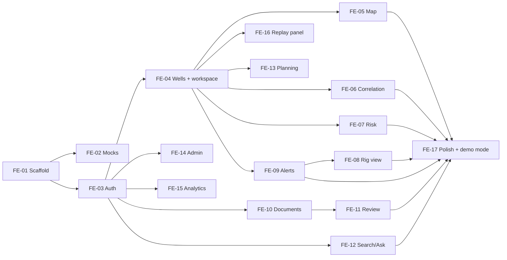

# NWIS PRD: Frontend (Person C)

**Workstream:** Frontend. **Owner:** Person C.
**Read first:** `00_SHARED_CONTRACTS.md` (§1, §4–§9, §11.1, §12 especially), and `NWIS_PRD.md` §10 (user workflows).
**You deliver:** the React app on Vercel: every screen of the user journey, the alert experience, mocks so you are never blocked, and the demo polish.

---

## 1. Your goal in one paragraph

Build the screens an engineer uses from login to alert feedback (`NWIS_PRD.md` §10.0): pick an active well, see offsets on a map, understand the formation and history, see the risk ahead, and handle alerts through their full lifecycle. You start on day 1 with **mocks** (FE-02) and switch each feature to real data as the Database and Backend tasks land. The UI must feel trustworthy: every number has a source, every alert has evidence, synthetic data is labelled, and nothing is scripted to one well.

## 2. What you own and what you do not

| You own | You do not own (but must use exactly) |
| --- | --- |
| `apps/web/src/**`, `index.html`, `vite.config.js`, `tailwind.config.js`, `apps/web/package.json` (frontend deps) | `apps/web/api/**` (Backend's Node routes) |
| Mock layer and fixtures | Tables, views, RPCs, RLS (Database) |
| UI copy, design system, accessibility | Risk maths, alert generation (Backend) |

## 3. Tech and conventions

- React 18 + **JavaScript with JSX (no TypeScript)** + Vite, Tailwind CSS, React Router 6, TanStack Query 5, `@supabase/supabase-js` v2, `react-leaflet` 4 + `leaflet` 1.9 (OpenStreetMap tiles, attribution shown), `react-plotly.js` + `plotly.js-dist-min` (**lazy-loaded**, correlation and risk charts only), `lucide-react` icons, `clsx`, `date-fns`, `react-markdown` (Ask answers), MSW 2 (mocks), Vitest + Testing Library.
- **Language:** plain JavaScript (ES modules). Components are `.jsx`, everything else `.js`; `"type": "module"` in `package.json`. Code quality comes from ESLint (`eslint-plugin-react`, `eslint-plugin-react-hooks`) + Prettier, and tests.
- **Constants and shapes:** `src/lib/constants.js` is a hand copy of contract §5–§11: every enum as a frozen array (`export const RISK_TYPES = Object.freeze([...])`), label maps, `EVENT_TO_RISK`, and JSDoc `@typedef` comments describing row and API shapes (editors show them as hints). Field names are snake_case exactly as in the contract. Any mismatch is a bug. Validate API responses you depend on with small guard functions in `src/lib/validate.js` during development.
- **Data access layer:** components never call `supabase` or `fetch` directly. They call functions in `src/lib/data/*.js` (e.g. `getWellSummaries()`, `getOffsets(wellboreId, radiusM, md, mode)`, `ackAlert(id, note)`), wrapped in TanStack Query hooks in `src/lib/hooks/*.js`. This is where mock vs real is switched.
- **Realtime:** `src/lib/realtime.js` exposes `subscribe(table, filter, onChange) → unsubscribe`. Real mode uses Supabase `postgres_changes`; mock mode uses an in-memory event bus plus a dev panel that emits fake alerts and stream updates.
- **Units:** `src/lib/units.js` formats SI values from the contract (`2395.0 m`, `1.18 SG`, `42 m³`, `15 kN·m`). No unit conversions in components.
- **Colours for risk bands and severities (tokens in `tailwind.config.js`):**

| Band / severity | Token | Light | Dark (rig view) |
| --- | --- | --- | --- |
| low | `risk-low` | green-600 | green-400 |
| moderate / info | `risk-moderate` | sky-600 | sky-400 |
| elevated / watch | `risk-elevated` | amber-500 | amber-300 |
| high / warning | `risk-high` | orange-600 | orange-400 |
| critical | `risk-critical` | red-600 | red-400 |

  Colour is never the only signal: every band/severity also shows its **word** and an icon.
- **Provenance badges:** `SYNTHETIC` (purple outline), `ANALOG`, `DIRECT` shown on wells, events, documents and answers.
- **Confidence chips:** High (solid), Medium (outline), Low (dashed outline + the word "Low confidence" + reason tooltip).
- **No hardcoded well names, depths or scores** outside `src/mocks/fixtures/`.

## 4. Screens, routes and data sources

| Route | Screen | Roles | Journey step (`NWIS_PRD.md` §10.0) | Reads | Writes / calls |
| --- | --- | --- | --- | --- | --- |
| `/login` | Login | public | 1 | Supabase Auth | `signInWithPassword` |
| `/` | Role redirect | all | 1 | `profiles.role` | – |
| `/wells` | Active wells | all | 2 | `v_well_summary` (status = drilling first), `stream_state` | – |
| `/wells/:wellboreId/map` | Workspace → Map | all | 3, 4 | `v_well_summary`, `v_trajectory_geojson`, RPC `offsets_within`, `stream_state` | – |
| `/wells/:wellboreId/formation` | Workspace → Formation + events | all | 5, 6 | RPC `formation_at_md`, `formation_tops`, RPC `events_for_offsets`, `lessons` | `/api/wells/{id}/predict-tops` |
| `/wells/:wellboreId/correlation` | Workspace → Correlation | all | 7 | `/api/wells/{id}/correlation` | – |
| `/wells/:wellboreId/risk` | Workspace → Risk ahead | all | 8 | `risk_scores` (+ Realtime) | `/api/wells/{id}/risk` |
| `/wells/:wellboreId/alerts` | Workspace → Alerts for this well | all | 9–13 | `alerts` (+ Realtime) | alert RPCs |
| `/rig/:wellboreId` | Rig view (tablet) | rig, rtoc, admin | 3, 5, 8, 9–11 | `stream_state`, `risk_scores`, `alerts`, RPC `formation_at_md`, `lessons` | alert RPCs |
| `/alerts` | All open alerts (RTOC) | rtoc, admin | 9–12 | `v_open_alerts` (+ Realtime) | alert RPCs |
| `/documents` | Upload + list | reviewer, office, admin | W2 | `documents`, `jobs` (+ Realtime) | `/api/documents/upload-url`, Storage `uploadToSignedUrl`, `/api/documents` |
| `/review`, `/review/:docId` | Review queue | reviewer, admin (office read-only) | W2 | `v_review_queue`, `document_pages` (signed image URL) | RPC `review_field` |
| `/search` | Search + Ask | all | W6 | – | `/api/search`, `/api/ask` |
| `/planning` | Pre-spud planning | office, admin | W3 | – | `/api/planning/brief` |
| `/analytics` | Analytics | all | – | `v_npt_by_formation`, `v_well_summary` | – |
| `/admin/users` | Users | admin | W1 | `profiles` | `/api/admin/users/invite`, `PATCH /api/admin/users/{id}` |
| `/admin/models` | Models | admin | W7 | `model_runs` | `/api/admin/retrain` |

Role home pages (contract/PRD W1): rig → `/rig/<first assigned wellbore>`; rtoc → `/wells`; office → `/wells`; reviewer → `/review`; admin → `/wells`.

## 5. Task order at a glance



| Sprint | Build (on mocks if needed) | Switch to real when |
| --- | --- | --- |
| S1 | FE-01, FE-02, FE-03, FE-04 | DB-05 (auth), DB-12 (well summary) |
| S2 | FE-05, FE-10, FE-11, FE-12 | DB-04 + DB-09 (map), BE-05/BE-20 (upload), BE-08 (review), BE-10 (search) |
| S3 | FE-06, FE-07, FE-09, FE-08, FE-16 | BE-13, BE-17, BE-19, BE-18 |
| S4 | FE-13, FE-14, FE-15, FE-17 | BE-23, BE-24, DB-12 |

---

## 6. Tasks

Every prompt assumes you first pasted the **Global context block** (contract §16) and the contract sections it lists.

---

### FE-01 Scaffold, design system, Vercel deploy

- **Blocked by:** nothing. **Blocks:** FE-02, FE-03.
- **Files:** `apps/web/` Vite React (JavaScript) project (`npm create vite@latest web -- --template react`); `src/app/App.jsx`, `src/app/routes.jsx`, `src/app/Layout.jsx` (top bar, side nav by role, content), `src/components/ui/` (Button, Card, Badge, Chip, Tabs, Table, Dialog, Toast, Spinner, EmptyState, ErrorState, Slider, Select), `src/lib/constants.js`, `src/lib/units.js`, `src/lib/supabase.js`, `src/lib/api.js`, `tailwind.config.js`, `.env.example` entries, `vercel.json` (SPA rewrite: all non-`/api` paths → `/index.html`).

**Spec**
- `constants.js`: every enum in contract §5 as a frozen array; JSDoc `@typedef` blocks for the row shapes the UI reads and the request/response shapes of every §9 endpoint; `EVENT_TO_RISK`; UI labels for risk types (contract §5).
- `units.js`: `fmtDepth(m)`, `fmtSG(x)`, `fmtVolume(m3)`, `fmtTorque`, `fmtDistance(m)` (m below 1,000, km above), `fmtDuration(h)`, `fmtTimeAgo(iso)`.
- `api.js`: `apiFetch(path, {method, body})` adding `Authorization: Bearer <session token>`, parsing the contract error shape into `NwisApiError {code, message, status}`.
- Theme: light theme for office screens; a `.rig` dark high-contrast theme class for the rig view.
- Deploy **manually** with `vercel --prod` (no auto-deploy). Set `VITE_*` env vars in the Vercel dashboard.

**Acceptance**
- [ ] `npm run dev`, `npm run build`, `npm run test` all work; the deployed URL shows the layout.
- [ ] `npm run lint` passes with no errors; a unit test checks `units.js` outputs.

**Prompt**
```text
Task FE-01. Read contract §3 (apps/web layout), §4 (units, naming), §5 (enums + labels), §6 (row
columns of tables/views the UI reads), §9 (all endpoint request/response shapes), §13 (VITE_ vars).
Create a Vite + React 18 JavaScript app (JSX, no TypeScript, ES modules) in apps/web with Tailwind,
React Router 6, TanStack Query 5, supabase-js v2, ESLint (react + react-hooks plugins) and Prettier.
Create: src/lib/constants.js (all §5 enums as Object.freeze arrays, label maps, EVENT_TO_RISK, and
JSDoc @typedef comments for row and API shapes — snake_case field names exactly), src/lib/units.js (formatters listed in my
PRD, with tests), src/lib/supabase.js (client from VITE_SUPABASE_URL/ANON_KEY), src/lib/api.js
(apiFetch with bearer token and NwisApiError), src/app/{App,routes,Layout}.jsx (routes from my PRD
§4 as placeholder pages), src/components/ui/* (the listed primitives, Tailwind only, accessible),
tailwind.config.js with the risk colour tokens from my PRD, vercel.json SPA rewrite excluding /api.
Do NOT create anything under apps/web/api (Backend owns it).
[paste PRD §3 colour table and §4 routes table]
```

---

### FE-02 Mock layer (MSW + fixtures + realtime bus)

- **Blocked by:** FE-01. **Blocks:** nothing formally; it lets every other FE task start before Database/Backend.
- **Files:** `src/mocks/browser.js`, `src/mocks/handlers.js`, `src/mocks/fixtures/*.json`, `src/lib/realtime.js`, `src/lib/data/*.js`, `src/dev/DevPanel.jsx`.

**Spec**
- `VITE_USE_MOCKS=true` → start MSW before rendering.
- **Fixtures** (follow contract shapes exactly): 8 wells (3 clusters, names `SYN-…`, 2 drilling), trajectories GeoJSON, formation tops, 40 events across formations, 6 lessons, risk_scores for the drilling wells (12 intervals × 5 risk types, a spread of bands), 4 alerts in different states, 3 documents with jobs, 10 review fields, 5 search results, 2 Ask answers (one sufficient with citations, one insufficient), a correlation response (§9.3), a planning brief (§9.4), model_runs.
- **Handlers** for: every `/api/*` endpoint (§9.2) and the Supabase REST paths the data layer uses (`*/rest/v1/<table or view>*`, `*/rest/v1/rpc/<function>`), including RPC errors (e.g. `ack_alert` by an office engineer → 400 with message `NWIS_FORBIDDEN: …`).
- **Mock auth:** a role picker on the login page in mock mode (creates a fake session with that role).
- **Realtime bus:** `realtime.js` `subscribe()` in mock mode listens to an in-memory emitter; `DevPanel` (bottom-right, dev/mock only) buttons: "Emit look-ahead alert", "Emit critical detector alert", "Advance bit 5 m", "Drop stream 45 s", "Complete job".
- **Mock state is mutable** (acknowledging an alert in mock mode really changes it) so flows can be tested end-to-end.

**Acceptance**
- [ ] With mocks on and no network, every screen of §4 renders with data.
- [ ] Switching `VITE_USE_MOCKS=false` needs no component changes.

**Prompt**
```text
Task FE-02. Read contract §6 (row shapes), §7 (RPC names + params), §9 (API shapes and examples),
§11.6 (evidence JSON), §12 (lifecycle rules — mock RPCs must enforce them too). Create
src/mocks/browser.js, src/mocks/handlers.js (MSW 2 http handlers for every /api/* endpoint and
for supabase REST paths */rest/v1/<name> and */rest/v1/rpc/<fn> used by src/lib/data), fixtures in
src/mocks/fixtures/*.json (list in my PRD), a mutable in-memory mock DB module, src/lib/realtime.js
(subscribe(table, filter, cb) using supabase channel postgres_changes in real mode and an
EventEmitter in mock mode), src/lib/data/*.js (one module per domain: wells, geo, events, risk,
alerts, documents, review, search, planning, admin, stream) and src/dev/DevPanel.jsx with the
buttons listed. Start MSW in main.jsx only when VITE_USE_MOCKS === 'true'.
```

---

### FE-03 Auth and role routing

- **Blocked by (start):** FE-01. **Integrate:** DB-05. **Blocks:** FE-04, FE-10, FE-12, FE-14, FE-15.
- **Files:** `src/features/auth/LoginPage.jsx`, `AuthProvider.jsx`, `RequireRole.jsx`, `useProfile.js`.

**Spec**
- Email + password login (`signInWithPassword`); show errors plainly; "Forgot password" link (`resetPasswordForEmail`).
- `AuthProvider`: session state, `profile` (role, full_name, assigned_wellbore_ids) from `profiles` (own row).
- `RequireRole roles=[…]` wrapper: redirect to login if no session; show a 403 page if role not allowed.
- Role redirect on `/` per §4.
- Top bar: user name, role badge, sign out.
- Nav items filtered by role.

**Acceptance**
- [ ] Each of the 5 roles lands on its home page; forbidden routes show 403; sign-out clears the session.

**Prompt**
```text
Task FE-03. Read contract §5 (user_role), §6 (profiles), §8 (profiles RLS). Create
src/features/auth/{LoginPage,AuthProvider,RequireRole}.jsx and useProfile.js; wire routes in
src/app/routes.jsx with RequireRole per my PRD §4 table and the role home redirect on "/". In mock
mode, LoginPage shows a role picker. Tests with Testing Library for redirect and 403 behaviour.
[paste PRD §4 table]
```

---

### FE-04 Active wells list and well workspace shell

- **Blocked by (start):** FE-03. **Integrate:** DB-12. **Blocks:** FE-05, FE-06, FE-07, FE-08, FE-09, FE-13, FE-16.
- **Files:** `src/features/wells/WellsPage.jsx`, `src/features/workspace/WorkspaceLayout.jsx`, `WellHeader.jsx`, `StreamStatusPill.jsx`.

**Spec**
- **Wells page:** drilling wells first (cards: name, field, provenance badge, bit depth and stream status from `stream_state`, open alert count by severity, top risk now); then a searchable table of all wells (name, field, status, TD, event count, NPT total, provenance).
- **Workspace layout** for `/wells/:wellboreId/*`: header (well name, field, provenance, current bit depth, current formation (RPC `formation_at_md`), stream status pill: `live` green / `stale` amber / `lost` red with "last data {time ago}" / `stopped` grey), tabs: Map · Formation & events · Correlation · Risk ahead · Alerts. Tab order = the journey order.
- `stream_state` subscribed via Realtime; header updates live.
- "Open rig view" button for rig/rtoc/admin.

**Acceptance**
- [ ] Selecting a well opens the workspace on the Map tab; header updates live when the mock bit advances.

**Prompt**
```text
Task FE-04. Read contract §6 (stream_state), §6 Views (v_well_summary), §7 (formation_at_md).
Create src/features/wells/WellsPage.jsx and src/features/workspace/{WorkspaceLayout,WellHeader,
StreamStatusPill}.jsx per my spec, using src/lib/hooks and realtime.subscribe('stream_state',
'wellbore_id=eq.<id>'). Nested routes for the five tabs. Tests: renders drilling wells first;
status pill colours and texts for each stream_status.
[paste FE-04 spec]
```

---

### FE-05 Map tab (offset wells)

- **Blocked by (start):** FE-04. **Integrate:** DB-04, DB-09. **Blocks:** FE-17.
- **Files:** `src/features/map/MapTab.jsx`, `WellMarkers.jsx`, `Trajectories.jsx`, `RadiusControl.jsx`, `OffsetList.jsx`, `WellPopup.jsx`.

**Spec**
- Leaflet map with OSM tiles; fit to the active well + offsets.
- **Controls:** radius slider 1–25 km (default 10), depth slider 0 → active TD (default current bit depth), mode toggle "Distance at surface / at depth" (maps to `p_mode`), filters: formation, event type, provenance.
- Draw: all wells as markers coloured by `top_risk_type` presence (grey if none); active well larger with a ring; radius circle around the active well; trajectories polylines from `v_trajectory_geojson` (active in accent colour); in depth mode, a small marker at each offset's position at the matched depth (from `offsets_within` lon/lat).
- **Offset list** beside the map: well, surface distance, depth distance, event count, provenance; sorted by the chosen distance; clicking a row pans to it and opens the popup.
- **Popup:** name, field, TD, status, casing summary (from `hole_sections`), event counts by risk type, link "Open workspace".
- Query `offsets_within` debounced 300 ms on slider changes.
- Explain the depth mode in a one-line helper text: "Deviated wells can be far apart at depth even when close at surface."

**Acceptance**
- [ ] Changing radius or depth updates the list and circle within 1 s; depth mode changes the order for deviated wells (Volve wells show this best).
- [ ] Works with 100+ wells without lag (marker clustering not required under 300 wells).

**Prompt**
```text
Task FE-05. Read contract §7 (offsets_within params/returns), §6 Views (v_well_summary,
v_trajectory_geojson), §6 (hole_sections). Create the map feature files listed in my PRD using
react-leaflet 4: OSM tile layer with attribution, markers, active ring, radius Circle, GeoJSON
polylines for trajectories, depth-position markers in depth mode, RadiusControl (radius slider,
depth slider, mode toggle, filters), OffsetList, WellPopup. Debounce RPC calls 300 ms. Tests for
the control → query parameter mapping.
[paste FE-05 spec]
```

---

### FE-06 Correlation tab

- **Blocked by (start):** FE-04. **Integrate:** BE-13. **Blocks:** FE-17.
- **Files:** `src/features/correlation/CorrelationTab.jsx`, `CorrelationPlot.jsx`, `CorrelationControls.jsx`.

**Spec**
- Controls: offset picker (default = 4 nearest from `offsets_within`; max 6), flatten formation select (formations present in the active well's tops, default = next formation below the bit), channels multi-select (`gr_api`, `rop_m_h`, `torque_knm`, `mw_sg`, `ecd_sg`; default gr_api, rop_m_h, mw_sg).
- Plot (Plotly, lazy-loaded): one column group per well (active first), one sub-track per channel, shared **reversed** depth axis (MD + `shift_m`), formation tops as horizontal lines with labels (predicted tops dashed with a translucent uncertainty band), casing shoes as triangles, events as markers coloured by risk type with hover (type, depth, description, source).
- A note under the plot: "Wells are aligned on the top of {formation}. Shifted depths are shown; hover shows true MD."
- If `flatten_missing` for a well, show it unshifted with a warning icon.
- The active well's tracks stop at the bit depth (the API guarantees it; show a "bit" line).

**Acceptance**
- [ ] Changing flatten formation re-aligns wells; hover shows true MD; predicted tops visibly differ from actual.

**Prompt**
```text
Task FE-06. Read contract §9.2 (correlation query params) and §9.3 (response). Create
src/features/correlation/{CorrelationTab,CorrelationPlot,CorrelationControls}.jsx. Lazy-load
react-plotly.js with plotly.js-dist-min. Build subplots: per well per channel, shared reversed y
(md + shift_m), tops lines (dashed + uncertainty band for source 'predicted'), casing triangles,
event markers coloured by risk type with hover text including true MD. Tests for the data →
trace transformation function (pure, no Plotly render).
[paste FE-06 spec]
```

---

### FE-07 Risk ahead tab

- **Blocked by (start):** FE-04. **Integrate:** BE-17. **Blocks:** FE-17.
- **Files:** `src/features/risk/RiskTab.jsx`, `RiskStrip.jsx`, `IntervalDetail.jsx`, `BandLegend.jsx`.

**Spec**
- Data: `risk_scores` for the wellbore with `md_from_m` between bit and bit + 300 (Realtime subscription on `risk_scores`), and a "Recompute" button (`POST /api/wells/{id}/risk`).
- **Risk strip:** rows = 5 risk types (labels from contract §5), columns = 25 m intervals from bit to +300 m; each cell coloured by band, showing the score; low-confidence cells hatched. The first 50 m (bit to bit+50) are shaded "at bit" (detectors only).
- **Band legend** exactly per contract §11.1 (0–20 Low … 81–100 Critical) with what each band means for the engineer (from `NWIS_PRD.md` F5 table).
- **Interval detail** (click a cell): score, band, confidence + reason, formation, layer contributions (L1/L2/L3 bars with values; missing layers shown as "not available"), SHAP reasons (feature + value), offset events behind L1 (well, distance, event, NPT, source link), and the recommended lessons.
- Explain in one line: "Score = estimated chance (%) that this happens in the interval, from offset wells, the ML model and live data."

**Acceptance**
- [ ] Band colours/words match §11.1 boundaries (test 20, 20.01, 40, 60, 80, 80.01 with the same `bandFor` helper used everywhere).
- [ ] New `risk_scores` rows appear live without reload.

**Prompt**
```text
Task FE-07. Read contract §6 (risk_scores incl. reasons JSON), §11.1 (bands), §11.5 (confidence),
§11.6 (evidence/reasons shapes). Create src/lib/risk.js (bandFor(score), severityFor(band),
BAND_META with labels/meaning/colour tokens) with boundary tests, and src/features/risk/{RiskTab,
RiskStrip,IntervalDetail,BandLegend}.jsx per my spec, subscribing to risk_scores via
realtime.subscribe. The strip is a CSS grid (no Plotly needed).
[paste FE-07 spec + NWIS_PRD F5 band table]
```

---

### FE-08 Rig view (tablet, high contrast)

- **Blocked by (start):** FE-04, FE-09 (uses the alert banner and card). **Integrate:** BE-18. **Blocks:** FE-17.
- **Files:** `src/features/rig/RigView.jsx`, `DepthPanel.jsx`, `FormationPanel.jsx`, `RiskGauges.jsx`, `LessonsPanel.jsx`.

**Spec**
- Dark, high-contrast (`.rig` theme), minimum body text 18 px, touch targets ≥ 48 px, landscape tablet 1024×768 first.
- **Depth panel:** bit depth (huge), hole depth, ROP, torque, flow in/out, pit volume (from `stream_state.latest`), stream status + "last data {time}"; when `lost`, a red full-width bar "Live data lost at {time}. Look-ahead from offset wells continues; live detectors paused."
- **Formation panel:** current formation, next formation and distance to its top ("Barail in ~120 m ± 25 m", uncertainty from predicted top).
- **Risk gauges:** 5 gauges (one per risk type) showing the **max** fused score in the next 300 m, its band word, confidence, and the depth of that max.
- **Lessons panel:** top 3 lessons for the current and next formation (title, mitigation, success rate, well count).
- **Alert banner** at the top (from FE-09); tapping opens the alert card full-screen.
- Wake lock (`navigator.wakeLock` if available) so the tablet screen stays on.

**Acceptance**
- [ ] Readable at arm's length (check on a real tablet or 1024×768 emulation); all actions reachable by touch.
- [ ] Values update live during replay; lost-stream bar appears on `/api/stream/drop`.

**Prompt**
```text
Task FE-08. Read contract §6 (stream_state.latest keys = depth_series columns, risk_scores,
lessons), §7 (formation_at_md), §11.1. Create src/features/rig/{RigView,DepthPanel,FormationPanel,
RiskGauges,LessonsPanel}.jsx per my spec using the .rig theme, realtime subscriptions for
stream_state, risk_scores and alerts, the AlertBanner/AlertCard from src/features/alerts (FE-09),
and navigator.wakeLock when available. Tests for gauge max computation and the lost-stream bar.
[paste FE-08 spec]
```

---

### FE-09 Alerts: realtime, banner, sound, card, evidence, lifecycle actions

- **Blocked by (start):** FE-04. **Integrate:** DB-05, DB-07, BE-19. **Blocks:** FE-08, FE-17.
- **Files:** `src/features/alerts/AlertProvider.jsx`, `AlertBanner.jsx`, `AlertCard.jsx`, `EvidencePanel.jsx`, `AlertActions.jsx`, `ResolveDialog.jsx`, `DismissDialog.jsx`, `FeedbackBar.jsx`, `AlertsPage.jsx`, `WellAlertsTab.jsx`, `sound.js`, `permissions.js`.

**Spec**
- **AlertProvider** (app-wide): subscribes to `alerts` (all visible to the user; RLS filters for rig engineers), keeps open alerts in state, triggers banner, sound and browser notification for **new or re-notified** `warning`/`critical` alerts (a re-notification = `sent_at` changed).
- **Sound (`sound.js`):** Web Audio beeps (warning: 2 beeps every 20 s; critical: 3 beeps every 8 s) until acknowledged. Browsers block audio until the user interacts, so show an "Enable alert sound" button in the top bar on first load; remember the choice in `localStorage`. Info/watch never make sound.
- **Browser notifications:** ask permission once (button in settings), show title + well + depth; clicking focuses the app on the alert.
- **Banner:** top of screen, colour by severity, text = title, well, "~{distance} m ahead", buttons "View" and (if allowed) "Acknowledge". Stays until acknowledged for warning/critical; `aria-live="assertive"` for critical, `polite` otherwise.
- **Alert card:** severity + band word, confidence chip (+ reason), score, risk type, zone (from–to m), expected depth, formation, time, state timeline (Generated → Sent → Viewed → Escalated? → Acknowledged → Resolved → Feedback with timestamps and who), message, recommendation, and the **Evidence panel**. Opening the card calls `mark_alert_viewed` once per user.
- **Evidence panel:** offsets (well, depth distance, events with NPT and source link → opens the source page viewer from FE-12), lessons (mitigation + success rate), SHAP reasons, layer values L1/L2/L3, detector signal (if any), sources list.
- **Actions (`permissions.js` mirrors contract §12 for showing/hiding buttons; the server still enforces):**
  - Acknowledge (note optional) → `ack_alert`.
  - Resolve → dialog with outcome (`event_occurred` / `avoided` / `false_alarm`) + note → `resolve_alert`.
  - Dismiss (info/watch only) → dialog with required reason (≥ 5 chars) → `dismiss_alert`.
  - Feedback after resolved → "Was this alert useful? Yes / No" → `rate_alert`.
  - Show server errors in plain words (`NWIS_FORBIDDEN` → "You don't have permission for this", `NWIS_BAD_STATE` → "This alert has changed; refreshed.").
- **Escalated** alerts show an "Escalated to RTOC lead" badge. **System** alerts ("Live data lost") use a distinct icon and no evidence panel.
- **AlertsPage** (`/alerts`, RTOC): `v_open_alerts` table grouped by well, sortable by severity/age, filters by state; unacknowledged warning/critical pinned on top with age counters.
- **WellAlertsTab:** open + history for one well (resolved alerts with outcome and feedback).

**Acceptance**
- [ ] Mock and real: a new critical alert shows banner + sound (after enable) + notification; acknowledging stops the sound for everyone viewing (state change arrives by Realtime).
- [ ] Buttons shown per role/state match the §12 table (unit tests for `permissions.js` covering every row).
- [ ] Dismiss is not offered for warning/critical; feedback only after resolved.
- [ ] Viewing records `viewed` once.

**Prompt (split into two chats)**
```text
Task FE-09 part 1 (provider, banner, sound, permissions). Read contract §6 (alerts), §6 Views
(v_open_alerts), §7 (alert RPCs), §8 (realtime), §11.1, §12 (lifecycle + permission table — copy
its rules into permissions.js). Create src/features/alerts/{AlertProvider,AlertBanner}.jsx,
sound.js (Web Audio beeps with the cadences in my spec and an enable-sound gate), permissions.js
(canAcknowledge, canResolve, canDismiss, canRate(user, alert)) with unit tests for every row of
the §12 table, and browser Notification support.
[paste FE-09 spec]
```
```text
Task FE-09 part 2 (card, evidence, actions, pages). Create src/features/alerts/{AlertCard,
EvidencePanel,AlertActions,ResolveDialog,DismissDialog,FeedbackBar,AlertsPage,WellAlertsTab}.jsx:
state timeline, mark_alert_viewed on open, the four action flows calling the RPCs through
src/lib/data/alerts.js, friendly error mapping, escalated badge, system alert variant. Evidence
panel renders the §11.6 evidence JSON. Tests: actions visible per role/state, dismiss reason
validation, feedback only after resolved.
```

---

### FE-10 Documents: upload and job progress

- **Blocked by (start):** FE-03. **Integrate:** BE-05, BE-20, DB-06, DB-07. **Blocks:** FE-11.
- **Files:** `src/features/documents/DocumentsPage.jsx`, `UploadDropzone.jsx`, `JobProgress.jsx`, `DocumentList.jsx`.

**Spec**
- Dropzone: multiple files; per file: client checks (≤ 25 MB, allowed types: PDF, PNG, JPG, TIFF, CSV, XLSX, XML, LAS/TXT); optional well select (from `v_well_summary`), doc type select (or "detect automatically"), provenance select (default `direct`).
- **Upload flow per file** (contract §9.1): `POST /api/documents/upload-url` → `supabase.storage.from('documents').uploadToSignedUrl(storage_path, token, file)` (show upload %) → `POST /api/documents` → if `duplicate`, show "Already in the library" with a link; else subscribe to `jobs` `id=eq.<job_id>` and show stage + progress (Classify → Read/OCR → Extract → Validate → Index).
- Final states: `done` → "Ready: N events extracted" + links (view in search, review); `needs_review` → "N fields need review" → link to `/review/<docId>`; `failed` → error text + retry button (re-POST `/api/documents`).
- Document list: title, type, well, pages, OCR engine, provenance, uploaded by/at, status.

**Acceptance**
- [ ] A 20 MB PDF uploads (progress shown) without passing through a Vercel function.
- [ ] Progress updates live; duplicate upload handled.

**Prompt**
```text
Task FE-10. Read contract §6 (documents, jobs), §8 (storage + realtime), §9.1 (upload rules) and
§9.2 (/api/documents/upload-url and /api/documents shapes). Create
src/features/documents/{DocumentsPage,UploadDropzone,JobProgress,DocumentList}.jsx implementing
the three-step upload flow, per-file progress, Realtime job subscription, the final states and
retry. Tests for client-side validation and the flow state machine (mock the data layer).
[paste FE-10 spec]
```

---

### FE-11 Review queue

- **Blocked by (start):** FE-10. **Integrate:** BE-08, DB-05. **Blocks:** FE-17.
- **Files:** `src/features/review/ReviewQueuePage.jsx`, `ReviewDocPage.jsx`, `PageViewer.jsx`, `FieldList.jsx`, `FieldEditor.jsx`.

**Spec**
- Queue page: documents with pending fields (count, doc type, well, oldest pending age) from `v_review_queue`.
- Doc page: left = page image (signed URL of `page-images/{doc}/{page}.png`) with the selected field's **bbox highlighted** (bbox fractions × image size); page navigation. Right = fields for that page: entity, field, value (raw → SI, e.g. "15 bbl/hr → 2.38 m³/h"), confidence bar, reason in plain words (map reason codes: `low_ocr_confidence` → "Scan was hard to read", `failed_rule:depth_gt_td` → "Depth is deeper than the well's TD", `unknown_formation` → "Formation name not recognised", `snippet_not_found` → "Couldn't find this text on the page", `unmatched_well` → "Couldn't match this document to a well", etc.). The `well_id` field (entity `well_header`) is edited with a well select from `v_well_summary`, and Approve is disabled until a well is chosen.
- Actions per field: **Approve** (a), **Edit** (e: typed input by field type; formation = select from `formations`; event_type = select), **Reject** (r); `j`/`k` move between fields. Calls `review_field`. After the last field, show "Document reviewed" and go to the next document.
- Office engineers see the queue read-only.

**Acceptance**
- [ ] Keyboard-only review of a document works; bbox highlight lines up with the text on the image.
- [ ] Approving the last field shows the job as done in FE-10.

**Prompt**
```text
Task FE-11. Read contract §6 (extracted_fields incl. value/bbox shapes, document_pages), §6 Views
(v_review_queue), §7 (review_field), §10 (reason codes). Create the review feature files listed in
my PRD: queue, doc page with PageViewer (image via createSignedUrl, bbox overlay in % units),
FieldList with reason-code-to-plain-words map, FieldEditor (typed inputs; selects for formation and
event_type), keyboard shortcuts a/e/r/j/k. Tests for bbox scaling and reason mapping.
[paste FE-11 spec]
```

---

### FE-12 Search, Ask and the source viewer

- **Blocked by (start):** FE-03. **Integrate:** BE-10, BE-20. **Blocks:** FE-17.
- **Files:** `src/features/search/SearchPage.jsx`, `SearchResults.jsx`, `AskPanel.jsx`, `AnswerView.jsx`, `SourceViewer.jsx` (shared drawer).

**Spec**
- One page, two tabs: **Ask** (default) and **Search**. Shared filters: formation, event type, field, depth range.
- **Ask:** question box with 4 example chips (generic, not tied to one well: "What worked for mud losses in Tipam?", "Where did offsets get stuck in Barail?", "Kicks below 3,500 m?", "Cement problems behind 9-5/8 casing?"); answer rendered with `react-markdown`; `[n]` citations turned into clickable chips; a sources list under the answer; `evidence: insufficient` shows a neutral "Not enough evidence" box with the closest records; show provider + "cached" in small text; loading skeleton.
- **Search:** results list: snippet (query terms highlighted), doc title, page, well, formation, provenance badge; click → source viewer.
- **SourceViewer drawer** (used here, in alerts evidence and review): signed URL of the page image + the snippet text; "Open document" (signed URL of the original, jump to page for PDFs with `#page=N`).
- Keep the last 10 questions in `localStorage` (per-user convenience only).

**Acceptance**
- [ ] Every citation chip opens the right page; insufficient answers never look like real answers.

**Prompt**
```text
Task FE-12. Read contract §9.2 (/api/search and /api/ask shapes) and §8 (signed URLs). Create
src/features/search/{SearchPage,SearchResults,AskPanel,AnswerView,SourceViewer}.jsx per my spec.
AnswerView parses [n] markers into citation chips linked to citations[n]. SourceViewer is a
reusable drawer exported for alerts and review. Tests for citation parsing (including [1][3] and
unknown numbers) and the insufficient-evidence rendering.
[paste FE-12 spec]
```

---

### FE-13 Planning page (Should)

- **Blocked by (start):** FE-04. **Integrate:** BE-23. **Blocks:** FE-17.
- **Files:** `src/features/planning/PlanningPage.jsx`, `PlanningForm.jsx`, `BriefView.jsx`, `print.css`.

**Spec**
- Map (reuse FE-05 components): click to set the location (or type lat/lon), planned TD, radius → "Build brief" → `POST /api/planning/brief`.
- Brief: offsets on the map + table, predicted tops table (formation, MD, ± uncertainty, n offsets), risk profile (reuse the FE-07 strip, vertical from surface to TD in 25 m rows), lessons per risky formation.
- "Print / save as PDF" uses `window.print()` with `print.css` (clean A4 layout, header "NWIS Offset Risk Brief", location, date, provenance note).

**Prompt**
```text
Task FE-13. Read contract §9.4 (planning brief shape). Create the planning feature files: form
(map click or lat/lon, TD, radius), BriefView reusing the map components and the risk strip in
vertical mode, and print.css for an A4 brief via window.print(). Tests for form validation.
```

---

### FE-14 Admin: users and models

- **Blocked by (start):** FE-03. **Integrate:** BE-24, BE-20. **Blocks:** FE-17.
- **Files:** `src/features/admin/UsersPage.jsx`, `InviteDialog.jsx`, `EditUserDialog.jsx`, `ModelsPage.jsx`.

**Spec**
- Users: table from `profiles` (email, name, role, assigned wells); invite (email, name, role, wells) → `/api/admin/users/invite`; edit role/assignments → `PATCH /api/admin/users/{id}`.
- Models: `model_runs` per risk type: version, date, PR-AUC vs baseline (bar pair), precision/recall, n wells, active flag; "Retrain" button → `/api/admin/retrain`, then poll `model_runs` every 10 s for 10 min and show new runs; explain "A new model becomes active only if it beats the offset-only baseline."

**Prompt**
```text
Task FE-14. Read contract §6 (profiles, model_runs metrics JSON), §9.2 (admin endpoints). Create
the admin feature files: UsersPage with invite/edit dialogs (wells multi-select from
v_well_summary), ModelsPage with metrics vs baseline and the retrain + polling flow. Admin-only
via RequireRole. Tests for the dialogs' validation.
```

---

### FE-15 Analytics

- **Blocked by (start):** FE-03. **Integrate:** DB-12. **Blocks:** FE-17.
- **Files:** `src/features/analytics/AnalyticsPage.jsx`.

**Spec**
- Two charts (lazy Plotly or simple CSS bars): NPT hours by formation stacked by risk type (`v_npt_by_formation`); event count by field. A table below with the numbers. Filter by provenance (synthetic / direct).

**Prompt**
```text
Task FE-15. Read contract §6 Views (v_npt_by_formation, v_well_summary). Create
src/features/analytics/AnalyticsPage.jsx with the two charts, a numbers table and a provenance
filter. Tests for the aggregation helper.
```

---

### FE-16 Replay control panel (demo)

- **Blocked by (start):** FE-04. **Integrate:** BE-18, BE-20. **Blocks:** FE-17.
- **Files:** `src/features/workspace/ReplayPanel.jsx`.

**Spec**
- Shown in the workspace header for rtoc/admin: source (Volve / synthetic, based on the well's provenance), speed 1× / 10× / 60×, Start, Stop, "Simulate data loss (45 s)" (`/api/stream/drop`). Shows `stream_state` status and bit depth live.
- Clear label "Replay of recorded data" so no one mistakes it for a live rig.

**Prompt**
```text
Task FE-16. Read contract §9.2 (stream endpoints incl. drop) and §6 (stream_state). Create
src/features/workspace/ReplayPanel.jsx per my spec, visible only to rtoc_engineer and admin.
Tests for button enable/disable by stream status.
```

---

### FE-17 Polish, states, accessibility, demo mode

- **Blocked by (start):** FE-05 … FE-16. **Blocks:** nothing (final).
- **Files:** across features; `src/app/ErrorBoundary.jsx`, `src/features/help/AboutPage.jsx`.

**Checklist**
- [ ] Every data view has loading (skeleton), empty ("No offsets within 10 km — widen the radius") and error states (retry button).
- [ ] Keyboard navigation everywhere; visible focus; alerts use `aria-live`; colour contrast ≥ 4.5:1 (rig view ≥ 7:1).
- [ ] Responsive: phone (read-only essentials), tablet (rig view), desktop (office).
- [ ] Provenance badges on every well, event, document, answer; an "About the data" page explaining synthetic vs real (Volve/NPD) data and licences (from `db/data/*/README.md`).
- [ ] Performance: first load < 3 s on 4G for the wells page (code-split Plotly and Leaflet).
- [ ] No console errors; no hardcoded well names outside fixtures (grep check in CI script `npm run check:hardcoded`).
- [ ] Demo helpers: `?demo=1` shows the DevPanel only in mock mode, never in production.

**Prompt**
```text
Task FE-17. Go through src/features/* and apply the checklist in my PRD: add loading/empty/error
states using the shared components, aria-live for alerts, focus styles, responsive breakpoints,
provenance badges where missing, ErrorBoundary, AboutPage, code splitting for Plotly and Leaflet
routes, and an npm script check:hardcoded that fails if files outside src/mocks contain "SYN-" or
well-name literals. Change only what the checklist requires; list every file you touched.
```

---

## 7. How each journey step maps to your screens (for the demo)

| # | Step (`NWIS_PRD.md` §10.0) | Screen / component |
| --- | --- | --- |
| 1 | Login | `/login` (FE-03) |
| 2 | Select active well | `/wells` (FE-04) |
| 3 | Current bit depth | Workspace header + rig depth panel (FE-04, FE-08) |
| 4 | Find offset wells | Map tab (FE-05) |
| 5 | View formation | Formation & events tab (FE-04 route; formation panel) |
| 6 | Review historical events | Formation & events tab: `events_for_offsets` table + lessons |
| 7 | View correlation | Correlation tab (FE-06) |
| 8 | Risk ahead | Risk tab (FE-07), rig gauges (FE-08) |
| 9 | Alert | Banner + sound (FE-09) |
| 10 | Evidence / lessons | Alert card evidence panel (FE-09) |
| 11 | Engineer acknowledgement | Acknowledge action (FE-09) |
| 12 | Resolved | Resolve/dismiss dialogs; auto-resolve arrives by Realtime (FE-09) |
| 13 | Feedback | Feedback bar (FE-09) |

> The **Formation & events** tab has no separate task number: build it inside FE-04's workspace (current/next formation from `formation_at_md`, a "Predict tops" button calling `/api/wells/{id}/predict-tops`, the `events_for_offsets` table filtered to current + next formation, and lessons cards). Budget it with FE-05.

## 8. Hand-off checklist

| When | Tell | Message |
| --- | --- | --- |
| FE-01 deployed | Everyone | "Frontend URL live (mocks)." |
| FE-02 | Backend | "Mocks follow contract §9 examples — tell me if any shape differs." |
| Each switch to real | Owner of the integrate task | "FE-xx now uses your real endpoint/table; found these issues: …" |

## 9. Risks in your workstream

| Risk | Mitigation |
| --- | --- |
| Blocked waiting for backend | MSW mocks + mutable mock DB from day 1 (FE-02) |
| Mock shapes drift from the real API | Types from the contract only; switch each feature to real as soon as its task lands; report mismatches as `contract:` PRs |
| Browsers block alert sound | Explicit "Enable alert sound" button; visual banner never depends on sound |
| Plotly/Leaflet bundle size | Lazy-load by route; `plotly.js-dist-min` |
| Rig view unreadable in daylight | High-contrast theme, large type, test on a real tablet |
| Realtime connection drops | Show a small "Reconnecting…" indicator; refetch open alerts on reconnect |
